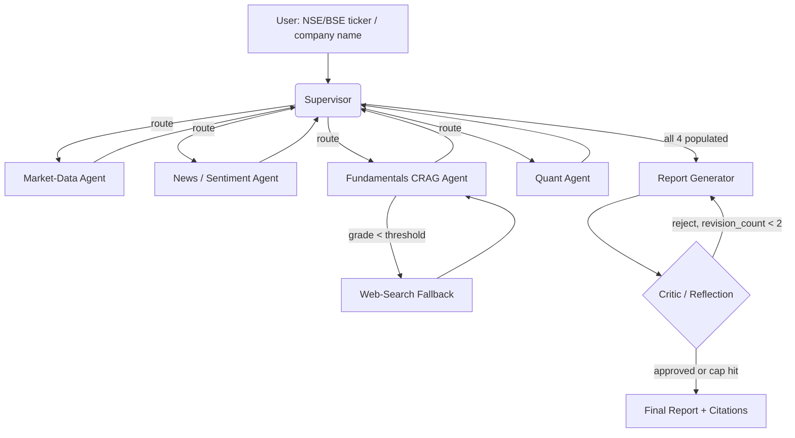

# PLAN.md — Multi-Agent Financial Research Analyst (India / NSE-BSE)

> **India-first.** This project targets NSE/BSE-listed equities and Indian filings by default, with a pluggable data layer that swaps to US/global markets by config (see §10 Localization + "worldwide mode"). The **architecture is unchanged from the original**: LangGraph supervisor, four specialist workers, Corrective RAG, a reflection/critic loop, LLM-as-judge eval, and the Target Agent Contract all survive exactly — only data sources, filing types, domain knowledge, currency/format, and example tickers are localized.

## 1. Objective & Success Criteria

Build a LangGraph supervisor system that, given an NSE/BSE ticker or company name, dispatches specialist agents to gather market data, news sentiment, fundamentals (via Corrective RAG over Indian annual reports / quarterly results / exchange filings), and quantitative ratios, then synthesizes a cited investment-research-style brief that a critic agent reviews and forces revisions on before final delivery.

| Metric | Target | How measured |
|---|---|---|
| LLM-as-judge grounding score (1–5) on the 15-ticker eval set | ≥85% of reports score ≥4/5 | `eval/run_eval.py`, judge = Claude Sonnet, temp 0, rubric in §6 |
| Citation integrity: every `[n]` in the report resolves to a real chunk/URL in that run's `sources` | 100% | deterministic code check, not LLM |
| P95 end-to-end latency | <90s | measured over the 15-ticker set, 3 runs each |
| Cost per report (LLM + data API) | <₹21 (≈ <$0.25) | token accounting logged per run (§5 cost model) |
| Critic approval within revision cap | ≤2 revisions in ≥90% of runs | `revision_count` logged |
| Graph never hangs | 100% terminate | hard turn cap (§8) verified by an injected-loop test |

"Grounding ≥4/5" and the rubric anchors are defined in §6 — the number is meaningless without them.

## 2. Architecture



### Agent roster

| Agent | Role | Tools | Reads (state) | Writes (state) | Model tier |
|---|---|---|---|---|---|
| Supervisor | Structured-output router; picks next worker or FINISH | none (Pydantic decision) | `task_queue`, all result fields | `task_queue`, `messages` | cheap/fast (Haiku) |
| Market-Data | Price history, key stats (via `MarketDataAdapter`) | market-data adapter (India default: yfinance `.NS`/`.BO`) | `ticker` | `market_data` | cheap (Haiku) |
| News/Sentiment | Web/news search + sentiment (via `NewsAdapter`) | news adapter (India default: Moneycontrol/ET + Tavily) | `ticker`, `company_name` | `news_sentiment` | mid (Sonnet) |
| Fundamentals CRAG | Corrective RAG over Indian annual reports / quarterly results; grades retrieval, web fallback | Chroma retriever, grader LLM, web search | `ticker` | `fundamentals`, `sources` (append) | mid (Sonnet) |
| Quant | Computes ratios in a sandboxed exec | curated-globals exec (§8) | `market_data` | `quant_analysis` | cheap (Haiku) |
| Report Generator | Synthesizes draft with inline `[n]` citations | none | all 4 results + `sources` | `draft_report` | strong (Sonnet) |
| Critic | Scores draft on the §6 rubric; approves or returns feedback | none | `draft_report`, `revision_count` | `critique`, `revision_count`, `final_report` | strong (Sonnet) |

**The seven agents, their roles, tools, communication, and the supervisor pattern are identical to the original.** Localization changes only what the Market-Data / News / Fundamentals tools fetch, and the domain knowledge the Report Generator and Critic encode (§ below).

### State schema (pseudocode — implement as a `TypedDict`)

```python
class Citation(TypedDict):
    source: str        # filing name / URL, e.g. "TCS Annual Report FY2024 — MD&A" or an NSE announcement URL
    locator: str       # "AR FY2024 §MD&A" / "Q3FY24 Results" / full URL
    chunk_id: str      # stable id assigned at ingestion

class MarketDataResult(TypedDict):
    as_of: str                 # ISO date of the data
    last_close: float          # INR
    pct_change_1m: float
    pct_change_1y: float
    volatility_30d: float      # annualized stdev of daily returns
    market_cap: float | None   # INR (store raw; format to ₹ cr in the report layer)
    pe_ttm: float | None
    circuit_band: str | None   # e.g. "±10%" — Indian price-band context (see domain notes)
    data_complete: bool        # False if the adapter returned partial/empty

class SentimentResult(TypedDict):
    headlines: list[dict]      # {title, url, published, sentiment: -1|0|1}
    net_sentiment: float       # mean of per-headline sentiment
    n_articles: int
    unavailable: bool          # True if search failed → report must hedge

class FundamentalsResult(TypedDict):
    summary: str               # grounded synthesis of relevant annual-report / results passages
    promoter_pledge_note: str | None   # promoter holding & pledged % if disclosed (see domain notes)
    used_web_fallback: bool
    retrieval_grade: float     # 0-1, mean grader score of retrieved chunks

class QuantResult(TypedDict):
    ratios: dict               # {pe, pb, debt_to_equity, revenue_growth_yoy, roce, ...}
    volatility_30d: float
    computed_from: str         # provenance note
    error: str | None

class CritiqueVerdict(TypedDict):
    approved: bool
    score: int                 # 1-5 overall grounding
    dimension_scores: dict     # {grounding, hedging, consistency}: 1-5 each
    feedback: str              # actionable, cites the offending section

class ResearchState(TypedDict):
    ticker: str                # e.g. "RELIANCE.NS", "TCS.NS", "500325.BO"
    company_name: str
    task_queue: list[str]              # workers the supervisor still owes
    market_data: MarketDataResult | None
    news_sentiment: SentimentResult | None
    fundamentals: FundamentalsResult | None
    quant_analysis: QuantResult | None
    sources: list[Citation]
    draft_report: str | None
    critique: CritiqueVerdict | None
    revision_count: int
    final_report: str | None
    messages: Annotated[list[BaseMessage], add_messages]   # supervisor scratchpad only
```

Two additive fields (`circuit_band`, `promoter_pledge_note`) carry India-specific context into the report; they don't alter the graph or the supervisor logic. Everything else is unchanged.

**Communication pattern.** Pure supervisor pattern — workers never call each other. Each worker returns `Command(goto="supervisor", update={...})`. The supervisor is a structured-output LLM call (`RouteDecision{next: Literal[...], reason: str}`) that reads which result fields are populated and routes accordingly; it hard-stops to the Report Generator once all four results are set, and force-finalizes once `revision_count >= 2`.

### The pluggable data layer (the localization + a real engineering lesson)

The three data-fetching tools sit behind adapter interfaces so "which market" is a config choice, not a rewrite. This is the key structural addition — it does not touch the agents, state, or supervisor:

```python
class MarketDataAdapter(Protocol):
    def get_market_data(self, ticker: str) -> MarketDataResult: ...
class NewsAdapter(Protocol):
    def search_news(self, ticker: str, company_name: str, k: int = 8) -> SentimentResult: ...
class FilingsAdapter(Protocol):
    def fetch_filings(self, ticker: str) -> list[LocalDoc]: ...   # for the CRAG corpus

# config selects the market
ADAPTERS = {
  "IN": (YFinanceINAdapter, MoneycontrolETAdapter, NseBseFilingsAdapter),   # default
  "US": (YFinanceUSAdapter, TavilyNewsAdapter, SecEdgarFilingsAdapter),     # worldwide mode
}
```

The India default `MarketDataAdapter` uses yfinance with `.NS`/`.BO` suffixes (falling back to `nsepython`/`jugaad-data`/`bsedata` for fields yfinance lacks); the US adapter is the original SEC/yfinance stack. Same agents call the same `get_market_data()` signature either way.

### Tool interface contracts (pseudocode)

```python
def get_market_data(ticker: str) -> MarketDataResult:
    """India default: yfinance '.NS'/'.BO'. Raises nothing. On empty/partial → data_complete=False.
       Populate circuit_band from the exchange price-band where available (nsepython)."""

def search_news(ticker: str, company_name: str, k: int = 8) -> SentimentResult:
    """India default: Moneycontrol/ET headlines + Tavily. On error or 0 results → unavailable=True."""

def crag_fundamentals(ticker: str, retriever, grader) -> FundamentalsResult:
    """retrieve top-k over Indian AR/results chunks → grade each chunk 0/1 → if mean<0.5, web-search fallback."""

def compute_quant(market_data: MarketDataResult) -> QuantResult:
    """Runs in the curated-globals sandbox (§8). On exec failure → error set, ratios={}."""
```

### FastAPI surface (this is also the Target Agent Contract other projects consume)

```
POST /analyze   {ticker: str}         -> {report_md, citations, trajectory, version, cost_usd, latency_ms}
GET  /healthz                         -> {status, version}
```
`trajectory` is the ordered list of `{node, tool_calls[], tokens_in, tokens_out, latency_ms}` — required so Projects 03/11/12/13 can observe this agent without importing its internals. `version` is the git SHA of the running build. (`cost_usd` keeps the field name for cross-project compatibility; report LLM cost in USD and show an INR figure in the UI.)

## 3. Tech Stack

| Choice | Why | Rejected alternative |
|---|---|---|
| LangGraph | Explicit cyclic graph (critic→revise loop) + native `Command`/checkpointer | CrewAI Flows — expresses loops but weaker conditional-routing control; kept as a design reference (`crews/stock_analysis`) |
| Chroma (embedded) | Zero-ops local vector store, fine for a handful of filings | Qdrant — better at scale; documented swap-in |
| yfinance (`.NS`/`.BO`) as the default MarketDataAdapter | Free, no key, supports NSE (`.NS`) + BSE (`.BO`) tickers and Indian indices (`^NSEI`, `^BSESN`) | Kite Connect / Upstox (need a broker account + auth) — documented adapters for real-time/L2 depth if you outgrow yfinance |
| `nsepython` / `jugaad-data` / `bsedata` for fields yfinance lacks | Free wrappers over NSE/BSE for circuit bands, shareholding, bhavcopy, F&O, corporate announcements | Scraping the portals raw — the libraries already handle NSE's cookie/header handshake |
| Moneycontrol/ET (+ Tavily) as the default NewsAdapter | India-relevant equity news the sentiment agent needs | Tavily-only — misses India-specific coverage; kept as the fallback + the US adapter |
| Curated-globals `exec` sandbox | Only the compute the quant agent needs, no new service | RestrictedPython (heavier); full code-interpreter service (over-scoped) |
| `text-embedding-3-small` (or `bge-small` local) | Cheap, strong enough for filing retrieval; 1536-dim | Large embedding models — cost with no measured benefit at this corpus size |
| FastAPI + Streamlit | Fast demo + report viewer; INR/lakh-crore formatting in the view layer | Next.js — nicer UX, +1 week, no portfolio benefit |
| Docker Compose (app + Chroma) | One-command reproducible demo | Bare-metal venv — not deployable |
| RAGAS + custom LLM-judge rubric | RAGAS covers the CRAG sub-component; rubric covers whole-report grounding | RAGAS only — doesn't grade market/quant sections |

**Model tiers.** Router + market + quant → Haiku (cheap, deterministic-ish, temp 0). News, fundamentals, report, critic → Sonnet (temp 0.2 for generation, temp 0 for the critic and grader). Judge (eval only) → Sonnet, temp 0, and must differ from the report model *config* to reduce self-preference bias. (Model choice is unchanged from the original; it's LLM-provider, not market-specific.)

## 4. Phase-by-Phase Build Plan

| Phase | Goal | Definition of Done | Tests to write | Est. |
|---|---|---|---|---|
| 0 — Setup | Repo scaffold, keys, ingest 2–3 sample Indian annual reports / quarterly-results PDFs into Chroma (section-aware chunks) | Retrieve top-k for a test query with sane relevance | ingestion snapshot test (chunk count, section tags) | 2–3 d |
| 1 — Skeleton | Supervisor + market-data worker happy path (yfinance `.NS`) | CLI run returns `market_data` for one NSE ticker | supervisor routing unit test w/ a stubbed decision | 3–4 d |
| 2 — Specialists | Add news, CRAG fundamentals, quant, each in isolation | Each worker unit-tested with mocked LLM/tool | per-worker: valid input, empty/error input, malformed | 5–7 d |
| 3 — Orchestration | Full routing + Report Generator assembling all 4 with `[n]` citations | 3 NSE tickers → coherent report end-to-end | citation-integrity test (every `[n]` resolves) | 4–5 d |
| 4 — Reflection + Eval | Critic loop (cap 2) + 15-ticker rubric eval | Eval prints scores; ≥85% ≥4/5 | injected-loop test (graph terminates); rubric golden test | 5–7 d |
| 5 — Deploy | FastAPI (+ trajectory), Streamlit (INR formatting), Compose | `docker compose up` serves the demo, `/analyze` returns the contract | contract schema test on `/analyze` | 3–4 d |
| 6 — Polish | README (diagram, GIF, "Technical Decisions", "Where it failed"), live URL | Recruiter runs a report in <2 min | — | 2–3 d |

**Total: ~4–6 weeks part-time.** (Phase structure unchanged; only the sample documents and tickers are Indian.)

## 5. Data, APIs & Cost Model

Default India stack (evaluated options with cost / rate-limit / auth are in RESOURCES.md §"Data & API layer — evaluated"):
- **yfinance (`.NS`/`.BO`)** — free, no key; supports NSE/BSE equities + indices (`^NSEI` NIFTY 50, `^BSESN` SENSEX, `^NSEBANK` Bank Nifty). Validate non-empty before trusting (silent empties happen) → `data_complete=False`.
- **`nsepython` / `jugaad-data` / `bsedata`** — free; fill gaps yfinance lacks: circuit price-bands, shareholding pattern (promoter holding/pledge), bhavcopy, F&O lot sizes, corporate announcements.
- **Moneycontrol / Economic Times (+ Tavily)** — news/sentiment; RSS + search. Tavily free tier ~1,000 req/mo as the fallback.
- **Fundamentals RAG corpus** — Indian **annual reports**, **quarterly results**, and **corporate announcements** fetched from NSE/BSE filing portals (exact fetch recipe in RESOURCES.md). Screener.in is the retail cross-check for ratios/links.
- **Kite Connect / Upstox** — optional real-time/L2 adapters; require a broker account + OAuth (see RESOURCES).
- **No PII.** Only freshness risk: re-ingest a ticker's filings if older than its latest quarterly result.

**Cost derivation (per report).** LLM cost is provider-priced (USD) and unchanged: router ~5 Haiku calls ≈ negligible; news+fundamentals+report+critic ≈ 4–6 Sonnet calls × ~3–5k tok in / ~1k out ≈ $0.08–0.20/report (≈ ₹7–17). Default data APIs (yfinance/nsepython/Moneycontrol) are free, so the <₹21 (<$0.25) ceiling is dominated by LLM tokens. The 15-ticker eval (×judge) ≈ $2–4 (≈ ₹170–340). Overrun cause is unchanged: re-running all four workers on each critic revision — cache and re-run only the Report Generator (§8).

## 6. Eval Strategy

- **Golden set:** 15 fixed NSE tickers spanning sectors, checked into `eval/tickers.json`:
  `RELIANCE.NS` (energy/conglomerate), `TCS.NS, INFY.NS, HCLTECH.NS` (IT), `HDFCBANK.NS, ICICIBANK.NS, SBIN.NS` (banks), `SUNPHARMA.NS, CIPLA.NS` (pharma), `MARUTI.NS, TATAMOTORS.NS` (auto), `HINDUNILVR.NS, ITC.NS` (FMCG), `LT.NS` (capital goods), `BHARTIARTL.NS` (telecom). Rationale unchanged: sector spread stresses the fundamentals retriever across different annual-report vocabularies (a bank's AR reads nothing like an FMCG AR).
- **Per-report checks:** identical to the original —
  1. Section completeness — all 4 sections present (binary).
  2. Citation integrity — every `[n]` resolves to a `chunk_id`/URL in `sources` (binary, **code-checked**).
  3. LLM-judge rubric (below).
  4. `revision_count`, latency, cost logged.
- **Judge rubric (1–5 per dimension; overall = min of dimensions):** unchanged, with an India note added to Consistency —

  | Dimension | 1 | 3 | 5 |
  |---|---|---|---|
  | Grounding | claims with no citation / contradicted by cited source | most claims cited, ≤1 unsupported | every material claim cited and supported |
  | Hedging | states uncertain figures as fact | some hedging on weak data | uncertainty (missing data, `unavailable` news, undisclosed pledge) explicitly flagged |
  | Consistency | narrative numbers contradict `quant_analysis`; ₹ figures mis-scaled (crore vs lakh) | minor rounding mismatch | narrative numbers match `quant_analysis`; lakh/crore scaling correct |

- **Thresholds:** ≥85% of 15 reports score ≥4/5 overall; 100% citation integrity; P95 <90s; mean cost <₹21. Publish this table in the README — it is the resume bullet.

## 7. Risks & Where These Projects Usually Fail

All original risks apply unchanged; India-specific ones are added:
- **Supervisor infinite loop** → hard cap of 15 supervisor turns; on cap, emit a partial report with a visible note.
- **Critic never approves** → cap 2 revisions; ship best-effort draft with an "unresolved critique" disclaimer.
- **Adapter silent empties** (yfinance for illiquid small-caps, or NSE cookie expiry) look valid → validate and set `data_complete=False`; the Report Generator must hedge when false.
- **Quant exec is an injection surface** → curated-globals sandbox, no `__import__`/IO, 5s wall-clock (§8).
- **Stale/duplicate vector entries** → key the Chroma collection on `ticker + filing_period` (e.g. `RELIANCE.NS + AR_FY2024`).
- **Cost blowup on revision** → cache worker outputs; re-run only the Report Generator.
- **Over-scoping the quant agent** into a backtester — a handful of ratios + volatility only.
- **India data gotchas (new):** (a) **lakh/crore mis-scaling** — Indian statements report in ₹ lakh or ₹ crore; the report layer must format consistently or the Critic's Consistency dimension will (correctly) fail it. (b) **NSE anti-bot** — direct nseindia.com calls need a browser-like header/cookie handshake; use the wrapper libraries, don't hammer the raw endpoint. (c) **BSE scrip codes vs NSE symbols** — BSE uses numeric codes (`500325.BO` = Reliance) while NSE uses symbols (`RELIANCE.NS`); the adapter must map both. (d) **promoter pledge** is a genuine risk signal the agent should surface but only if disclosed — never infer it.

## 8. Implementation Notes for the Executing Model

Front-loaded decisions (all original notes stand; India specifics added):

- **Router, not ReAct.** Hand-roll supervisor nodes with explicit `Command(goto=..., update=...)` returning a Pydantic `RouteDecision`; do not use `create_react_agent`'s implicit tool loop for a 4-way branch. Routing prompt skeleton unchanged.
- **CRAG grader is binary, per-chunk.** Grade each retrieved chunk 0/1 ("Does this passage help answer a question about {company}'s fundamentals? Answer only 0 or 1."), mean < 0.5 → web fallback. Unchanged.
- **Citation format is `[n]` inline**, `n` indexing `sources`; the integrity checker parses `\[(\d+)\]` and asserts each index exists. Unchanged.
- **Chunk section-aware — Indian annual-report sections, not 10-K Items.** Split on the Indian AR structure: **Management Discussion & Analysis (MD&A)**, **Board's/Directors' Report**, **Corporate Governance Report**, **Business Responsibility & Sustainability Report (BRSR)**, **Notes to Financial Statements** (standalone + consolidated), **Auditor's Report**. For quarterly results, split on the SEBI LODR Reg-33 result format. Target ~800 tokens/chunk, 100 overlap only within a section. Track `chunk_id → (source_doc, section, page)`. *This is the single most important localization — the retrieval quality depends on matching Indian document structure, exactly as the original matched 10-K Items.*
- **Quant sandbox:** `exec(code, {"__builtins__": {}}, {"np": numpy, "pd": pandas, "data": market_data})` in a subprocess, 5s `signal.alarm`, no network. Unchanged. Add ROCE/ROE to the ratio set (the ratios Indian retail investors weight most, per Screener conventions).
- **Checkpointing:** `SqliteSaver`/Postgres saver from Phase 3. Unchanged.
- **Worker failure isolation:** a failed adapter returns a result object with `unavailable`/`data_complete=False`, never raises. Unchanged.
- **INR formatting is a view-layer concern:** store raw floats in state; format to the Indian numbering system (₹1,23,45,678; "₹2,340 cr", "₹45 lakh") only in the report/Streamlit layer, so the quant math stays unit-clean. 1 lakh = 1e5, 1 crore = 1e7.
- **Domain knowledge to encode in the Report Generator + Critic prompts (India):** promoter holding & **pledged %** (from the quarterly shareholding pattern), **FII/DII** flow direction as context, **circuit/price-band** for volatility framing, **lot size** if F&O is mentioned, and SEBI-body context (SEBI is the regulator, not the SEC). These are *domain facts the agent reasons with*, not new architecture.

## 9. Definition of Done

- [ ] CLI and `/analyze` both work end-to-end for an arbitrary NSE/BSE ticker, returning the Target Agent Contract shape.
- [ ] 15-ticker (Indian) eval runs and prints the §6 table; results committed to the README.
- [ ] Data layer is adapter-based; flipping `MARKET=US` swaps to the SEC/US stack with no agent-code change (worldwide mode).
- [ ] Dockerized (`docker compose up` from a clean clone).
- [ ] Deployed to a live URL.
- [ ] Injected-loop test proves the graph always terminates.
- [ ] README has an architecture diagram, demo GIF, "Technical Decisions", and "Where it failed and what I learned".

## 10. Localization

**What changed (data/domain/format only):**
- **Market & tickers:** US tickers → NSE/BSE (`.NS`/`.BO`), indices `^NSEI`/`^BSESN`/`^NSEBANK`; eval set is 15 Indian large-caps across sectors.
- **Filings corpus:** SEC 10-K/10-Q → Indian **annual reports, quarterly results, and corporate announcements** from NSE/BSE portals + SEBI disclosures; section-aware chunking now matches Indian AR structure (MD&A / Directors' Report / BRSR / Notes / Corporate Governance).
- **Data/API layer:** default stack = yfinance(`.NS`/`.BO`) + nsepython/jugaad-data/bsedata + Moneycontrol/ET; Kite Connect / Upstox documented as optional real-time adapters. Full cost/rate-limit/auth evaluation in RESOURCES.md.
- **Domain context:** promoter holding & pledging, FII/DII flows, SEBI (regulator), circuit limits/price bands, F&O lot sizes, INR lakh/crore formatting — added as agent domain knowledge and to the Critic's Consistency rubric.
- **Currency/format:** ₹, Indian numbering system; cost targets shown in ₹ (LLM tokens still priced in USD upstream).

**What stayed global (unchanged, per the hard constraint):** the entire architecture — supervisor orchestration, the four specialist agents, Corrective RAG with a binary grader + web fallback, the reflection/critic loop, the state machine, LLM-as-judge + RAGAS eval, model tiers, the quant sandbox, checkpointing, and the Target Agent Contract. No pattern, protocol, or learning objective was removed or simplified.

**Worldwide mode (design lesson).** Because the three data tools sit behind `MarketDataAdapter` / `NewsAdapter` / `FilingsAdapter`, supporting US/global markets is a **config change** (`MARKET=US` selects the SEC/yfinance-US adapters), not a rewrite. This adapter/ports-and-adapters pattern is itself a portfolio-worthy engineering lesson — taught in PROFESSOR-NOTES.md §"Ports & adapters". Trade-off recorded: adapters add one indirection layer; the payoff is that the same agents serve any market and the US curriculum value (SEC filings, 10-K structure) remains reachable for comparison.
