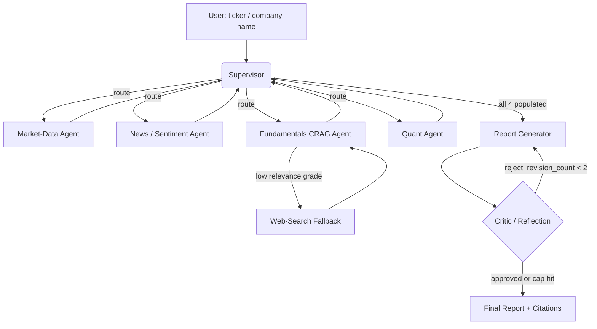

# PLAN.md — Multi-Agent Financial Research Analyst

## 1. Objective & Success Criteria

Build a LangGraph supervisor system that, given a US-listed ticker or company name, dispatches specialist agents to gather market data, news sentiment, fundamentals (via Corrective RAG over SEC filings), and quantitative ratios, then synthesizes a cited investment-research-style brief that a critic agent reviews and forces revisions on before final delivery.

| Metric | Target |
|---|---|
| LLM-as-judge grounding score (1–5) on a 15-ticker eval set | ≥85% of reports score ≥4/5 |
| Reports with ≥1 real citation per section (no fabricated sources, spot-checked) | 100% |
| P95 end-to-end latency | <90s |
| Cost per report (LLM + API calls) | <$0.25 |
| Critic approval within revision cap | ≤2 revisions in ≥90% of runs |

## 2. Architecture



### Agent roster

| Agent | Role | Tools | Reads (state) | Writes (state) |
|---|---|---|---|---|
| Supervisor | Structured-output router; decides next worker or FINISH | none (pure LLM decision + Pydantic schema) | `task_queue`, all worker-result fields | `task_queue`, `messages` |
| Market-Data Agent | Pulls price history, key stats | `yfinance` wrapper | `ticker` | `market_data` |
| News/Sentiment Agent | Web search + sentiment classification | Tavily/DuckDuckGo search | `ticker`, `company_name` | `news_sentiment` |
| Fundamentals CRAG Agent | Corrective RAG over 10-K/10-Q chunks; grades retrieval, falls back to web search if weak | Chroma retriever, grader LLM call, web-search tool | `ticker` | `fundamentals`, `sources` (append) |
| Quant Agent | Computes ratios (P/E, growth, volatility) in a sandboxed Python exec | restricted Python REPL (numpy/pandas only, no I/O, 5s timeout) | `market_data` | `quant_analysis` |
| Report Generator | Synthesizes draft from all 4 sections with inline citations | none | `market_data`, `news_sentiment`, `fundamentals`, `quant_analysis`, `sources` | `draft_report` |
| Critic / Reflection | Scores draft on a rubric; approves or sends back with feedback | none | `draft_report`, `revision_count` | `critique`, `revision_count`, `final_report` |

### State schema (pseudocode — implement as a `TypedDict`)

```python
class Citation(TypedDict):
    source: str        # filing name / URL
    locator: str        # page or section
    chunk_id: str

class ResearchState(TypedDict):
    ticker: str
    company_name: str
    task_queue: list[str]              # remaining worker names supervisor still owes
    market_data: MarketDataResult | None
    news_sentiment: SentimentResult | None
    fundamentals: FundamentalsResult | None
    quant_analysis: QuantResult | None
    sources: list[Citation]
    draft_report: str | None
    critique: CritiqueVerdict | None    # Pydantic: approved: bool, feedback: str, score: int
    revision_count: int
    final_report: str | None
    messages: Annotated[list[BaseMessage], add_messages]   # supervisor scratchpad only
```

**Communication pattern:** pure supervisor pattern — workers never call each other. Each worker node returns `Command(goto="supervisor", update={...})`. The supervisor is a structured-output LLM call (Pydantic `RouteDecision{next: Literal[...], reason: str}`) that reads which state fields are populated and routes accordingly; it hard-stops after `all 4 fields set` → Report Generator, and after `revision_count >= 2` → force-finalize regardless of critic verdict.

## 3. Tech Stack

| Choice | Why | Rejected alternative |
|---|---|---|
| LangGraph | Explicit graph with cycles (needed for critic→revise loop) and native `Command`/checkpoint support | CrewAI Flows — can express loops but gives less precise control over conditional routing; kept only as a design reference (`stock_analysis` crew) |
| Chroma (embedded) | Zero-ops local vector store, good enough for a handful of filings | Qdrant — better at scale/concurrent writes, note as swap-in if you outgrow Chroma |
| yfinance | Free, no key, sufficient OHLCV + basic fundamentals | Paid APIs (Alpha Vantage, FMP) — keep as a documented fallback if yfinance throttles you |
| Tavily search API | Clean JSON, LLM-oriented, generous free tier | SerpAPI (paid), raw DuckDuckGo (no key but noisier results) |
| Restricted Python exec (quant agent) | Only sandboxed compute the project needs | Full code-interpreter service — over-scoped for 4 ratios and a volatility calc |
| FastAPI + Streamlit | Fast to stand up a demo; Streamlit is enough for a report viewer | Next.js — nicer UX but adds a week for no portfolio benefit here |
| Docker Compose (app + Chroma) | One-command reproducible demo | Bare-metal / manual venv — not deployable |
| RAGAS + custom LLM-judge rubric | RAGAS covers the CRAG sub-component; custom rubric covers the whole-report grounding/completeness | Only using RAGAS — doesn't grade the non-RAG sections (market data, quant) |

## 4. Phase-by-Phase Build Plan

| Phase | Goal | Definition of Done | Est. time |
|---|---|---|---|
| 0 — Setup | Repo scaffold, API keys, ingest 2–3 sample 10-K/10-Q PDFs into Chroma | Can retrieve top-k chunks for a test query with sane relevance | 2–3 days |
| 1 — Skeleton | Supervisor + single worker (market-data) happy path | CLI run for one ticker returns JSON with `market_data` populated, no other workers wired yet | 3–4 days |
| 2 — Specialists | Add news/sentiment, fundamentals CRAG, quant agents independently | Each worker unit-tested in isolation with a mocked LLM/tool call | 5–7 days |
| 3 — Orchestration | Full supervisor routing + report generator assembling all 4 sections with citations | 3 sample tickers produce a coherent report end-to-end without crashing | 4–5 days |
| 4 — Reflection + Eval | Critic loop (max 2 revisions) + 15-ticker golden eval set, rubric-scored | Eval script prints numeric scores; ≥80% pass rubric threshold | 5–7 days |
| 5 — Deploy | FastAPI wrapper, Streamlit UI, Docker Compose | `docker compose up` serves a working demo end-to-end | 3–4 days |
| 6 — Polish | README (architecture diagram, demo GIF, "Technical Decisions", "Where it failed"), deploy to a live URL (Render/Fly) | Recruiter can open a URL and run a report in <2 min | 2–3 days |

**Total: ~4–6 weeks part-time.**

## 5. Data & API Requirements

- **yfinance** — free, no key; validate returned frames are non-empty before trusting them (silent empty responses happen under rate-limit).
- **Tavily API** — free tier (~1,000 req/month) for news/sentiment search; DuckDuckGo unofficial search is a no-key fallback if you want to avoid signup.
- **SEC EDGAR full-text search / `sec-edgar-downloader`** — free, public, no key; use it to pull 2–3 real 10-K/10-Q filings per eval ticker.
- **LLM provider** (Claude or OpenAI) — used by every agent, the critic, and the eval judge. Budget ≈$0.05–0.20/report; a 15-ticker eval run ≈$1–3.
- No user PII is involved; the only "data requirement" risk is filing freshness — re-ingest a ticker's filings if older than the most recent 10-Q.

## 6. Eval Strategy

- **Golden set:** 15 tickers spanning tech, finance, and healthcare large-caps (fixed list, checked into the repo as `eval/tickers.json`).
- **Per-report checks:**
  1. Section completeness — all 4 worker sections present in the final report (binary).
  2. Citation integrity — every citation in the report resolves to a `chunk_id`/URL actually present in `sources` for that run (binary, code-checked, not LLM-judged — this is the one thing you can verify deterministically).
  3. LLM-as-judge rubric (1–5) on: factual grounding, hedge/uncertainty language appropriateness, and internal consistency (numbers in narrative match `quant_analysis`).
  4. Revision count and latency/cost per run, logged for every ticker.
- **Thresholds:** ≥85% of the 15 reports score ≥4/5 on grounding; 100% pass citation integrity; P95 latency <90s; mean cost <$0.25.
- Publish this table in the project README — it's the single most important line on the resume bullet.

## 7. Risks & Where These Projects Usually Fail

- **Supervisor infinite loop** if routing logic doesn't correctly track which workers have already run → always add a hard turn cap (e.g., 15 supervisor turns) that force-terminates to a partial report instead of hanging.
- **Critic loop that never approves** → hard cap at 2 revisions; ship the best-effort draft with a visible "unresolved critique" disclaimer rather than looping forever.
- **yfinance silent failures** under rate-limiting return empty/stale frames that look valid — the report then hallucinates numbers from a `None`/empty DataFrame. Validate non-empty before writing to state.
- **Quant agent code execution is a real injection surface** if not sandboxed — restrict the exec namespace (numpy/pandas only, no `__import__`, no file/network I/O), and wall-clock timeout at 5s.
- **Stale/duplicate vector store entries** if a ticker's filing is re-ingested without versioning — key the Chroma collection by `ticker + filing_date`, not just `ticker`.
- **Cost blowup on every critic revision** if a revision re-runs all 4 workers instead of just the Report Generator — cache worker outputs in state and only re-invoke Report Generator (optionally the single flagged worker) on revise.
- **Over-scoping the quant agent** into a full backtester/portfolio simulator — the project only needs a handful of ratios and a volatility measure; resist scope creep here, it's not what's being evaluated.

## 8. Implementation Notes for the Executing Model

- Prefer hand-rolled LangGraph nodes with explicit `Command(goto=..., update=...)` returns for the supervisor over `create_react_agent`'s implicit tool-loop — a 4-way branch is more reliable when the routing decision is an explicit structured output, not a parsed tool call.
- Use Pydantic models for the supervisor's routing decision and the critic's verdict. Do **not** parse free-text like `"next: worker_name"` — brittle and a common source of silent bugs.
- Persist LangGraph checkpoints (`SqliteSaver` or equivalent) so a request that fails mid-graph can resume instead of restarting from scratch — required for a project claiming "production-grade," not optional polish.
- Check your installed LangGraph version's actual API before following any tutorial notebook verbatim — the message-passing and node-return conventions have changed across releases (this is exactly the kind of drift that made several links in `RESOURCES.md` stale; see the note there).
- When chunking 10-Ks for the CRAG retriever, split section-aware (on Item 1/1A/7/7A headers), not fixed-size — naive fixed-size chunking splits mid-table and hurts grading precision.
- Track a `(chunk_id → source_doc, page)` map at ingestion time. The Report Generator must only cite `chunk_id`s actually returned by that run's retrieval — never let it invent a citation.
- Don't let the news/sentiment agent's search tool be the single point of failure — if the search API errors or returns zero results, the worker should return a state marking `news_sentiment` as "unavailable" rather than crash the whole graph.

## 9. Definition of Done

- [ ] CLI and FastAPI endpoint both work end-to-end for an arbitrary US-listed ticker.
- [ ] 15-ticker eval harness runs and prints the metrics table from §6, with results committed to the README.
- [ ] Dockerized (`docker compose up` works from a clean clone).
- [ ] Deployed to a live URL.
- [ ] README has an architecture diagram, a demo GIF, a "Technical Decisions" section, and a "Where it failed and what I learned" section.
