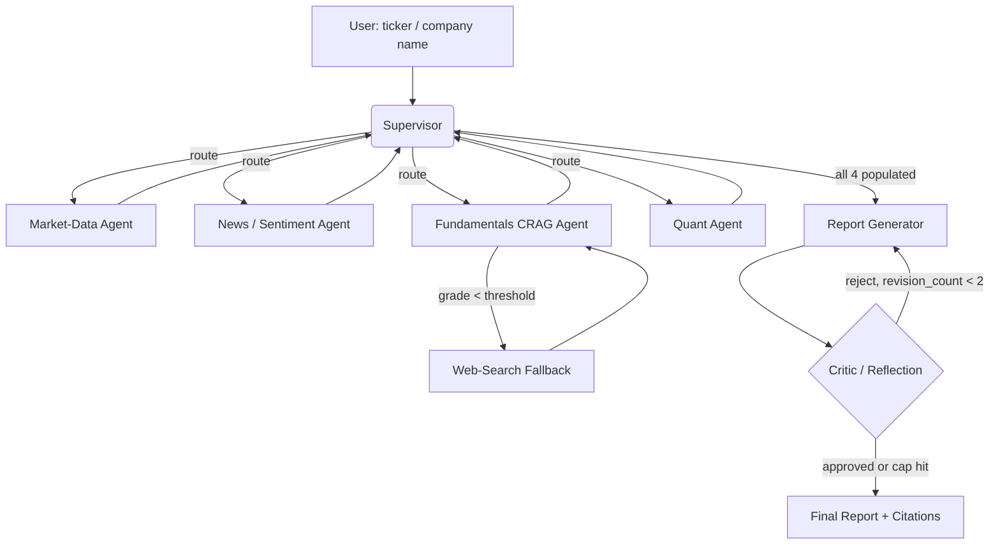

# PLAN.md — Multi-Agent Financial Research Analyst

## 1. Objective & Success Criteria

Build a LangGraph supervisor system that, given a US-listed ticker or company name, dispatches specialist agents to gather market data, news sentiment, fundamentals (via Corrective RAG over SEC filings), and quantitative ratios, then synthesizes a cited investment-research-style brief that a critic agent reviews and forces revisions on before final delivery.

| Metric | Target | How measured |
|---|---|---|
| LLM-as-judge grounding score (1–5) on the 15-ticker eval set | ≥85% of reports score ≥4/5 | `eval/run_eval.py`, judge = Claude Sonnet, temp 0, rubric in §6 |
| Citation integrity: every `[n]` in the report resolves to a real chunk/URL in that run's `sources` | 100% | deterministic code check, not LLM |
| P95 end-to-end latency | <90s | measured over the 15-ticker set, 3 runs each |
| Cost per report (LLM + API) | <$0.25 | token accounting logged per run (§5 cost model) |
| Critic approval within revision cap | ≤2 revisions in ≥90% of runs | `revision_count` logged |
| Graph never hangs | 100% terminate | hard turn cap (§8) verified by an injected-loop test |

"Grounding ≥4/5" and the rubric anchors are defined in §6 — the number is meaningless without them.

## 2. Architecture



### Agent roster

| Agent | Role | Tools | Reads (state) | Writes (state) | Model tier |
|---|---|---|---|---|---|
| Supervisor | Structured-output router; picks next worker or FINISH | none (Pydantic decision) | `task_queue`, all result fields | `task_queue`, `messages` | cheap/fast (Haiku) |
| Market-Data | Price history, key stats | `yfinance` wrapper | `ticker` | `market_data` | cheap (Haiku) |
| News/Sentiment | Web search + sentiment | Tavily search | `ticker`, `company_name` | `news_sentiment` | mid (Sonnet) |
| Fundamentals CRAG | Corrective RAG over 10-K/10-Q; grades retrieval, web fallback | Chroma retriever, grader LLM, web search | `ticker` | `fundamentals`, `sources` (append) | mid (Sonnet) |
| Quant | Computes ratios in a sandboxed exec | curated-globals exec (§8) | `market_data` | `quant_analysis` | cheap (Haiku) |
| Report Generator | Synthesizes draft with inline `[n]` citations | none | all 4 results + `sources` | `draft_report` | strong (Sonnet) |
| Critic | Scores draft on the §6 rubric; approves or returns feedback | none | `draft_report`, `revision_count` | `critique`, `revision_count`, `final_report` | strong (Sonnet) |

### State schema (pseudocode — implement as a `TypedDict`)

```python
class Citation(TypedDict):
    source: str        # filing name / URL
    locator: str       # "10-K FY2024 Item 7" or full URL
    chunk_id: str      # stable id assigned at ingestion

class MarketDataResult(TypedDict):
    as_of: str                 # ISO date of the data
    last_close: float
    pct_change_1m: float
    pct_change_1y: float
    volatility_30d: float      # annualized stdev of daily returns
    market_cap: float | None
    pe_ttm: float | None
    data_complete: bool        # False if yfinance returned partial/empty

class SentimentResult(TypedDict):
    headlines: list[dict]      # {title, url, published, sentiment: -1|0|1}
    net_sentiment: float       # mean of per-headline sentiment
    n_articles: int
    unavailable: bool          # True if search failed → report must hedge

class FundamentalsResult(TypedDict):
    summary: str               # grounded synthesis of relevant 10-K/10-Q passages
    used_web_fallback: bool
    retrieval_grade: float     # 0-1, mean grader score of retrieved chunks

class QuantResult(TypedDict):
    ratios: dict               # {pe, pb, debt_to_equity, revenue_growth_yoy, ...}
    volatility_30d: float
    computed_from: str         # provenance note
    error: str | None

class CritiqueVerdict(TypedDict):
    approved: bool
    score: int                 # 1-5 overall grounding
    dimension_scores: dict     # {grounding, hedging, consistency}: 1-5 each
    feedback: str              # actionable, cites the offending section

class ResearchState(TypedDict):
    ticker: str
    company_name: str
    task_queue: list[str]              # workers the supervisor still owes
    market_data: MarketDataResult | None
    news_sentiment: SentimentResult | None
    fundamentals: FundamentalsResult | None
    quant_analysis: QuantResult | None
    sources: list[Citation]
    draft_report: str | None
    critique: CritiqueVerdict | None
    revision_count: int
    final_report: str | None
    messages: Annotated[list[BaseMessage], add_messages]   # supervisor scratchpad only
```

**Communication pattern.** Pure supervisor pattern — workers never call each other. Each worker returns `Command(goto="supervisor", update={...})`. The supervisor is a structured-output LLM call (`RouteDecision{next: Literal[...], reason: str}`) that reads which result fields are populated and routes accordingly; it hard-stops to the Report Generator once all four results are set, and force-finalizes once `revision_count >= 2`.

### Tool interface contracts (pseudocode)

```python
def get_market_data(ticker: str) -> MarketDataResult:
    """Raises nothing. On yfinance empty/partial → data_complete=False, fields None."""

def search_news(ticker: str, company_name: str, k: int = 8) -> SentimentResult:
    """On API error or 0 results → unavailable=True. Never raises to the graph."""

def crag_fundamentals(ticker: str, retriever, grader) -> FundamentalsResult:
    """retrieve top-k → grade each chunk 0/1 → if mean grade < 0.5, web-search fallback."""

def compute_quant(market_data: MarketDataResult) -> QuantResult:
    """Runs in the curated-globals sandbox (§8). On exec failure → error set, ratios={}."""
```

### FastAPI surface (this is also the Target Agent Contract other projects consume)

```
POST /analyze   {ticker: str}         -> {report_md, citations, trajectory, version, cost_usd, latency_ms}
GET  /healthz                         -> {status, version}
```
`trajectory` is the ordered list of `{node, tool_calls[], tokens_in, tokens_out, latency_ms}` — required so Projects 03/11/12/13 can observe this agent without importing its internals. `version` is the git SHA of the running build.

## 3. Tech Stack

| Choice | Why | Rejected alternative |
|---|---|---|
| LangGraph | Explicit cyclic graph (critic→revise loop) + native `Command`/checkpointer | CrewAI Flows — expresses loops but weaker conditional-routing control; kept as a design reference (`crews/stock_analysis`) |
| Chroma (embedded) | Zero-ops local vector store, fine for a handful of filings | Qdrant — better at scale; documented swap-in |
| yfinance | Free, no key, sufficient OHLCV + basic fundamentals | Alpha Vantage/FMP (paid) — documented fallback if yfinance throttles |
| Tavily search | Clean LLM-oriented JSON, generous free tier | SerpAPI (paid), raw DuckDuckGo (noisier) |
| Curated-globals `exec` sandbox | Only the compute the quant agent needs, no new service | RestrictedPython (heavier); full code-interpreter service (over-scoped) |
| `text-embedding-3-small` (or `bge-small` local) | Cheap, strong enough for filing retrieval; 1536-dim | Large embedding models — cost with no measured benefit at this corpus size |
| FastAPI + Streamlit | Fast demo + report viewer | Next.js — nicer UX, +1 week, no portfolio benefit |
| Docker Compose (app + Chroma) | One-command reproducible demo | Bare-metal venv — not deployable |
| RAGAS + custom LLM-judge rubric | RAGAS covers the CRAG sub-component; rubric covers whole-report grounding | RAGAS only — doesn't grade market/quant sections |

**Model tiers.** Router + market + quant → Haiku (cheap, deterministic-ish, temp 0). News, fundamentals, report, critic → Sonnet (temp 0.2 for generation, temp 0 for the critic and grader). Judge (eval only) → Sonnet, temp 0, and must differ from the report model *config* to reduce self-preference bias.

## 4. Phase-by-Phase Build Plan

| Phase | Goal | Definition of Done | Tests to write | Est. |
|---|---|---|---|---|
| 0 — Setup | Repo scaffold, keys, ingest 2–3 sample 10-K/10-Q into Chroma (section-aware chunks) | Retrieve top-k for a test query with sane relevance | ingestion snapshot test (chunk count, line ranges) | 2–3 d |
| 1 — Skeleton | Supervisor + market-data worker happy path | CLI run returns `market_data` for one ticker | supervisor routing unit test w/ a stubbed decision | 3–4 d |
| 2 — Specialists | Add news, CRAG fundamentals, quant, each in isolation | Each worker unit-tested with mocked LLM/tool | per-worker: valid input, empty/error input, malformed | 5–7 d |
| 3 — Orchestration | Full routing + Report Generator assembling all 4 with `[n]` citations | 3 tickers → coherent report end-to-end | citation-integrity test (every `[n]` resolves) | 4–5 d |
| 4 — Reflection + Eval | Critic loop (cap 2) + 15-ticker rubric eval | Eval prints scores; ≥85% ≥4/5 | injected-loop test (graph terminates); rubric golden test | 5–7 d |
| 5 — Deploy | FastAPI (+ trajectory), Streamlit, Compose | `docker compose up` serves the demo, `/analyze` returns the contract | contract schema test on `/analyze` | 3–4 d |
| 6 — Polish | README (diagram, GIF, "Technical Decisions", "Where it failed"), live URL | Recruiter runs a report in <2 min | — | 2–3 d |

**Total: ~4–6 weeks part-time.**

## 5. Data, APIs & Cost Model

- **yfinance** — free; validate non-empty before trusting (silent empties under rate-limit) → set `data_complete=False`.
- **Tavily** — free tier ~1,000 req/mo; DuckDuckGo no-key fallback.
- **SEC EDGAR / `sec-edgar-downloader`** — free; pull 2–3 real 10-K/10-Q per eval ticker.
- **LLM** — used by every agent, critic, judge.
- **No PII.** Only freshness risk: re-ingest if a ticker's filings predate the latest 10-Q.

**Cost derivation (per report).** Router ~5 calls × ~500 tok (Haiku) ≈ negligible; news+fundamentals+report+critic ≈ 4–6 Sonnet calls × ~3–5k tok in / ~1k out. At Sonnet pricing that lands ≈ $0.08–0.20/report; the 15-ticker eval (×judge) ≈ $2–4. The <$0.25 target is the derived ceiling; if you exceed it, the usual cause is re-running all four workers on each critic revision — cache results and re-run only the Report Generator (§8).

## 6. Eval Strategy

- **Golden set:** 15 fixed tickers spanning sectors, checked into `eval/tickers.json`: `AAPL, MSFT, NVDA` (large tech), `JPM, BAC, GS` (financials), `JNJ, PFE, UNH` (healthcare), `XOM, CVX` (energy), `WMT, COST` (consumer), `CAT, BA` (industrials). Rationale: sector spread stresses the fundamentals retriever across different 10-K vocabularies.
- **Per-report checks:**
  1. Section completeness — all 4 sections present (binary).
  2. Citation integrity — every `[n]` resolves to a `chunk_id`/URL in `sources` (binary, **code-checked**).
  3. LLM-judge rubric (below).
  4. `revision_count`, latency, cost logged.
- **Judge rubric (1–5 per dimension; overall = min of dimensions to punish any single failure):**

  | Dimension | 1 | 3 | 5 |
  |---|---|---|---|
  | Grounding | claims with no citation / contradicted by cited source | most claims cited, ≤1 unsupported | every material claim cited and supported |
  | Hedging | states uncertain figures as fact | some hedging on weak data | uncertainty (missing data, `unavailable` news) explicitly flagged |
  | Consistency | narrative numbers contradict `quant_analysis` | minor rounding mismatch | narrative numbers exactly match `quant_analysis` |

- **Thresholds:** ≥85% of 15 reports score ≥4/5 overall; 100% citation integrity; P95 <90s; mean cost <$0.25. Publish this table in the README — it is the resume bullet.

## 7. Risks & Where These Projects Usually Fail

- **Supervisor infinite loop** → hard cap of 15 supervisor turns; on cap, emit a partial report with a visible note.
- **Critic never approves** → cap 2 revisions; ship best-effort draft with an "unresolved critique" disclaimer.
- **yfinance silent empties** look valid → validate and set `data_complete=False`; the Report Generator must hedge when false.
- **Quant exec is an injection surface** → curated-globals sandbox, no `__import__`/IO, 5s wall-clock (§8).
- **Stale/duplicate vector entries** → key the Chroma collection on `ticker + filing_date`.
- **Cost blowup on revision** → cache worker outputs; re-run only the Report Generator (optionally one flagged worker).
- **Over-scoping the quant agent** into a backtester — it needs a handful of ratios + a volatility measure, nothing more.

## 8. Implementation Notes for the Executing Model

Front-loaded decisions so nothing is re-derived:

- **Router, not ReAct.** Hand-roll supervisor nodes with explicit `Command(goto=..., update=...)` returning a Pydantic `RouteDecision`; do not use `create_react_agent`'s implicit tool loop for a 4-way branch. Routing prompt skeleton:
  > "You are a router. Given which result fields are populated, output the next worker to run, or FINISH once all of market_data, news_sentiment, fundamentals, quant_analysis are present. Never pick a worker whose result field is already populated. Fields populated: {…}."
- **CRAG grader is binary, per-chunk.** Decision made: grade each retrieved chunk 0/1 for relevance ("Does this passage help answer a question about {ticker}'s fundamentals? Answer only 0 or 1."), take the mean; if mean < 0.5, trigger web fallback. Binary is cheaper and more reliable than a 1–5 scale here.
- **Citation format is `[n]` inline**, where `n` indexes into `sources`. The Report Generator must only emit `[n]` for sources actually in `sources`; the integrity checker parses `\[(\d+)\]` and asserts each index exists. This is why the format is fixed now — the checker can't exist otherwise.
- **Chunk section-aware:** split on 10-K/10-Q Item headers (Item 1/1A/7/7A), not fixed size; target ~800 tokens/chunk with 100 overlap only *within* a section. Track `chunk_id → (source_doc, item, page)` at ingestion.
- **Quant sandbox:** `exec(code, {"__builtins__": {}}, {"np": numpy, "pd": pandas, "data": market_data})` inside a subprocess with a 5s `signal.alarm` and no network. The quant agent generates only expression code over `data`, never imports.
- **Checkpointing:** use `SqliteSaver` (or Postgres saver) from Phase 3 so a mid-graph failure resumes. Required for the "production-grade" claim.
- **Worker failure isolation:** a failed search/tool returns a result object with `unavailable`/`data_complete=False`, never raises into the graph. The Report Generator branches on these flags.
- **Version pinning:** check the installed LangGraph version's `Command`/return conventions before copying any notebook — the API drifted across releases (this is why the old tutorial paths in RESOURCES are corrected to `examples/`).

## 9. Definition of Done

- [ ] CLI and `/analyze` both work end-to-end for an arbitrary US ticker, returning the Target Agent Contract shape.
- [ ] 15-ticker eval runs and prints the §6 table; results committed to the README.
- [ ] Dockerized (`docker compose up` from a clean clone).
- [ ] Deployed to a live URL.
- [ ] Injected-loop test proves the graph always terminates.
- [ ] README has an architecture diagram, demo GIF, "Technical Decisions", and "Where it failed and what I learned".
