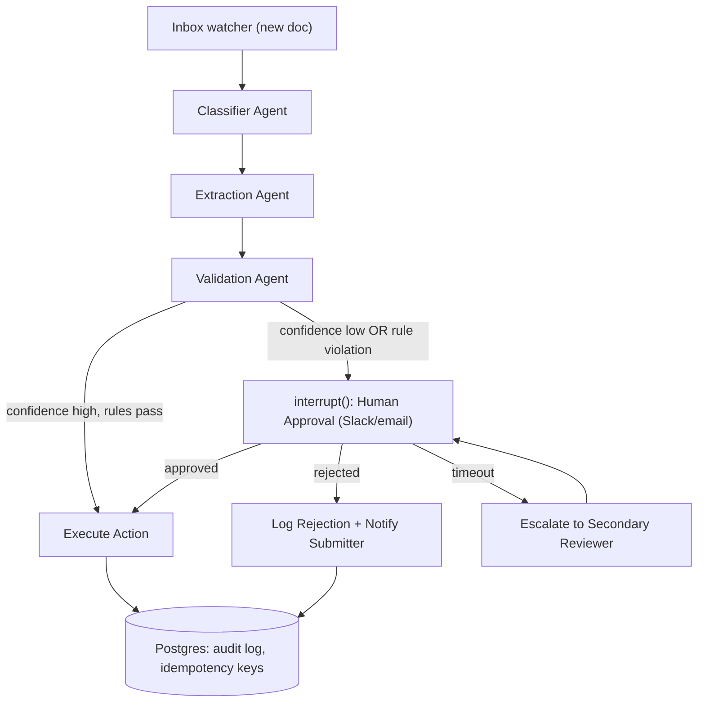

# PLAN.md — Autonomous Document-Processing Pipeline with Human-in-the-Loop

## 1. Objective & Success Criteria

Build a LangGraph state machine that watches an inbox for documents (invoices, claims, contracts), classifies each, extracts structured fields, validates against business rules, and — for anything risky or low-confidence — pauses and asks a human for approval (Slack/email) before executing the resulting action (DB write, reply, ticket). Every action must be idempotent and logged. This is the single most common real-world enterprise agent pattern; the deliverable proves you can build durable, auditable, human-gated automation, not just a demo.

| Metric | Target |
|---|---|
| Extraction accuracy on a 500-document eval set (field-level F1) | ≥95% |
| Documents correctly routed to human review (recall on "should have been flagged") | 100% (false negatives here are the dangerous failure mode) |
| False-positive HITL rate (flagged but shouldn't have been) | <15% (too high = humans stop trusting the queue) |
| End-to-end latency for auto-approved documents | <30s |
| Every executed action has a corresponding audit log row | 100% |
| Duplicate/replayed document produces zero duplicate actions | 100% (idempotency) |

## 2. Architecture



### Agent roster

| Agent | Role | Tools | Reads (state) | Writes (state) |
|---|---|---|---|---|
| Classifier | Determines document type (invoice/claim/contract/other) | LLM w/ structured output | `raw_document` | `doc_type`, `classification_confidence` |
| Extraction | Pulls structured fields per doc type (amount, parties, dates, line items) | LLM w/ Pydantic schema per `doc_type`, OCR tool if scanned | `raw_document`, `doc_type` | `extracted_fields`, `extraction_confidence` |
| Validation | Checks extracted fields against business rules (amount thresholds, required fields present, duplicate detection) | rules engine (plain code, not LLM), duplicate-hash lookup against Postgres | `extracted_fields`, `doc_type` | `validation_result`, `requires_human` |
| Human Approval (interrupt node) | Pauses the graph, notifies a human, resumes on their decision | Slack/email webhook | `extracted_fields`, `validation_result` | `human_decision`, `decision_timestamp` |
| Action Executor | Performs the actual side-effecting action, idempotency-checked | DB write / email send / ticket-create tool | `extracted_fields`, `human_decision` | `action_result`, `idempotency_key` |
| Audit Logger | Writes an immutable record of every state transition | Postgres insert | (reads everything) | (writes to `audit_log` table, not graph state) |

### State schema (pseudocode)

```python
class DocumentState(TypedDict):
    document_id: str                 # stable hash of raw content, used for idempotency
    raw_document: bytes | str
    doc_type: Literal["invoice","claim","contract","other"] | None
    classification_confidence: float
    extracted_fields: dict | None     # schema varies by doc_type, validated via Pydantic per-type model
    extraction_confidence: float
    validation_result: ValidationVerdict | None   # {passed: bool, violations: list[str]}
    requires_human: bool
    human_decision: Literal["approved","rejected", None]
    decision_timestamp: str | None
    action_result: ActionResult | None
    idempotency_key: str
    retry_count: int
```

**Communication pattern:** linear pipeline with one conditional branch (`requires_human`) and one true interrupt point. Use LangGraph's `interrupt()` primitive at the Human Approval node — this suspends graph execution and persists state via a checkpointer; a separate resume call (triggered by the Slack/email webhook callback) supplies `human_decision` and continues the graph. This is fundamentally different from a polling loop — the process can be down for hours and resume exactly where it left off.

## 3. Tech Stack

| Choice | Why | Rejected alternative |
|---|---|---|
| LangGraph `interrupt`/checkpoint | Purpose-built for pause-for-human-then-resume; state survives process restarts | A hand-rolled polling loop against a status column — reinvents what LangGraph already solved, and is easy to get wrong (races, lost updates) |
| Postgres (not Redis) for state + audit log | You need durable, queryable, ACID-compliant history for an audit log — this is the one place in the whole portfolio where "just use Redis" is the wrong call | Redis — fine as a queue/cache, wrong as the system of record for auditability |
| Slack Bot API (Block Kit approval buttons) for human notification | Native "Approve/Reject" buttons, webhook callback is straightforward | Email-only — works but adds friction (parsing free-text replies); keep as a fallback channel, not primary |
| Deterministic rules engine (plain Python, not an LLM call) for Validation | Business rules ("amount > $10k needs approval") must be exact and auditable, not probabilistic | LLM-as-validator — non-deterministic, and you cannot explain to an auditor why a threshold check "felt" different across runs |
| Content-hash based `document_id` | Cheap, deterministic idempotency key that doesn't depend on external doc metadata | UUID per upload — doesn't detect the same document uploaded twice |

## 4. Phase-by-Phase Build Plan

| Phase | Goal | Definition of Done | Est. time |
|---|---|---|---|
| 0 — Setup | Postgres schema (audit_log, idempotency_keys, documents), sample doc set (invoices/claims/contracts, synthetic + a few real redacted samples) | Schema migrated; 20 sample docs loaded | 2–3 days |
| 1 — Classify + Extract | Classifier + Extraction agents on the happy path | 90%+ of the 20 sample docs classified correctly, fields extracted into typed schema | 4–5 days |
| 2 — Validation + Rules | Deterministic rules engine, duplicate detection via content hash | Rule violations correctly flag `requires_human=True`; duplicate resubmission detected | 3–4 days |
| 3 — HITL Interrupt | `interrupt()` node wired to Slack approval buttons, resume webhook | A paused graph can be resumed hours later from a cold process start and reach the same result | 5–7 days |
| 4 — Action + Idempotency | Action executor with idempotency guard; audit logger | Replaying the same `document_id` twice produces one action and two audit rows (one marked "skipped: duplicate") | 3–4 days |
| 5 — Eval | 500-document eval set (mostly synthetic, some real redacted), scored per §6 | Metrics table generated and committed | 4–5 days |
| 6 — Deploy + Escalation | Timeout/escalation path for stale approvals, Docker, FastAPI ingestion endpoint | An approval left untouched for >X hours auto-escalates to a secondary reviewer instead of hanging forever | 3–4 days |
| 7 — Polish | README with architecture diagram, demo video of the approval flow, "Technical Decisions"/"Where it failed" | Recruiter can see the human-approval Slack flow in a 30s clip | 2–3 days |

**Total: ~4–6 weeks part-time.**

## 5. Data & API Requirements

- Synthetic document generator (LLM-generated invoices/claims/contracts with known ground-truth fields) for the bulk of the 500-doc eval set — real documents are hard to source without PII risk; **do not use real customer data**. A handful of publicly available redacted sample invoices/contracts (e.g., government open-data portals) can supplement for realism.
- Slack app + bot token (free workspace) for approval buttons; or SMTP credentials if using email fallback.
- Postgres instance (local Docker container is fine, no cloud dependency required).
- OCR (e.g., an open-source OCR library) only if you choose to support scanned/image documents — optional stretch, not required for MVP.

## 6. Eval Strategy

- **Extraction accuracy:** field-level F1 against ground truth on the synthetic 500-doc set (you control ground truth since you generated it) — this is the one metric you can measure exactly, not via LLM judge.
- **HITL routing correctness:** hand-label a subset (~50 docs) with "should a human have reviewed this" and measure recall (missed reviews are the dangerous failure) and false-positive rate (over-flagging burns reviewer trust) separately — report both, don't average them into one number.
- **Idempotency test:** replay the same document 3x through the pipeline; assert exactly one action executed and audit log shows the other two as no-ops.
- **Latency:** track P50/P95 separately for auto-approved vs. human-approved paths (the second includes human response time, which is not a system metric — report system-processing time only, excluding wait-for-human).

## 7. Risks & Where These Projects Usually Fail

- **The approval queue becomes a black hole** — if timeouts/escalation aren't built, documents wait forever for a reviewer who never sees the Slack message. Build the escalation path in Phase 6, not as an afterthought.
- **Non-idempotent actions** — a network hiccup after "approved" but before "action confirmed" causes a naive retry to double-charge/double-email. The idempotency key must be checked *before* every side-effecting action, not just at ingestion.
- **Confusing "low confidence" with "high risk."** A $12 invoice extracted with 60% confidence and a $2M invoice extracted with 95% confidence need different review policies — validation rules should combine confidence *and* business-impact thresholds, not confidence alone.
- **LLM-based validation instead of rules-based** — teams that let the LLM "decide if this looks OK" lose auditability; a human reviewer or auditor needs to see an exact rule that fired, not a vibe.
- **No audit trail for the human decision itself** — logging only the final action, not who approved it and when, defeats the entire point of a HITL system for compliance purposes.
- **Testing only the happy path** — the interrupt/resume mechanism is the hardest part to get right and the easiest to skip testing; explicitly test "kill the process while a document is paused for approval, then restart and resume."

## 8. Implementation Notes for the Executing Model

- Use LangGraph's checkpointer backed by Postgres (not the in-memory saver) from Phase 3 onward — the in-memory saver will pass your demo but silently fail the "resume after a real process restart" requirement, which is the whole point of this project.
- Design `extracted_fields` as a `Union`/discriminated Pydantic model keyed by `doc_type` — an invoice and a contract have different required fields; don't force one flat schema.
- The Slack "Approve/Reject" webhook handler must validate the Slack request signature before trusting it — this is a real external-facing endpoint, treat it like any other webhook security surface.
- Idempotency key = hash of (document content hash + action type), not just document hash — the same document might legitimately need two different actions over its lifecycle (e.g., re-validated after a correction).
- Don't over-build the rules engine into a full DSL — a plain Python function per doc_type returning a list of violated rule names is sufficient and more auditable than a generic rule-config system nobody will read.
- Escalation timeout should be configurable per document type (a $50 invoice can wait 48h; a time-sensitive claim should escalate in 4h) — don't hardcode one global timeout.

## 9. Definition of Done

- [ ] Classifier → Extraction → Validation → (HITL or auto) → Action → Audit pipeline runs end-to-end.
- [ ] Killing and restarting the process mid-approval correctly resumes.
- [ ] 500-doc eval set run with the metrics table from §6 committed to the README.
- [ ] Idempotency replay test passes.
- [ ] Dockerized, deployed, README complete with architecture diagram + approval-flow demo clip + "Technical Decisions"/"Where it failed" sections.
