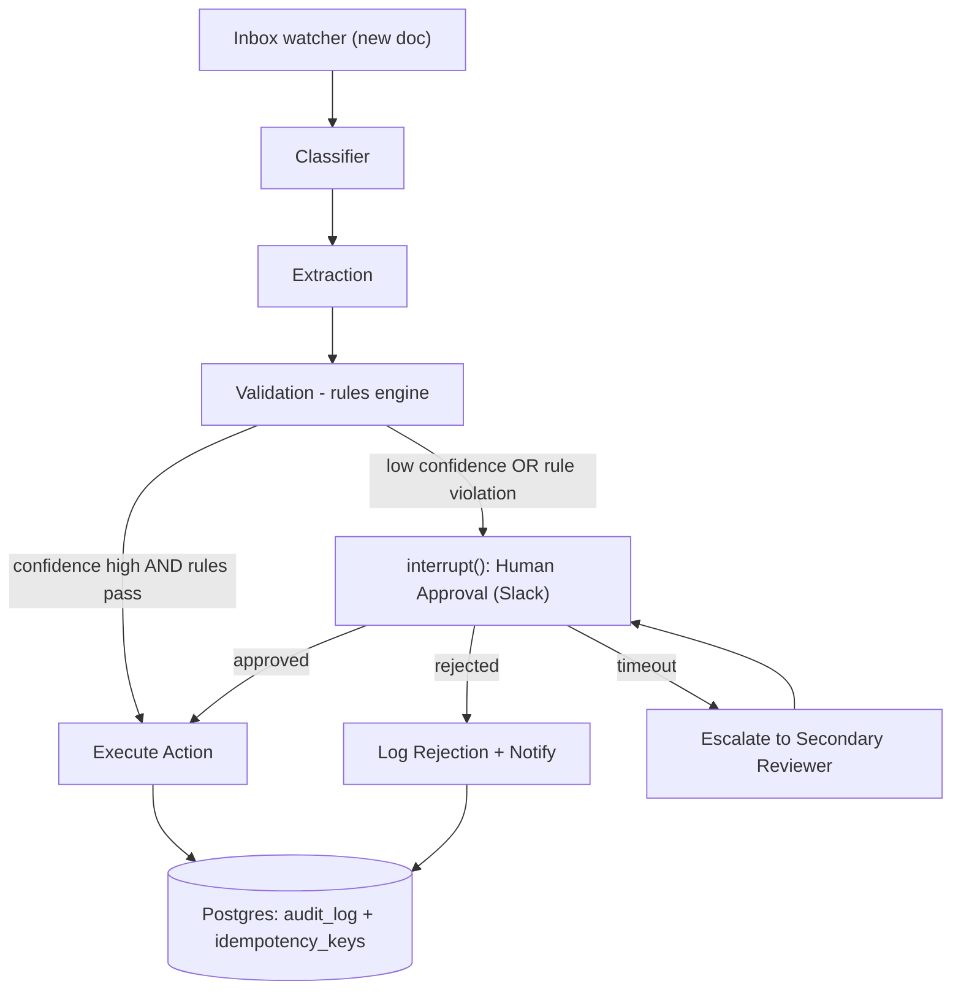

# PLAN.md — Autonomous Document-Processing Pipeline with Human-in-the-Loop

## 1. Objective & Success Criteria

Build a LangGraph state machine that watches an inbox for documents (invoices, claims, contracts), classifies each, extracts structured fields, validates against business rules, and — for anything risky or low-confidence — pauses via `interrupt()` and asks a human for approval (Slack) before executing the resulting action (DB write, reply, ticket). Every action is idempotent and logged. This is the most common real-world enterprise agent pattern; the deliverable proves durable, auditable, human-gated automation.

| Metric | Target | How measured |
|---|---|---|
| Extraction field-level F1 on a 500-doc synthetic eval set | ≥95% | ground truth is generated alongside each doc (§5) |
| HITL routing recall ("should have been flagged" caught) | 100% | hand-labeled 50-doc subset; false negatives are the dangerous failure |
| HITL false-positive rate (flagged but needn't be) | <15% | same subset; too high burns reviewer trust |
| End-to-end latency, auto-approved path | <30s | excludes wait-for-human |
| Executed actions with an audit row | 100% | code-checked against `audit_log` |
| Duplicate/replayed doc → duplicate actions | 0 | idempotency replay test (§6) |

## 2. Architecture



### Agent/component roster

| Component | Role | Tools | Reads | Writes |
|---|---|---|---|---|
| Classifier | Doc type (invoice/claim/contract/other) | LLM structured output | `raw_document` | `doc_type`, `classification_confidence` |
| Extraction | Typed fields per doc type | LLM w/ per-type Pydantic schema; OCR if scanned | `raw_document`, `doc_type` | `extracted_fields`, `extraction_confidence` |
| Validation | Business rules + duplicate detection | deterministic rules engine (code), duplicate-hash lookup | `extracted_fields`, `doc_type` | `validation_result`, `requires_human` |
| Human Approval | Suspends graph, notifies human, resumes on decision | Slack Block Kit + resume webhook | `extracted_fields`, `validation_result` | `human_decision`, `decision_timestamp`, `decided_by` |
| Action Executor | Side-effecting action, idempotency-checked | DB write / email / ticket tool | `extracted_fields`, `human_decision` | `action_result`, `idempotency_key` |
| Audit Logger | Immutable record of every transition | Postgres insert | (reads all) | `audit_log` table |

### State schema (pseudocode)

```python
class InvoiceFields(TypedDict):
    vendor: str; invoice_number: str; amount: float; currency: str
    due_date: str; line_items: list[dict]

class ClaimFields(TypedDict):
    claimant: str; policy_number: str; claim_amount: float
    incident_date: str; claim_type: str

class ContractFields(TypedDict):
    counterparty: str; effective_date: str; term_months: int
    total_value: float; auto_renew: bool; governing_law: str

ExtractedFields = InvoiceFields | ClaimFields | ContractFields   # discriminated by doc_type

class ValidationVerdict(TypedDict):
    passed: bool
    violations: list[str]          # names of rules that fired, e.g. "amount_over_10k"
    risk_score: float              # 0-1, from business impact, NOT confidence

class DocumentState(TypedDict):
    document_id: str               # sha256 of raw content — idempotency root
    raw_document: bytes | str
    doc_type: Literal["invoice","claim","contract","other"] | None
    classification_confidence: float
    extracted_fields: ExtractedFields | None
    extraction_confidence: float
    validation_result: ValidationVerdict | None
    requires_human: bool
    human_decision: Literal["approved","rejected"] | None
    decided_by: str | None
    decision_timestamp: str | None
    action_result: dict | None
    idempotency_key: str
    retry_count: int
```

### Where `extraction_confidence` actually comes from (the gap Sonnet left open)

LLM self-reported confidence ("I'm 90% sure") is **not** trustworthy. Decision: compute confidence by **self-consistency** — run extraction 3× at temp 0.4, and set `extraction_confidence` = fraction of the 3 runs that agree on each critical field (amount, counterparty, dates), averaged. Fields that disagree across runs are the low-confidence ones and drive `requires_human`. This is cheap (3 short calls) and grounded in observed disagreement, not the model's opinion of itself. (Alternative if your provider exposes logprobs: mean top-token logprob over extracted field spans. Pick self-consistency for portability.)

### Business-rules starter catalog (deterministic, code — not LLM)

| Doc type | Rule (fires → `requires_human`) | Threshold |
|---|---|---|
| invoice | `amount_over_threshold` | amount > $10,000 |
| invoice | `unknown_vendor` | vendor not in approved-vendor table |
| invoice | `duplicate_invoice_number` | (vendor, invoice_number) seen before |
| claim | `high_value_claim` | claim_amount > $5,000 |
| claim | `stale_incident` | incident_date > 90 days before submission |
| contract | `auto_renew_present` | auto_renew == True |
| contract | `high_value_or_long_term` | total_value > $50k OR term_months > 24 |
| any | `low_extraction_confidence` | extraction_confidence < 0.8 |

`risk_score` is a separate axis from confidence: a $12 invoice at 60% confidence is low risk; a $2M invoice at 95% is high risk. Route to human on `risk_score` **combined with** confidence, never confidence alone.

### DB schema (DDL sketch)

```sql
CREATE TABLE idempotency_keys (
  idempotency_key TEXT PRIMARY KEY,   -- sha256(document_id + action_type)
  action_result   JSONB NOT NULL,
  created_at      TIMESTAMPTZ DEFAULT now()
);
CREATE TABLE audit_log (
  id             BIGSERIAL PRIMARY KEY,
  document_id    TEXT NOT NULL,
  transition     TEXT NOT NULL,        -- 'classified','extracted','validated','approved','executed','skipped_duplicate',...
  payload        JSONB,                -- NEVER stores raw PII beyond what's needed
  decided_by     TEXT,
  created_at     TIMESTAMPTZ DEFAULT now()
);
```

**Communication pattern.** Linear pipeline, one conditional branch (`requires_human`), one true interrupt. Use LangGraph `interrupt()` at the Human Approval node — it suspends and persists state via the **Postgres** checkpointer; a separate resume call (triggered by the Slack webhook) supplies `human_decision` and continues. The process can be down for hours and resume exactly where it left off — fundamentally different from a polling loop.

## 3. Tech Stack

| Choice | Why | Rejected |
|---|---|---|
| LangGraph `interrupt`/checkpoint | Purpose-built pause-for-human-then-resume; survives restarts | Hand-rolled status-column polling — racy, reinvents this |
| Postgres (not Redis) for state + audit | Durable, queryable, ACID audit trail | Redis — fine as cache/queue, wrong as system-of-record |
| Slack Block Kit approval buttons | Native Approve/Reject, clean webhook callback | Email-only — free-text reply parsing; keep as fallback |
| Deterministic rules engine (plain Python) | Exact, auditable ("amount>$10k fired") | LLM validator — non-deterministic, unexplainable to an auditor |
| Content-hash `document_id` | Cheap deterministic idempotency root | UUID per upload — misses the same doc uploaded twice |
| Self-consistency confidence | Grounded in observed disagreement | LLM self-reported confidence — a known trap |

## 4. Phase-by-Phase Build Plan

| Phase | Goal | Definition of Done | Tests | Est. |
|---|---|---|---|---|
| 0 — Setup | Postgres schema, 20 sample docs (synthetic + a few redacted) | Schema migrated; docs loaded | schema migration test | 2–3 d |
| 1 — Classify + Extract | Classifier + Extraction happy path w/ self-consistency confidence | 90%+ of 20 docs classified, typed fields extracted | per-type extraction unit tests | 4–5 d |
| 2 — Validation | Rules engine + duplicate detection | Violations flag `requires_human`; duplicate detected | rule-catalog unit tests, each rule fires/doesn't | 3–4 d |
| 3 — HITL Interrupt | `interrupt()` + Slack buttons + resume webhook | **Kill the process mid-approval, restart, resume to same result** | process-restart resume test | 5–7 d |
| 4 — Action + Idempotency | Executor with idempotency guard; audit logger | Replaying `document_id` twice → 1 action, 2 audit rows (one `skipped_duplicate`) | idempotency replay + concurrency test | 3–4 d |
| 5 — Eval | 500-doc set scored per §6 | Metrics table committed | F1 harness | 4–5 d |
| 6 — Deploy + Escalation | Timeout/escalation, Docker, ingestion endpoint | Untouched approval >X h auto-escalates | escalation-timer test | 3–4 d |
| 7 — Polish | README (diagram, 30s approval-flow clip, decisions/failures) | Recruiter sees the Slack approval in a clip | — | 2–3 d |

**Total: ~4–6 weeks part-time.**

## 5. Data & API Requirements

- **Synthetic generator** for the 500-doc set: prompt an LLM to emit *both* a realistic document *and* its ground-truth field JSON, varying vendor/amount/date distributions and injecting ~10% edge cases (missing field, ambiguous amount, duplicate number). Cost ≈ 500 × ~1.5k tok ≈ a few dollars. Supplement with a handful of publicly redacted samples for realism. **Never use real customer PII.**
- Slack app + bot token (free workspace) for approval; SMTP fallback.
- Postgres (local Docker).
- OCR: **recommendation** — skip for MVP (generate text-native synthetic docs); add Tesseract only as a stretch for scanned images.

## 6. Eval Strategy

- **Extraction F1:** field-level against generated ground truth (exact — you control it).
- **HITL routing:** hand-label ~50 docs with "should a human review this"; report recall (missed reviews = dangerous) and false-positive rate **separately** — never averaged.
- **Idempotency:** replay one document 3× → assert exactly one action, two audit rows marked no-op. Add a **concurrency** variant: fire two identical requests simultaneously and assert one action (tests the atomic constraint, not just sequential replay).
- **Latency:** P50/P95 for auto-approved vs. human-approved paths separately; report system-processing time only (exclude wait-for-human).

## 7. Risks & Where These Projects Usually Fail

- **Approval black hole** — no timeout/escalation → docs wait forever. Build escalation in Phase 6, not as an afterthought.
- **Non-idempotent actions** — a crash after "approved" before "confirmed" → naive retry double-charges. Check the idempotency key **before** every side effect, atomically (DB unique constraint, not check-then-act).
- **Confidence ≠ risk** — combine both; don't rubber-stamp high-confidence high-stakes actions.
- **LLM-as-validator** — loses auditability; a reviewer needs the exact rule that fired.
- **No audit of the decision itself** — log who approved and when, not just the final action.
- **Happy-path-only testing** — the interrupt/resume mechanism is the hardest part and easiest to skip; test "kill process while paused, restart, resume".

## 8. Implementation Notes for the Executing Model

- **Postgres checkpointer from Phase 3**, never the in-memory saver — the in-memory one passes the demo but silently fails the restart-resume requirement, which is the whole point.
- `extracted_fields` is a **discriminated union keyed by `doc_type`** — don't force one flat schema across invoice/claim/contract.
- **Verify the Slack request signature** before trusting the webhook — it's a real external endpoint.
- **Idempotency key = `sha256(document_id + action_type)`** — the same doc may legitimately need two different actions over its lifecycle.
- **Resume mapping:** the LangGraph `thread_id` is the `document_id`; the Slack message carries `document_id` in its `block_id`/`value`, so the webhook resumes the exact thread. Sketch the approval Block Kit payload: a section with the extracted summary + two buttons `{action_id: "approve"|"reject", value: document_id}`.
- **Don't over-build the rules engine** into a DSL — one plain Python function per doc_type returning a list of violated rule names is more auditable.
- **Escalation timeout is per doc type** (config): a $50 invoice waits 48h; a time-sensitive claim escalates in 4h.
- **Confidence:** implement the 3-run self-consistency described in §2; store per-field agreement so `low_extraction_confidence` fires on the specific weak fields.

## 9. Definition of Done

- [ ] Classify → Extract → Validate → (HITL or auto) → Action → Audit runs end-to-end.
- [ ] Kill + restart mid-approval resumes correctly.
- [ ] 500-doc eval with the §6 metrics table in the README.
- [ ] Idempotency replay **and** concurrency tests pass.
- [ ] Dockerized, deployed, README with diagram + approval-flow clip + decisions/failures.

## 10. Localization (India-first)

**Deep-localized** — this project becomes markedly more useful for Indian back-offices, and adds a genuinely important learning topic (the DPDP Act) **without removing any HITL/durable-execution content**.

**What changed (document types, rules, regulatory context — not architecture):**
- **Document types:** invoices → **GST tax invoices** (GSTIN, HSN/SAC codes, CGST/SGST/IGST split, place-of-supply, reverse-charge flag); claims → **Indian insurance claims** (IRDAI-regulated, policy/claim numbers, cashless vs reimbursement); contracts stay but add **KYC documents** (PAN, Aadhaar, bank proof) as a fourth type — the exact docs Indian fintechs (Razorpay, Zerodha onboarding, PhonePe merchant KYC) process at scale.
- **Per-doc-type extraction schemas:** localized fields — `InvoiceFields` gains `gstin, hsn_sac, cgst, sgst, igst, place_of_supply`; new `KYCFields{pan, aadhaar_masked, name, dob, address}`.
- **Business-rules catalog (deterministic, unchanged mechanism):** add India rules — `gstin_checksum_invalid` (GSTIN has a verifiable check digit — a great deterministic-rule example), `igst_cgst_sgst_mismatch` (tax split must reconcile to the total), `pan_format_invalid` (`[A-Z]{5}[0-9]{4}[A-Z]`), `high_value_over_2L` (₹2 lakh threshold, echoing PMLA reporting norms). These *strengthen* the "deterministic rules, not an LLM" lesson with checkable Indian formats.
- **Regulatory context:** SEC/FDA framing → **SEBI/RBI/IRDAI/GSTN**; amounts in ₹ lakh/crore.

**New learning topic — the DPDP Act 2023 (added, nothing removed):** KYC docs contain Aadhaar/PAN — **personal data** under India's Digital Personal Data Protection Act. This makes HITL and audit *more* important, not less: teach **data minimization** (store masked Aadhaar — last 4 digits — never the full number), **purpose limitation**, **consent/audit trail** (the `audit_log` now doubles as a DPDP processing record), and why the approval gate is also a compliance control. This is a real, hireable Indian-market skill (every regulated fintech needs it) layered *on top of* the durable-execution curriculum. Cross-reference Project 11's PII redaction for Aadhaar/PAN masking.

**What stayed global (unchanged):** LangGraph `interrupt()` durable execution, idempotency, the deterministic rules engine, confidence-vs-risk routing, escalation, the Postgres audit log, the kill-mid-approval resume test — every architecture pattern and learning objective is intact. Synthetic data stays synthetic (never real Aadhaar/PAN — generate format-valid fakes, which the DPDP topic makes doubly important).

**Trade-off recorded:** GST/KYC add domain complexity (checksum validation, masking) that slightly enlarges the extraction/rules surface — but it *reinforces* the deterministic-validation lesson rather than diluting it, and the DPDP layer is exactly the kind of compliance-aware HITL that Indian enterprise roles test for.
