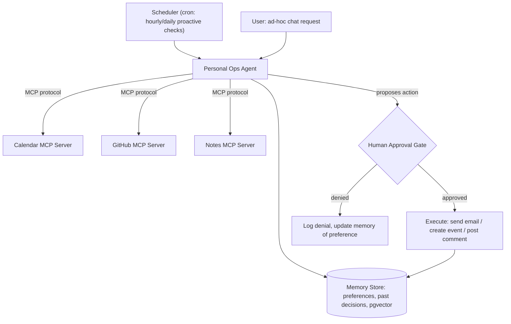

# PLAN.md — MCP-Native Personal Ops Agent

## 1. Objective & Success Criteria

Build a persistent personal assistant that connects to your real tools exclusively via **MCP servers you write yourself** (calendar, GitHub, notes, job boards), maintains long-term memory of preferences and past decisions, runs scheduled proactive checks ("3 PRs need review, interview tomorrow"), and requires explicit approval before sending anything externally-visible (email, Slack message, calendar invite). The point is not "an agent with tools" — it's "an agent whose tools are standards-compliant MCP servers you authored," which is the differentiator.

| Metric | Target |
|---|---|
| MCP servers authored (calendar, GitHub, notes — minimum) | 3, each passing MCP Inspector's compliance checks |
| Proactive check false-positive rate (nags you about nothing) over a 2-week trial | <10% of notifications |
| Actions sent without approval | 0 (every externally-visible action is approval-gated, no exceptions) |
| Memory recall accuracy (does it correctly recall a stated preference from >1 week ago) | ≥90% on a 20-question self-test |
| Daily proactive check run cost | <$0.10/day |

## 2. Architecture



### Components

| Component | Role | Protocol/Tooling | Reads | Writes |
|---|---|---|---|---|
| Calendar MCP Server | Exposes `list_events`, `create_event`, `find_free_slots` as MCP tools | MCP server (Python SDK), wraps a real calendar API (Google Calendar API or a local `.ics`-backed stub for a no-OAuth demo) | calendar backend | calendar backend |
| GitHub MCP Server | Exposes `list_open_prs_for_review`, `list_my_issues`, `comment_on_pr` as MCP tools | MCP server, wraps GitHub REST API | GitHub API | GitHub API |
| Notes MCP Server | Exposes `search_notes`, `add_note`, `get_note` over a local note store | MCP server, wraps a local Markdown-file or SQLite-backed store | local notes | local notes |
| Personal Ops Agent | The single LLM-driven agent that discovers and calls the above MCP servers as tools, reasons over the daily digest, and proposes actions | Claude/OpenAI SDK w/ MCP client, LangGraph for the proactive-check loop | `memory`, MCP tool results | proposed actions, `memory` updates |
| Memory Store | Long-term preferences ("I don't want reminders after 6pm") and a log of past approved/denied actions | pgvector or SQLite+embeddings | agent queries at start of every run | agent writes after every user interaction or approval decision |
| Approval Gate | Same HITL principle as Project 02, applied to personal-scale actions | Slack DM or terminal prompt (simpler than Project 02's Slack Block Kit, since this is single-user) | proposed action | `human_decision` |
| Scheduler | Triggers the proactive-check flow on a cadence | plain cron / APScheduler | — | invokes Agent |

### State schema (pseudocode)

```python
class MemoryEntry(TypedDict):
    entry_id: str
    kind: Literal["preference","past_decision","fact"]
    content: str
    embedding: list[float]
    created_at: str

class ProposedAction(TypedDict):
    action_type: Literal["send_email","create_event","post_pr_comment","other"]
    payload: dict
    rationale: str
    requires_approval: bool   # always True for anything externally-visible — not actually optional

class ProactiveCheckState(TypedDict):
    digest_items: list[str]        # e.g. "3 PRs need review", "interview tomorrow 2pm"
    relevant_memories: list[MemoryEntry]
    proposed_actions: list[ProposedAction]
    human_decisions: list[Literal["approved","denied"]]
```

**Communication pattern:** the agent is an MCP **client**; each capability (calendar/GitHub/notes) is a separate MCP **server** process, discovered and called over the Model Context Protocol (JSON-RPC over stdio or HTTP+SSE depending on transport). This is architecturally different from Projects 01–03: instead of LangGraph nodes sharing one state object, each tool provider is an independently runnable, independently testable process that speaks a standard protocol — the agent could be swapped for a totally different client (e.g., Claude Desktop) and the same MCP servers would still work unmodified.

## 3. Tech Stack

| Choice | Why | Rejected alternative |
|---|---|---|
| Official MCP Python SDK for servers | Standards-compliant by construction; MCP Inspector can validate it | Hand-rolled JSON-RPC — reinvents a spec that already exists and risks non-compliance |
| stdio transport for local servers, HTTP+SSE if you containerize | stdio is simplest for locally-run personal tools; HTTP+SSE if you want the servers reachable from a deployed agent | Only ever using stdio — fine for this project, but document the HTTP option since Project 09 (MCP Server Trilogy) requires it |
| pgvector (or SQLite + a small embedding lib) for memory | Needs semantic recall ("did I say anything about not wanting Friday meetings"), not just exact match | Plain keyword search — will miss paraphrased preferences |
| APScheduler or plain cron for proactive checks | Simple, no extra infra | A message queue / event bus — over-engineered for a single-user personal agent |
| Google Calendar API OR a local `.ics` stub | Real Calendar API needs OAuth setup, which is extra friction for a demo; document both paths, recommend starting with the local stub and upgrading to real OAuth once the MCP server logic works | Only supporting the real API — blocks a fast Phase 1 |

## 4. Phase-by-Phase Build Plan

| Phase | Goal | Definition of Done | Est. time |
|---|---|---|---|
| 0 — Setup | MCP Python SDK installed, MCP Inspector working, decide calendar backend (stub vs. real OAuth) | Inspector can connect to a "hello world" MCP server you wrote | 2 days |
| 1 — Notes MCP Server | Simplest server first — local file/SQLite notes with `search_notes`/`add_note` | Inspector shows all tools/resources correctly typed; a manual call round-trips | 2–3 days |
| 2 — GitHub MCP Server | Wraps GitHub REST API for PR/issue queries and comment posting | Same Inspector validation; a real query against your own GitHub account returns real PRs | 3–4 days |
| 3 — Calendar MCP Server | Wraps calendar backend for event listing/creation/free-slot finding | Same validation; can list today's events and propose a free slot | 3–4 days |
| 4 — Agent + Memory | Personal Ops Agent as an MCP client calling all 3 servers, with pgvector memory | Ad-hoc chat query ("what do I have going on today") correctly pulls from all 3 servers | 4–5 days |
| 5 — Proactive checks + Approval | Scheduler triggers a daily digest; agent proposes actions; approval gate blocks execution until you respond | Running for a real week produces a daily digest with ≤10% false-positive nags, and zero unapproved sends | 4–5 days |
| 6 — Publish + Polish | Package one MCP server for public reuse (e.g., the Notes server), README, demo | One MCP server has its own standalone README and is installable independently of the rest of the project | 2–3 days |

**Total: ~3–4 weeks part-time.**

## 5. Data & API Requirements

- GitHub personal access token (read PRs/issues, write comments) — scope it minimally (repo read + PR comment, not admin).
- Google Calendar API credentials (OAuth) if using the real backend; otherwise a local `.ics` file is sufficient for the demo and avoids OAuth setup entirely.
- No special dataset — your own notes/calendar/GitHub activity *is* the data, which also makes this the most personally useful project in the portfolio.
- LLM cost: proactive daily check ≈ a few thousand tokens/day, well under $0.10/day; ad-hoc chat usage variable but low.

## 6. Eval Strategy

- **MCP compliance:** run MCP Inspector against each of the 3 servers; all tool/resource schemas must validate with no errors.
- **Memory recall self-test:** write 20 preference statements into memory over a week of real use, then 1+ week later ask the agent 20 recall questions; score exact/paraphrase-correct recall ≥90%.
- **Proactive-check precision:** log every notification for 2 weeks of real use; retrospectively mark each as useful/noise; false-positive rate <10%.
- **Approval-gate integrity:** code-review (not LLM-judged) check that every `action_type` in `ProposedAction` routes through the Approval Gate before execution — this should be enforced structurally (the execution function should be unreachable without a decision object), not just tested by observation.

## 7. Risks & Where These Projects Usually Fail

- **Building "just a wrapper," not an MCP server.** If your "MCP server" is actually just a Python function called directly by your agent code, you haven't built what this project is about — it must be a separate process speaking the MCP protocol, connectable from any MCP client (test this by connecting MCP Inspector to it, not just your own agent).
- **OAuth setup swallowing the whole timebox.** Real Calendar/GitHub OAuth flows are fiddly; start with a stub/local backend and get the MCP mechanics right first, then swap in the real API — don't let Phase 0 become Phase 0-through-2.
- **No approval gate on "the small stuff."** It's tempting to auto-send innocuous-looking things ("just a calendar invite") — but the whole pitch of this portfolio is that consequential actions are gated; keep the rule absolute (all externally-visible actions gated), and let false-positive rate (§6) be the metric you tune instead of loosening the gate.
- **Memory that's just a chat log, not structured preferences.** Dumping the whole conversation history into the prompt every time isn't "long-term memory" and won't scale or generalize; extract and store discrete preference/fact entries with embeddings, as in the schema above.
- **Proactive checks that nag constantly and get ignored.** If false-positive rate isn't tracked and tuned, you'll produce a notification firehose indistinguishable from a naive polling script — defeats the "agentic" pitch entirely.

## 8. Implementation Notes for the Executing Model

- Build and validate each MCP server **completely independently** of the agent, using MCP Inspector, before writing any agent code that calls it — this catches protocol-compliance bugs early and keeps the servers genuinely reusable.
- Use MCP's `resources` (not just `tools`) for read-only data like "today's calendar" if it fits the resource model better than a tool call — this is a distinction the MCP spec makes deliberately; don't force everything into `tools`.
- Version each MCP server's `requirements.txt`/`pyproject.toml` independently — since the pitch is "one of these is a standalone, publishable package," it shouldn't secretly depend on the personal-ops-agent's own dependencies.
- For the proactive-check scheduler, make the check idempotent per day (don't re-notify about the same PR twice in one day if the cron fires more than once) — reuse the idempotency-key idea from Project 02 if you've built that first.
- Keep the approval channel dead simple (a terminal prompt or a single Slack DM) — this is a single-user project; don't rebuild Project 02's multi-reviewer Slack Block Kit flow here, that's solving a problem you don't have.

## 9. Definition of Done

- [ ] 3 MCP servers built, each independently passing MCP Inspector validation.
- [ ] Agent successfully calls all 3 as an MCP client for both ad-hoc chat and scheduled proactive checks.
- [ ] 2-week real-use trial logged with false-positive rate reported.
- [ ] Memory recall self-test run with accuracy reported.
- [ ] At least one MCP server packaged with its own README as a standalone, publishable artifact.
