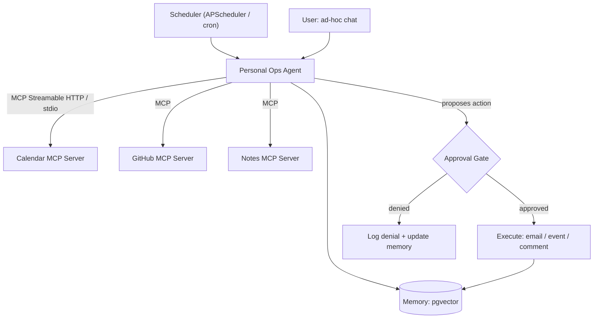

# PLAN.md — MCP-Native Personal Ops Agent

## 1. Objective & Success Criteria

Build a persistent personal assistant that connects to real tools exclusively via **MCP servers you write yourself** (calendar, GitHub, notes), maintains long-term memory of preferences and past decisions, runs scheduled proactive checks ("3 PRs need review, interview tomorrow"), and requires explicit approval before any externally-visible action. The differentiator is not "an agent with tools" — it's "an agent whose tools are standards-compliant MCP servers you authored." (Project 09 goes deeper into pure authoring + publishing; this project pairs authoring with being your own first consumer.)

| Metric | Target | How measured |
|---|---|---|
| MCP servers authored, Inspector-clean | 3 (calendar, GitHub, notes) | MCP Inspector, 0 schema errors each |
| Proactive-check false-positive rate | <10% of notifications over a 2-week trial (or a replayed 2-week fixture) | logged + retro-labeled |
| Actions sent without approval | 0 | structural enforcement (§8), code-checked |
| Memory recall accuracy | ≥90% on a 20-question self-test | §6 |
| Daily proactive-check cost | <$0.10/day | token accounting |

## 2. Architecture



### Components + tool interface contracts

| Server | Tools (typed) | Resources | Backing |
|---|---|---|---|
| Calendar | `list_events(day: str) -> list[Event]`, `create_event(title,start,end) -> Event`, `find_free_slots(day, duration_min) -> list[Slot]` | `today` (read-only) | Google Calendar API **or** local `.ics` stub |
| GitHub | `list_open_prs_for_review() -> list[PR]`, `list_my_issues() -> list[Issue]`, `comment_on_pr(repo,num,body) -> Comment` | `review_queue` | GitHub REST |
| Notes | `search_notes(query, k=5) -> list[Note]`, `add_note(text) -> Note`, `get_note(id) -> Note` | `note_index` | SQLite + embeddings |

`find_free_slots` is a real algorithm, not a stub: fetch the day's events, sort by start, compute gaps between consecutive events within working hours (configurable, default 09:00–18:00), and return gaps ≥ `duration_min`. Handle the boundary gaps (before first event, after last).

### Long-term memory design (the gap Sonnet left shallow)

```python
class MemoryEntry(TypedDict):
    entry_id: str
    kind: Literal["preference","past_decision","fact"]
    content: str
    embedding: list[float]
    created_at: str
    superseded_by: str | None    # id of a later entry that overrides this
    salience: float              # decays over time unless reinforced
```
Policies:
- **Write:** after each user interaction, a small extraction call proposes 0–N candidate memories ("The user said they don't want reminders after 6pm" → a `preference`). Only write if it's not a near-duplicate of an existing entry (cosine > 0.9 against retrieved neighbors).
- **Consolidate/supersede:** on write, if the new entry contradicts an existing one (e.g., "I do want evening reminders now"), set the old entry's `superseded_by` rather than deleting — auditable history. Retrieval ignores superseded entries.
- **Retrieve:** at the start of every run, semantic-search the top-k relevant, non-superseded entries by the current context.
- **Forget/decay:** `salience` decays with age; reinforced when re-referenced. Low-salience, old, non-preference facts can be pruned.

### Approval gate — structural enforcement (Sonnet stated the goal, not the mechanism)

```python
class ApprovedAction:            # only constructible via the gate
    def __init__(self, action, decision_token): ...

def execute(action: ApprovedAction): ...   # signature requires an ApprovedAction

# The agent proposes a ProposedAction; execute() cannot be called with one.
# The only path to an ApprovedAction is gate.approve(proposal, human_decision),
# which returns one iff human_decision == "approved". Unapproved actions are
# unrepresentable at the type level, not merely discouraged.
```

**Communication pattern.** The agent is an MCP **client**; each capability is a separate MCP **server** process, discovered and called over MCP (JSON-RPC; **stdio** locally, **Streamable HTTP** remotely — *not* the deprecated HTTP+SSE). Any MCP client (e.g., Claude Desktop) could use the same servers unmodified — that's the point.

## 3. Tech Stack

| Choice | Why | Rejected |
|---|---|---|
| Official MCP Python SDK (FastMCP) | Standards-compliant by construction; Inspector-validatable | Hand-rolled JSON-RPC — risks non-compliance |
| stdio local / Streamable HTTP remote | stdio simplest for local tools; Streamable HTTP is the current remote transport | HTTP+SSE — **deprecated** in the 2025 spec revision |
| pgvector for memory | Semantic recall of paraphrased preferences | Keyword search — misses paraphrases |
| APScheduler / cron | Simple, no extra infra | Message queue — over-engineered for single-user |
| Calendar `.ics` stub → real OAuth later | Get MCP mechanics right before OAuth friction | Real API first — blocks a fast Phase 1 |

## 4. Phase-by-Phase Build Plan

| Phase | Goal | Definition of Done | Est. |
|---|---|---|---|
| 0 — Setup | SDK + Inspector; pick calendar backend | Inspector connects to a hello-world server | 2 d |
| 1 — Notes server | Simplest server first | Inspector clean; a manual call round-trips | 2–3 d |
| 2 — GitHub server | Wraps GitHub REST | Real query returns your real PRs; Inspector clean | 3–4 d |
| 3 — Calendar server | Event listing/creation/`find_free_slots` | Lists today; proposes a free slot; Inspector clean | 3–4 d |
| 4 — Agent + Memory | MCP client calling all 3 + pgvector memory w/ policies | "What's going on today" pulls from all 3; memory write/supersede works | 4–5 d |
| 5 — Proactive + Approval | Scheduler daily digest; structural approval gate | 2-week (or replayed) trial: ≤10% FP nags, 0 unapproved sends | 4–5 d |
| 6 — Publish + Polish | Package one server standalone; README | Notes server installs independently | 2–3 d |

**Total: ~3–4 weeks part-time.**

## 5. Data & API Requirements

- GitHub fine-grained PAT (repo read + PR comment only — minimal scope).
- Google Calendar OAuth **or** a local `.ics` (recommended start).
- Your own notes/calendar/GitHub activity is the data.
- Cost: proactive check ≈ a few k tokens/day, well under $0.10.

## 6. Eval Strategy

- **MCP compliance:** Inspector on all 3 servers, 0 errors.
- **Memory recall:** write 20 preference statements over a week (or seed a fixture), then ≥1 week later ask 20 recall questions; score ≥90% (exact or paraphrase-correct).
- **Proactive precision:** log every notification for 2 weeks (or replay a fixture of PR/calendar states), retro-label useful/noise, FP <10%.
- **Approval integrity:** code-check that `execute()` is unreachable without an `ApprovedAction` — structural, not observational.

## 7. Risks & Where These Projects Usually Fail

- **"Just a wrapper," not an MCP server** — must be a separate process any MCP client can connect to; test with Inspector, not only your own agent.
- **OAuth eating the timebox** — stub first, real API after mechanics work.
- **Under-gating "small" actions** — keep the rule absolute; tune the FP rate, don't loosen the gate.
- **Memory as a chat log** — extract discrete entries with embeddings + supersede policy, don't dump transcripts.
- **Notification firehose** — track and tune FP or it's indistinguishable from a polling script.

## 8. Implementation Notes for the Executing Model

- Build + Inspector-validate each server **independently** before any agent code — catches compliance bugs early, keeps servers reusable.
- Use MCP **resources** for read-only data ("today's calendar") and **tools** for actions — don't force everything into tools.
- Version each server's `pyproject.toml` independently — the publishable one must not depend on the agent's deps.
- Idempotent proactive checks per day — don't re-notify about the same PR twice if cron double-fires (reuse Project 02's idempotency-key idea).
- Keep the approval channel dead simple (terminal prompt or one Slack DM) — single-user; don't rebuild Project 02's multi-reviewer flow.
- **Structural gate:** implement the `ApprovedAction` type described in §2 — the eval literally checks the execute path is unreachable otherwise.

## 9. Definition of Done

- [ ] 3 MCP servers, each Inspector-clean, using Streamable HTTP or stdio.
- [ ] Agent calls all 3 as a client for chat + scheduled checks.
- [ ] 2-week (or replayed) trial logged with FP rate.
- [ ] Memory recall self-test reported; supersede policy demonstrated.
- [ ] One server packaged standalone with its own README.

## 10. Localization (India-first)

**Deep-localized** — this is the most personally useful project to localize, and every MCP/HITL/memory concept survives unchanged. Only the tools' data sources and the scheduling/formatting context are Indian.

**What changed (tool data + context — not architecture):**
- **Calendar/scheduling:** default timezone **IST (Asia/Kolkata)**; `find_free_slots` respects Indian working hours and the **Indian holiday calendar** (national + regional); the calendar MCP server exposes an `india_holidays` resource. (The `find_free_slots` interval algorithm is unchanged — only the working-hours/holiday config is Indian.)
- **GitHub server:** unchanged (code is global) — but the "proactive digest" can prioritize IST-friendly review windows.
- **Notes/jobs context:** the proactive checks add **Indian job-board signals** (Naukri, Instahyre, LinkedIn India, Wellfound India) alongside GitHub PRs — useful for an India-based engineer's daily digest.
- **New optional MCP server — UPI-style expense tracker:** a fourth MCP server wrapping a local expense ledger with **UPI-transaction-style entries** (payee VPA, amount in ₹, category), demonstrating the same authoring pattern on an India-relevant domain. Reads only a local CSV/SQLite the user maintains — **no real bank/UPI integration, no PII** (this is a learning tool; connecting to a real Account Aggregator / UPI is explicitly out of scope and would trigger RBI/NPCI compliance).
- **Formatting:** ₹, IST timestamps, DD-MM-YYYY dates.

**What stayed global (unchanged):** MCP authoring vs. consumption, Streamable HTTP transport, MCP Inspector compliance, the structural approval gate, the memory-lite store and its supersede policy, proactive scheduling. Every learning objective intact.

**Trade-off recorded:** the UPI expense server is optional; if you'd rather keep the trilogy identical to the original (calendar/GitHub/notes), do so — the localization is additive, not a swap. The IST/holiday context, by contrast, is a strict improvement for an India-based user with zero curriculum cost.
