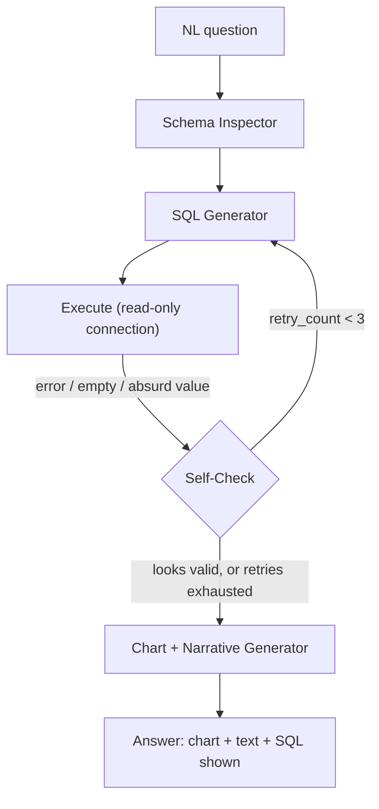

# PLAN.md — Self-Healing SQL Analytics Agent

## 1. Objective & Success Criteria

Build an agent that takes a natural-language question, inspects a database schema, writes SQL, executes it, checks its own results for errors/emptiness/absurd values, and — within a bounded retry budget — fixes its own query before generating a chart and narrative answer. Report accuracy on a Spider-benchmark subset so the resume claim is a number, not an adjective.

| Metric | Target |
|---|---|
| Execution accuracy on a 100-question Spider-benchmark subset | ≥70% (Spider is intentionally hard; report the number honestly even if it's not near-100%) |
| Self-healing success rate (fraction of initially-failing queries fixed within retry budget) | ≥60% |
| Retry budget | max 3 attempts per question, hard cap |
| P95 latency per question (including retries) | <20s |
| Queries that execute a destructive statement (`DROP`/`DELETE`/`UPDATE` on a read-only analytics task) | 0 — must be structurally impossible, not just prompted against |

## 2. Architecture



### Agent roster

| Agent | Role | Tools | Reads | Writes |
|---|---|---|---|---|
| Schema Inspector | Loads table/column names, types, foreign keys, and a few sample rows | DB introspection query (not LLM) | `db_connection` | `schema_context` |
| SQL Generator | Writes SQL given the question, schema, and (on retry) prior error/feedback | LLM w/ schema context in prompt | `question`, `schema_context`, `prior_feedback` | `sql_query` |
| Executor | Runs the query against a **read-only** DB role/connection | DB driver | `sql_query` | `result_rows`, `execution_error` |
| Self-Check | Deterministic + lightweight-LLM checks: did it error, is the result empty when it plausibly shouldn't be, are values absurd (negative counts, dates outside data range) | rule checks (code) + optional LLM sanity pass | `result_rows`, `execution_error`, `question` | `check_verdict`, `retry_count` |
| Narrative Generator | Produces a chart spec + plain-language answer from the final result set | LLM | `result_rows`, `question` | `chart_spec`, `narrative` |

### State schema (pseudocode)

```python
class SQLAgentState(TypedDict):
    question: str
    schema_context: str            # cached per DB, not regenerated per question
    sql_query: str | None
    prior_feedback: str | None      # populated only on retry, from the failed attempt
    result_rows: list[dict] | None
    execution_error: str | None
    check_verdict: Literal["ok","retry","exhausted"]
    retry_count: int
    chart_spec: dict | None
    narrative: str | None
```

**Communication pattern:** linear pipeline with one bounded retry loop (Self-Check → SQL Generator). This is deliberately the simplest orchestration pattern in the portfolio — the interesting engineering is in the self-check logic and the read-only safety boundary, not in agent-to-agent choreography.

## 3. Tech Stack

| Choice | Why | Rejected alternative |
|---|---|---|
| LangGraph for the generate→execute→check→retry cycle | A small bounded loop is exactly what LangGraph's conditional edges are for | Plain Python while-loop — works, but you lose checkpointing/tracing for free; fine as a fallback if you want to keep this project minimal |
| A dedicated **read-only** DB role/connection string | Structural safety: even a prompt-injected or buggy-generated `DROP TABLE` cannot execute if the DB user lacks write permissions | Relying on prompt instructions ("only write SELECT queries") alone — prompts are not a security boundary |
| SQLite or Postgres with the Spider benchmark's databases | Spider provides ready-made schemas + gold queries for exactly this kind of eval | A single custom toy database — can't report a benchmark number against it |
| Matplotlib/Plotly for chart generation | Simple, well-understood output the narrative agent can target with a small chart-spec schema | A generic BI tool integration — out of scope for a portfolio project |

## 4. Phase-by-Phase Build Plan

| Phase | Goal | Definition of Done | Est. time |
|---|---|---|---|
| 0 — Setup | Load a Spider-benchmark subset (pick 3–5 of its databases), set up a read-only DB role | Can connect read-only and confirm a `DROP TABLE` attempt is rejected at the DB permission level | 2–3 days |
| 1 — Happy path | Schema Inspector + SQL Generator + Executor on easy questions | 10 easy Spider questions answered correctly with no retries needed | 3–4 days |
| 2 — Self-check + retry | Detect empty/error/absurd results, feed error back into generator, bounded retry | A deliberately ambiguous question that first produces a wrong/empty query gets corrected within budget | 4–5 days |
| 3 — Narrative + chart | Generate chart spec + plain-language answer from final results | Output includes a rendered chart and a sentence that correctly restates the numeric answer | 3–4 days |
| 4 — Benchmark eval | Run the full 100-question Spider subset, compute execution accuracy and self-healing rate | Metrics table generated matching §6 targets (or an honest report of the actual numbers) | 4–5 days |
| 5 — Deploy + Polish | FastAPI + simple UI, Docker, README with the benchmark score front and center | Benchmark number is the first thing visible in the README | 3–4 days |

**Total: ~3–4 weeks part-time.**

## 5. Data & API Requirements

- **Spider benchmark** (Yale's text-to-SQL benchmark) — public, free, includes multiple databases + gold SQL + natural-language questions; use a subset (3–5 databases, 100 questions) rather than the full benchmark to keep eval cost/time bounded.
- LLM provider budget: ≈100 questions × up to 3 attempts each ≈ 300 generation calls; budget a few dollars for a full eval run.
- No external APIs beyond the LLM and the local DB.

## 6. Eval Strategy

- **Execution accuracy** (Spider's standard metric): does executing the generated SQL against the database produce the same result set as executing the gold SQL — not string-matching the SQL text itself, since equivalent queries can be written differently.
- **Self-healing rate:** of the questions whose *first* attempt fails the self-check, what fraction succeed within the 3-attempt budget — report this separately from raw execution accuracy, since it's the specific capability this project is demonstrating.
- **Safety check:** attempt at least one adversarial prompt designed to produce a destructive statement; confirm it's rejected at the DB permission layer even if the LLM naively generates it.
- Report all three numbers in the README — this is the project whose single killer feature is "a number on your resume beats adjectives" per the original brief; don't bury it.

## 7. Risks & Where These Projects Usually Fail

- **Treating "the query ran without an error" as success.** A syntactically valid SQL query can execute cleanly and still answer the wrong question (e.g., silently dropping a `WHERE` clause) — the self-check needs a sanity dimension beyond "did it error," such as row-count plausibility or a secondary LLM pass comparing the question's intent to the result shape.
- **No structural safety boundary.** If the only thing preventing destructive statements is a system prompt, a sufficiently adversarial or just unlucky generation can still attempt one — the read-only DB role is not optional.
- **Schema context that's too large or too small.** Dumping an entire 50-table schema into every prompt wastes tokens and hurts accuracy; retrieving only relevant tables (schema linking) is itself a known hard sub-problem — for a portfolio project, a reasonable middle ground is caching the full schema once per DB (not per question) and optionally truncating obviously irrelevant tables for very large schemas.
- **Retry loop that regenerates from scratch instead of learning from the error.** If `prior_feedback` isn't actually included in the retry prompt, "self-healing" is just "try again and hope" — verify the feedback loop is real by checking that retried queries visibly differ in response to the specific error.
- **Reporting benchmark accuracy without stating the subset/method.** "70% on Spider" is meaningless without saying which subset, how many questions, and whether it's execution accuracy or exact-match — be precise in the README, vague numbers undermine the whole point of using a named benchmark.

## 8. Implementation Notes for the Executing Model

- Create the DB read-only role/user before writing any agent code, and write a one-line test that a `DELETE`/`DROP` attempt against it fails — do this first, not as a Phase 4 afterthought.
- Cache `schema_context` per database connection at the start of a session; regenerating it via a fresh introspection query on every question is wasted latency and cost.
- For the "absurd value" check, keep it cheap and rule-based where possible (negative counts, dates outside the table's actual min/max, empty result for a question that shouldn't plausibly be empty) before reaching for an LLM sanity pass — save the LLM check for genuinely ambiguous cases.
- Cap retries at 3 and make the cap enforced in code (not just "the agent decided to stop") — this is the same class of bug as the supervisor infinite-loop risk in Project 01.
- When reporting Spider accuracy, use the benchmark's own evaluation script/methodology if available rather than inventing your own comparison logic — this makes the number comparable to published results.

## 9. Definition of Done

- [ ] Structural read-only safety boundary verified with an adversarial test.
- [ ] 100-question Spider subset run; execution accuracy and self-healing rate reported honestly.
- [ ] Chart + narrative generation works on the final result set.
- [ ] Dockerized, deployed, README leads with the benchmark number.
