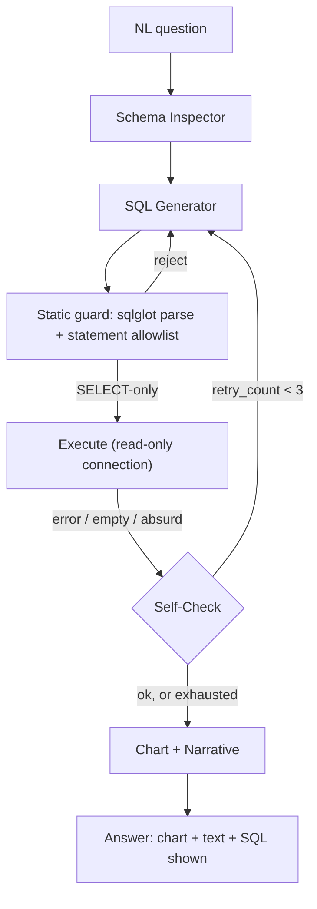

# PLAN.md — Self-Healing SQL Analytics Agent

## 1. Objective & Success Criteria

Build an agent that takes a natural-language question, inspects a database schema, writes SQL, executes it, checks its own results for errors/emptiness/absurd values, and — within a bounded retry budget — fixes its own query before generating a chart and narrative answer. Report accuracy on a Spider-benchmark subset so the resume claim is a number, not an adjective.

| Metric | Target | How measured |
|---|---|---|
| Execution accuracy on a 100-question Spider subset | ≥70% | Spider's `evaluation.py`, execution-match |
| Self-healing rate (initially-failing queries fixed within budget) | ≥60% | fraction of first-attempt failures that pass by attempt ≤3 |
| Retry budget | max 3 attempts/question, hard cap | code-enforced |
| P95 latency incl. retries | <20s | measured over the 100-question set |
| Destructive statements executed | 0 — structurally impossible | adversarial test at the connection layer |

Reporting note: "70% on Spider" is meaningless without the subset, the count, and the metric — the README must state all three (which DBs, 100 questions, execution accuracy).

## 2. Architecture



### Agent roster

| Agent | Role | Tools | Reads | Writes |
|---|---|---|---|---|
| Schema Inspector | Table/column names, types, FKs, few sample rows | DB introspection (not LLM) | `db_connection` | `schema_context` |
| SQL Generator | Writes SQL from question + schema + prior feedback | LLM w/ schema in prompt | `question`, `schema_context`, `prior_feedback` | `sql_query` |
| Static Guard | Parses SQL, rejects non-SELECT before execution | `sqlglot` (code) | `sql_query` | `guard_verdict` |
| Executor | Runs against a **read-only** connection | DB driver | `sql_query` | `result_rows`, `execution_error` |
| Self-Check | Rule-based + light-LLM sanity checks | rules (code) + optional LLM | `result_rows`, `execution_error`, `question` | `check_verdict`, `retry_count` |
| Narrative | Chart spec + plain-language answer | LLM | `result_rows`, `question` | `chart_spec`, `narrative` |

### State schema (pseudocode)

```python
class SQLAgentState(TypedDict):
    question: str
    schema_context: str          # cached per DB
    sql_query: str | None
    guard_verdict: Literal["ok","rejected"] | None
    prior_feedback: str | None    # only on retry
    result_rows: list[dict] | None
    execution_error: str | None
    check_verdict: Literal["ok","retry","exhausted"]
    retry_count: int
    chart_spec: dict | None       # {type: "bar"|"line"|"table", x: str, y: str, series: list}
    narrative: str | None
```

### The read-only boundary (Sonnet used Postgres vocabulary for a SQLite benchmark — the real gotcha)

Spider databases are **SQLite**, which has **no roles/`GRANT`**. So "read-only DB role" doesn't apply as written. Two concrete mechanisms, both specced:
- **SQLite (Spider):** open with `sqlite3.connect("file:db?mode=ro", uri=True)` and additionally set `PRAGMA query_only = ON;`. `mode=ro` blocks writes at the OS/VFS level.
- **Postgres (if you also demo a Postgres DB):** create a role with `GRANT SELECT` only and connect as it.
Defense in depth: the **Static Guard** parses every query with `sqlglot` and rejects anything whose top-level statement isn't `SELECT`/`WITH…SELECT` *before* execution — so a `DROP` never even reaches the driver, and the read-only connection is the backstop.

### Self-check rules (enumerated, with thresholds)

| Check | Fires "retry" when | Feedback to generator |
|---|---|---|
| syntax/execution error | driver raised | the exact error text |
| empty-when-implausible | 0 rows AND question implies ≥1 (heuristic: no "which/any/does there exist" phrasing) | "returned 0 rows; re-examine joins/filters" |
| absurd value | negative COUNT, date outside table min/max, aggregate wildly outside column range | "value X is outside the plausible range for column Y" |
| LLM sanity (only if above pass but answer feels off) | LLM says result shape doesn't match question intent | its one-line reason |

## 3. Tech Stack

| Choice | Why | Rejected |
|---|---|---|
| LangGraph generate→guard→execute→check→retry | Bounded loop = conditional edges | Plain while-loop — works, loses checkpointing/tracing |
| SQLite read-only URI + `PRAGMA query_only` | The actual structural boundary for Spider | "read-only role" — doesn't exist in SQLite |
| `sqlglot` static guard | Cheap pre-exec safety + better feedback than a raw driver error | Regex on SQL text — brittle, misses cases |
| Spider benchmark DBs + `evaluation.py` | Ready schemas + gold queries + comparable metric | Custom toy DB — no benchmark number |
| Matplotlib/Plotly via a chart-spec | Small structured output the narrative agent targets | Generic BI tool — out of scope |

## 4. Phase-by-Phase Build Plan

| Phase | Goal | Definition of Done | Tests | Est. |
|---|---|---|---|---|
| 0 — Setup | Load 3–5 Spider DBs; read-only connection + guard | A `DROP`/`DELETE` is rejected by both the guard and the connection | safety unit test | 2–3 d |
| 1 — Happy path | Inspector + Generator + Executor on easy Qs | 10 easy Spider Qs correct, no retries | schema-context snapshot | 3–4 d |
| 2 — Self-check + retry | Rules + feedback loop, bounded | An ambiguous Q first wrong → corrected within budget; retried SQL visibly differs | retry-differs assertion | 4–5 d |
| 3 — Narrative + chart | Chart spec + answer | Rendered chart + a sentence restating the number | chart-spec schema test | 3–4 d |
| 4 — Benchmark | Full 100-Q run, exec accuracy + self-heal rate | §6 metrics table (honest) | Spider eval integration | 4–5 d |
| 5 — Deploy + Polish | FastAPI + UI, Docker, README leads with the number | Benchmark number is first thing in README | — | 3–4 d |

**Total: ~3–4 weeks part-time.**

## 5. Data & API Requirements

- **Spider** (Yale) — pick 3–5 databases; select **100 questions stratified across Spider's difficulty tags** (easy/medium/hard/extra) so the accuracy number isn't cherry-picked. Commit the exact question ids to `eval/questions.json`.
- LLM budget: ≤100 Qs × ≤3 attempts ≈ 300 calls, a few dollars.
- No external APIs beyond the LLM + local DB.

## 6. Eval Strategy

- **Execution accuracy** (Spider's metric): does the generated SQL's result set match the gold SQL's — not string match. Use Spider's own `evaluation.py`/`process_sql.py` (note: Python-2-era code; run under the compatible interpreter or the maintained fork). Consider the test-suite-accuracy variant only as a stretch.
- **Self-healing rate:** of questions whose *first* attempt fails the self-check, fraction passing within 3 — report separately from raw accuracy.
- **Safety:** at least one adversarial prompt engineered to produce a destructive statement; confirm rejection at both guard and connection layers.
- Report all three in the README; it's the "one number beats adjectives" project.

## 7. Risks & Where These Projects Usually Fail

- **"Ran without error" ≠ correct** — a valid query can silently drop a WHERE; the self-check needs the plausibility dimension, not just error/no-error.
- **Prompt-only safety** — the read-only connection + static guard are the boundary, not the system prompt.
- **Schema too large/small** — cache the full schema per DB (not per question); for very large schemas, truncate obviously irrelevant tables (schema linking is a known hard sub-problem — a reasonable middle ground is fine for a portfolio).
- **Retry that doesn't learn** — if `prior_feedback` isn't actually in the retry prompt, "self-healing" is "try again and hope"; assert retried SQL differs.
- **Vague benchmark reporting** — always state subset + count + metric.

## 8. Implementation Notes for the Executing Model

- Create the read-only connection + static guard **first** (Phase 0), with a test that a `DELETE`/`DROP` fails — not a Phase 4 afterthought.
- Cache `schema_context` per DB at session start.
- Keep the "absurd value" check cheap and rule-based (negative counts, out-of-range dates) before any LLM sanity pass.
- Cap retries at 3 **in code**, not "the agent decided to stop" — same class as Project 01's loop cap.
- **Retry prompt template:** include the original question, the schema, the failed SQL, and the specific failure (error text or the fired check) with an instruction to fix that specific issue. This is what makes healing real.
- Use Spider's own eval methodology so the number is comparable to published results — don't invent comparison logic.
- Emit the Target Agent Contract trajectory from the FastAPI endpoint (nodes, the SQL attempts, retry count) so this agent is observable by Project 03/13.

## 9. Definition of Done

- [ ] Read-only boundary (URI + `PRAGMA` + static guard) verified with an adversarial test.
- [ ] 100-question stratified Spider subset run; execution accuracy + self-healing rate reported honestly.
- [ ] Chart + narrative works on final results.
- [ ] Dockerized, deployed, README leads with the benchmark number.
