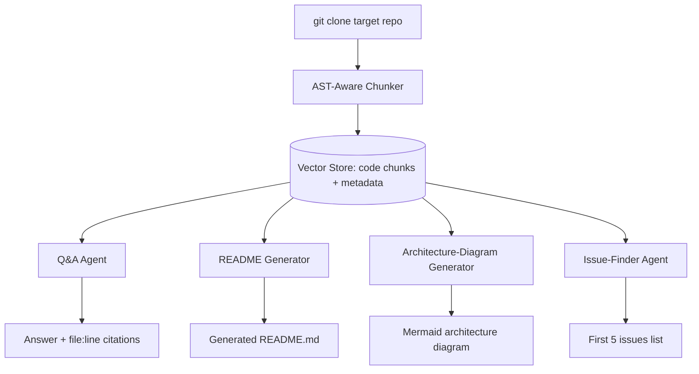

# PLAN.md — Codebase Onboarding Agent

## 1. Objective & Success Criteria

Point this agent at any public GitHub repo: it indexes the code with AST-aware chunking (not naive fixed-size splitting), answers architecture questions with file/line citations, generates a README and an architecture diagram, and produces a "first 5 issues to try" list for new contributors. The single strongest demo in the portfolio, because you can run it live on the interviewer's own repo.

| Metric | Target |
|---|---|
| Answer accuracy with correct file/line citation on a 50-question eval set across 5 repos | ≥80% |
| Citations that point to a real, existing file/line (not hallucinated) | 100% (code-checked, not LLM-judged) |
| README quality: does the generated README correctly state the repo's actual entry point/main dependencies | Verified correct on all 5 test repos |
| Time to index a medium repo (~500 files) | <5 min |
| Cost to fully onboard one repo (index + generate README + issues list) | <$1 |

## 2. Architecture



### Agent roster

| Agent | Role | Tools | Reads | Writes |
|---|---|---|---|---|
| AST-Aware Chunker | Parses source files by function/class boundary (not fixed-size text splitting), attaches file/line metadata to each chunk | language-specific AST parser (e.g. Python `ast`, or `tree-sitter` for multi-language) | cloned repo files | code chunks + metadata |
| Q&A Agent | Answers architecture questions, citing file:line for every claim | vector retriever over indexed chunks | `question`, indexed chunks | `answer`, `citations` |
| README Generator | Summarizes purpose, structure, setup instructions from the indexed code + any existing docs | retriever, LLM | indexed chunks, existing README/docs if present | `generated_readme` |
| Architecture-Diagram Generator | Produces a mermaid diagram of module/component relationships | static import-graph analysis (code, not LLM) + LLM for labeling/simplification | import graph, indexed chunks | `architecture_diagram` |
| Issue-Finder Agent | Scans for TODOs, obvious gaps (missing tests, undocumented public functions), ranks 5 good-first-issues | retriever, static heuristics (grep for TODO/FIXME, missing docstrings) | indexed chunks | `suggested_issues` |

### State schema (pseudocode)

```python
class CodeChunk(TypedDict):
    chunk_id: str
    file_path: str
    start_line: int
    end_line: int
    kind: Literal["function","class","module_docstring","config"]
    content: str
    embedding: list[float]

class OnboardingState(TypedDict):
    repo_url: str
    chunks: list[CodeChunk]
    import_graph: dict            # module -> [imported modules]
    generated_readme: str | None
    architecture_diagram: str | None   # mermaid source
    suggested_issues: list[dict] | None
```

**Communication pattern:** a shared index (vector store + import graph), fanned out to 4 independent consumer agents (Q&A, README, Architecture, Issue-Finder) that don't need to coordinate with each other — this is a "shared-knowledge-base, independent-consumers" pattern, distinct from Project 01's supervisor-routed pattern.

## 3. Tech Stack

| Choice | Why | Rejected alternative |
|---|---|---|
| `tree-sitter` for multi-language AST parsing | Handles function/class boundaries correctly across many languages without writing a parser per language | Fixed-size text splitting — the exact anti-pattern this project is teaching you to avoid; splits mid-function and destroys citation accuracy |
| Chroma for the code-chunk vector store | Same reasoning as Project 01 — simple, local, sufficient at this scale | A dedicated code-search engine (e.g. Sourcegraph) — massive overkill for a portfolio project |
| Static import-graph analysis (not an LLM) for the architecture diagram's structure | Import relationships are exact, deterministic facts — extracting them by parsing is both cheaper and more accurate than asking an LLM to "figure out the architecture" from text alone | Pure LLM-inferred architecture — prone to hallucinating relationships that don't exist in the actual import graph |
| AutoGen RetrieveChat as a design reference for Q&A retrieval flow | Directly relevant prior art for retrieval-augmented code Q&A | Building the Q&A retrieval flow from scratch with no reference — slower, no reason to skip a working pattern |

## 4. Phase-by-Phase Build Plan

| Phase | Goal | Definition of Done | Est. time |
|---|---|---|---|
| 0 — Setup | Pick 5 test repos (varying size/language), get `tree-sitter` parsing working on at least Python + one other language | Chunker produces function/class-level chunks with correct file/line metadata on all 5 repos | 3–4 days |
| 1 — Indexing | Embed chunks into Chroma, build the import graph | Indexing a ~500-file repo completes in <5 min | 3–4 days |
| 2 — Q&A Agent | Retrieval + citation-grounded answering | Citations verified to point at real file/line ranges (code-checked) on a test set | 4–5 days |
| 3 — README + Architecture Diagram | Generate both from the index | Generated README correctly states the actual entry point/dependencies on all 5 test repos (manually verified) | 4–5 days |
| 4 — Issue-Finder | TODO/gap scanning + ranking | Produces a plausible "first 5 issues" list a real contributor could act on, for all 5 test repos | 3–4 days |
| 5 — Eval | 50-question eval set (10 per repo × 5 repos) | Accuracy and citation-correctness numbers from §6 committed to README | 4–5 days |
| 6 — Deploy + Polish | Simple web UI (paste a repo URL, get results), Docker, README | Live demo works against a repo the user pastes in, not just your 5 pre-indexed ones | 3–4 days |

**Total: ~4–5 weeks part-time.**

## 5. Data & API Requirements

- 5 public GitHub repos of varying size/language for the eval set (mix languages if using `tree-sitter`, or stick to Python-only for a smaller/faster build using Python's own `ast` module).
- LLM provider budget: indexing is cheap (embeddings only); Q&A/README/architecture/issue generation calls are the main cost, budgeted at <$1/repo per §1.
- No external API beyond `git clone` and the LLM provider.

## 6. Eval Strategy

- **Q&A accuracy + citation correctness:** 10 hand-written questions per test repo (50 total), each with a known-correct file/line answer; score both "is the answer substantively correct" (LLM-judge or manual) and "does the citation point to a real file/line that actually supports the answer" (code-checked: does the cited file:line exist and does its content plausibly relate to the claim).
- **README correctness:** manually verify the generated README's stated entry point and top dependencies against the real repo for all 5 test repos — this is a small enough check to do by hand and is more convincing than an automated proxy metric.
- **Issue-list plausibility:** manually review the "first 5 issues" list per repo for whether a new contributor could actually act on it (not vague, not something already fixed) — report a pass/fail count, e.g. "22/25 suggested issues were actionable."

## 7. Risks & Where These Projects Usually Fail

- **Naive chunking undermines the entire pitch.** If you fall back to fixed-size text splitting "to save time," you lose the ability to cite exact functions/classes, which is this project's core differentiator versus a generic RAG-over-text-files project.
- **Citations that look plausible but are wrong.** An LLM can produce a confident-looking `file.py:42` that doesn't actually contain what it claims — always verify citations against the actual indexed chunk, never let the LLM freely invent a line number.
- **Import-graph analysis breaking on dynamic imports/monorepos.** Static analysis has real limits (dynamic `importlib` calls, complex build systems); document this as a known limitation rather than silently producing a wrong diagram.
- **README generation that just restates file names.** A generated README that says "this repo has a `utils.py` and a `main.py`" without synthesizing *purpose* isn't useful — the retrieval step needs to actually pull docstrings/comments/existing docs, not just file listings.
- **Demo-ability tunnel vision.** It's tempting to hardcode assumptions that work for your 5 test repos but break on an interviewer's live repo — explicitly test on at least one repo you've never seen before you ship, since "run it live on their repo" is the whole point.

## 8. Implementation Notes for the Executing Model

- Build the citation-verification check as a hard code assertion in the Q&A agent's output path (does `file_path:start_line-end_line` exist in the current index) — reject/regenerate an answer that fails this check rather than shipping an unverifiable citation.
- Start with Python-only via the standard library `ast` module for Phase 0 if multi-language `tree-sitter` setup is taking too long — you can extend language support later; don't let parser breadth block getting the pipeline working end-to-end first.
- Cache the cloned repo and its index — re-cloning and re-indexing on every question is wasteful; index once per repo, serve many questions against the same index.
- For the "first 5 issues" list, bias toward concrete, scoped suggestions ("add a docstring to `parse_config()` in `config.py:12`, which is public but undocumented") over vague ones ("improve test coverage") — specificity is what makes it demo-able.
- When testing live against an unfamiliar repo, set a reasonable file-count/size ceiling (e.g., skip indexing generated/vendored directories like `node_modules`, `dist`, `.venv`) — a naive indexer that tries to parse a repo's entire dependency tree will time out and look broken in a live demo.

## 9. Definition of Done

- [ ] AST-aware chunking verified on at least 2 languages (or clearly scoped to Python with that limitation documented).
- [ ] 50-question eval set run with accuracy + citation-correctness numbers in the README.
- [ ] README/architecture-diagram/issue-list generation manually verified correct on all 5 test repos.
- [ ] Live demo successfully run against a repo not in the original 5 (tested at least once before considering this done).
- [ ] Dockerized, deployed, README complete.
