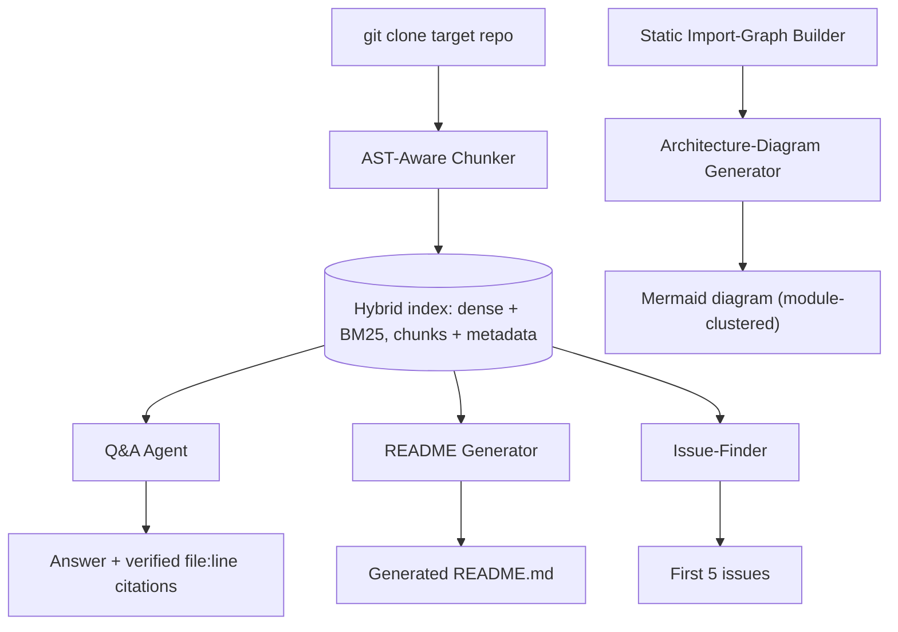

# PLAN.md — Codebase Onboarding Agent

## 1. Objective & Success Criteria

Point this agent at any public GitHub repo: it indexes the code with AST-aware chunking (not naive fixed-size splitting), answers architecture questions with file/line citations, generates a README and an architecture diagram, and produces a "first 5 issues to try" list. The strongest live demo in the portfolio — run it on the interviewer's own repo.

| Metric | Target | How measured |
|---|---|---|
| Answer accuracy w/ correct citation, 50-question set across 5 repos | ≥80% | LLM-judge (or manual) for correctness |
| Citations pointing to a real, existing file/line | 100% | **code-checked**, not LLM-judged |
| README correctly states actual entry point + main deps | verified on all 5 repos | manual |
| Time to index a ~500-file repo | <5 min | measured |
| Cost to fully onboard one repo | <$1 | token accounting |

## 2. Architecture



### Agent roster

| Agent | Role | Tools | Reads | Writes |
|---|---|---|---|---|
| AST-Aware Chunker | Parse by function/class boundary; attach file/line metadata; split oversized nodes | `tree-sitter` (multi-lang) or `ast` (Python) | cloned files | code chunks + metadata |
| Import-Graph Builder | Extract module→module edges per language | per-language import extraction | cloned files | `import_graph` |
| Q&A Agent | Answers w/ verified file:line citations | hybrid retriever | `question`, index | `answer`, `citations` |
| README Generator | Purpose/structure/setup from fixed probe queries + existing docs | retriever, LLM | index, existing docs | `generated_readme` |
| Architecture-Diagram | Mermaid from the import graph, clustered/simplified | import graph + LLM labeling | `import_graph` | `architecture_diagram` |
| Issue-Finder | TODO/gap scan → ranked scoped issues | grep heuristics + retriever | index | `suggested_issues` |

### State schema (pseudocode)

```python
class CodeChunk(TypedDict):
    chunk_id: str
    file_path: str
    start_line: int; end_line: int
    kind: Literal["function","class","method","module_docstring","config"]
    parent_symbol: str | None    # for split oversized nodes: the enclosing class/function
    content: str
    embedding: list[float]

class OnboardingState(TypedDict):
    repo_url: str
    chunks: list[CodeChunk]
    import_graph: dict            # module -> [imported modules]
    generated_readme: str | None
    architecture_diagram: str | None   # mermaid source
    suggested_issues: list[dict] | None
```

### Oversized-node handling (the gap Sonnet left)

An 800-line class won't fit one embedding well. Rule: if a function/class node exceeds ~1,500 tokens, split it into sub-chunks (by method for a class, by logical block for a long function), each carrying `parent_symbol` and the accurate line range of the sub-chunk. Retrieval can then return a method chunk but cite the enclosing class in context.

### Retrieval design (Sonnet left it unspecified — code retrieval needs this)

- **Embedding model:** a code-aware embedding (e.g., a code-specialized model) — general prose embeddings under-retrieve on identifiers.
- **Hybrid search:** BM25 (exact identifier/keyword match — critical for "where is `parse_config` defined") + dense (semantic "how does auth work"), fused by reciprocal-rank fusion. Code Q&A fails on dense-only because identifiers are rare tokens.
- **k = 8**, then an LLM re-rank to top 4 for the answer prompt.

### Citation verification (split deterministic vs. judged)

- **Deterministic (must be 100%):** the cited `file:start-end` exists in the current index and corresponds to a real chunk. Parse the model's citation, assert the chunk exists; reject/regenerate if not.
- **Judged (part of the 80% accuracy):** does the cited chunk's *content* actually support the claim. This is the LLM-judge/manual part.

## 3. Tech Stack

| Choice | Why | Rejected |
|---|---|---|
| `tree-sitter` multi-lang AST | Correct function/class boundaries across languages | Fixed-size splitting — the anti-pattern this project teaches against |
| `ast` (Python) fallback | Faster start if scoping to Python | — |
| Hybrid dense+BM25 (e.g., Chroma + rank-bm25) | Code retrieval needs identifier-exact + semantic | Dense-only — misses identifier lookups |
| Static import graph (not LLM) | Import edges are exact facts | LLM-inferred architecture — hallucinates edges |
| Mermaid w/ module-level clustering | A 500-file graph is unreadable raw | Full per-file graph — illegible |

Note the asymmetry Sonnet glossed: `tree-sitter` gives you multi-language *chunking* cheaply, but *import extraction* is per-language work (Python `import`, JS `import/require`, Go `import`). Ship Python import-graph first; document other languages as chunk-only until their import extractor exists.

## 4. Phase-by-Phase Build Plan

| Phase | Goal | Definition of Done | Tests | Est. |
|---|---|---|---|---|
| 0 — Setup | 5 test repos; tree-sitter on Python + one other | Chunker emits function/class chunks w/ correct line metadata on all 5 | line-range accuracy test | 3–4 d |
| 1 — Indexing | Hybrid index + Python import graph; oversized-node split | ~500-file repo indexes in <5 min | index-time benchmark | 3–4 d |
| 2 — Q&A | Retrieval + citation verification | Citations code-checked to real file:line on a test set | citation-existence test | 4–5 d |
| 3 — README + Diagram | Both from index + import graph, clustered | README states real entry point/deps on all 5 | manual verify | 4–5 d |
| 4 — Issue-Finder | TODO/gap scan + ranked scoped issues | Plausible actionable "first 5" per repo | — | 3–4 d |
| 5 — Eval | 50-question set (10/repo) | Accuracy + citation-correctness in README | eval harness | 4–5 d |
| 6 — Deploy + Polish | Paste-a-URL web UI (w/ index progress), Docker | Live run on a pasted, never-indexed repo | live held-out test | 3–4 d |

**Total: ~4–5 weeks part-time.**

## 5. Data & API Requirements

- 5 public repos of varying size/language (one small Python lib, one ~500-file web app, one second-language repo if multi-lang, one with a good README as a sanity check, one **held-out** repo you've never seen).
- LLM budget: indexing cheap (embeddings); generation is the cost, <$1/repo.
- No API beyond `git clone` + LLM.

## 6. Eval Strategy

- **Q&A accuracy + citation correctness:** 10 hand-written questions/repo, categorized (entry-point, data-flow, "where is X handled", "why this design"), each with a known file/line. Score correctness (LLM-judge/manual) **and** citation-exists (code). Report both.
- **README correctness:** manually verify stated entry point + top deps on all 5 (small enough to do by hand, more convincing than a proxy metric).
- **Issue plausibility:** manually review "first 5" per repo for actionability; report a pass count (e.g., "22/25 actionable").

## 7. Risks & Where These Projects Usually Fail

- **Naive chunking undermines the pitch** — fixed-size splitting kills citation accuracy; if you fall back temporarily, treat it as a known gap.
- **Plausible-but-wrong citations** — always verify against the actual chunk; never let the LLM invent a line number.
- **Import graph breaks on dynamic imports/monorepos** — document the limitation rather than emitting a wrong diagram.
- **README that restates filenames** — pull docstrings/comments/existing docs via fixed probe queries, not a file listing.
- **Demo tunnel-vision** — test on an unseen repo before shipping; "run it live" is the whole point.

## 8. Implementation Notes for the Executing Model

- Citation verification is a **hard code assertion** in the Q&A output path — reject/regenerate an answer whose citation doesn't resolve.
- Start Python-only via `ast` if multi-language `tree-sitter` setup drags — extend later; don't let parser breadth block an end-to-end pipeline.
- Cache the clone + index per repo; index once, serve many questions.
- **README probe queries (fixed list):** "entry point / main", "installation / setup", "dependencies (parse `requirements.txt`/`package.json`/`pyproject.toml` directly)", "high-level purpose (top-level README/docstring)", "how to run tests". Feed retrieved results, not raw file lists.
- **Diagram simplification:** roll the import graph up to module/package level; if >~25 nodes, show the top-N by in-degree + an "others" cluster.
- Issue suggestions must be **scoped** ("add a docstring to `parse_config()` in `config.py:12`, which is public but undocumented"), never vague ("improve tests").
- Exclude vendored/generated dirs (`node_modules`, `dist`, `.venv`, `build`) — a naive indexer times out on them in a live demo.

## 9. Definition of Done

- [ ] AST-aware chunking verified on ≥2 languages (or scoped to Python w/ that documented).
- [ ] 50-question eval with accuracy + citation-correctness in README.
- [ ] README/diagram/issue-list manually verified on all 5 repos.
- [ ] Live run on a repo not in the original 5 (tested before "done").
- [ ] Dockerized, deployed, README complete.
