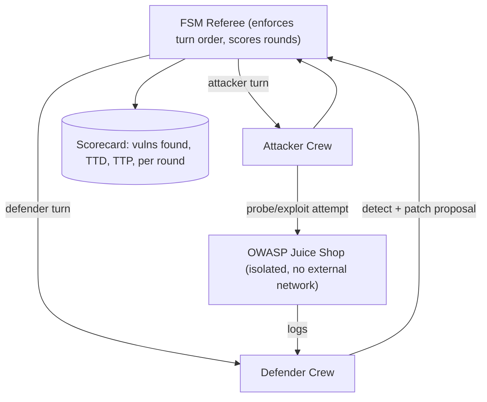

# PLAN.md — Red-Team vs Blue-Team Agent Arena

**Scope discipline:** this project is strictly a defensive-research / CTF-lab exercise against an intentionally vulnerable, isolated target application. All attacker-crew actions are scoped to that sandboxed target only. Nothing built here is a general-purpose intrusion tool, and none of it should ever be pointed at a system you don't own and haven't deliberately set up as a vulnerable lab.

## 1. Objective & Success Criteria

Build two agent crews in a sandboxed, isolated lab: an attacker crew that probes a deliberately vulnerable application (OWASP Juice Shop) while a defender crew watches logs and applies fixes, refereed by a finite-state-machine (FSM) that enforces turn order and scores rounds. The deliverable is a defensive-research writeup: what classes of vulnerability the attacker crew found, how fast the defender crew detected and patched them, framed entirely around evaluation and defense.

| Metric | Target |
|---|---|
| Known Juice Shop challenges the attacker crew successfully identifies (out of a fixed subset you pick, e.g. 15 "easy/medium" challenges) | ≥50% |
| Defender crew mean time-to-detect (from attack log entry to defender flagging it) | reported, not gamed — the number itself is the point |
| Defender crew mean time-to-patch (from detection to a corrective action being proposed) | reported |
| FSM referee correctly enforces turn order with zero out-of-turn actions | 100% (code-checked) |
| Lab isolation verified (target has no route to any real network) | verified before every run, not just once |

## 2. Architecture



### Agent roster

| Agent/Crew member | Role | Tools | Reads | Writes |
|---|---|---|---|---|
| FSM Referee | Enforces which crew acts each turn, tracks round state, scores outcomes | AutoGen FSM group-chat transition graph (code, not LLM-decided) | round state | `current_turn`, `scorecard` |
| Attacker: Recon Agent | Enumerates the target's visible attack surface (endpoints, forms, known Juice Shop challenge categories) | HTTP client scoped to the isolated target only | target responses | `recon_findings` |
| Attacker: Exploit Agent | Attempts a specific known vulnerability class (e.g. SQL injection on a login form) from a fixed, pre-approved challenge list | HTTP client, same scoping | `recon_findings` | `exploit_attempt`, `exploit_result` |
| Defender: Log-Analysis Agent | Watches the target's request/error logs for suspicious patterns | log-tailing tool scoped to the target's own logs | target logs | `detected_incidents` |
| Defender: Patch-Proposal Agent | Given a detected incident, proposes a concrete fix (config change, input validation rule) | code/config diff generation (proposal only — see risk note on not auto-applying) | `detected_incidents` | `patch_proposal` |

### State schema (pseudocode)

```python
class Round(TypedDict):
    round_number: int
    turn: Literal["attacker","defender"]
    attacker_action: dict | None
    target_response: dict | None
    defender_detection: dict | None
    defender_patch_proposal: dict | None
    time_to_detect_s: float | None
    time_to_patch_s: float | None

class ArenaState(TypedDict):
    rounds: list[Round]
    challenge_list: list[str]        # fixed, pre-approved subset of Juice Shop challenges
    scorecard: dict                   # aggregate stats across all rounds
```

**Communication pattern:** AutoGen's finite-state-machine group-chat transition graph — the referee is not an LLM making a judgment call about whose turn it is, it's a literal state machine (`allowed_transitions` dict) that makes out-of-turn action structurally impossible, which is the entire point of using the FSM pattern here instead of a free-form group chat.

## 3. Tech Stack

| Choice | Why | Rejected alternative |
|---|---|---|
| AutoGen with FSM-constrained group chat | Purpose-built for exactly this "enforce a strict speaker/turn order" requirement | Free-form AutoGen group chat with an LLM "choosing" the next speaker — reintroduces the risk of an agent acting out of turn, which matters more here than in a normal chatbot |
| OWASP Juice Shop (Docker container) as the target | A deliberately vulnerable, well-documented, purpose-built training application with known, cataloged challenges — exactly designed for this use case | A real production app, even a toy one you wrote — no fixed catalog of "known" vulnerabilities to score against, and higher risk of an undocumented, genuinely dangerous flaw |
| Fully isolated Docker network (no route out) for the target | Non-negotiable safety requirement — the attacker crew must be structurally unable to reach anything outside the lab | Running the target on the host network "just for the demo" — this is exactly the shortcut that turns a safe lab into a real incident |
| Patch proposals only (never auto-applied) by the Defender crew | Keeps a human in the loop for any actual system change, consistent with the HITL principle used elsewhere in this portfolio | Auto-applying patches — even in a sandbox, this teaches the wrong habit for a security-adjacent project |

## 4. Phase-by-Phase Build Plan

| Phase | Goal | Definition of Done | Est. time |
|---|---|---|---|
| 0 — Lab Setup | Juice Shop in an isolated Docker network, verified no outbound route | `docker network inspect` confirms isolation; a test `curl` to an external host from inside the target's network namespace fails | 2–3 days |
| 1 — FSM Referee | AutoGen FSM group chat skeleton with attacker/defender turn enforcement | An out-of-turn action attempt is rejected by the state machine, verified with a deliberate test | 3–4 days |
| 2 — Attacker Crew | Recon + Exploit agents against a fixed subset of ~15 known Juice Shop challenges | Attacker crew successfully triggers ≥50% of the chosen challenge subset over several runs | 5–6 days |
| 3 — Defender Crew | Log-analysis + patch-proposal agents | Defender crew detects a majority of attacker actions within the same session and produces a plausible patch proposal for each | 5–6 days |
| 4 — Scoring + Eval | Full round-by-round scorecard: vulns found, time-to-detect, time-to-patch | Scorecard generated across ≥5 full arena runs, aggregated and reported | 3–4 days |
| 5 — Writeup + Polish | README framed entirely around defensive research/evaluation, explicit scope/safety statement, Docker Compose for the whole lab | `docker compose up` reproduces the full isolated arena from a clean clone; README leads with the safety/scope statement | 3–4 days |

**Total: ~4–5 weeks part-time.**

## 5. Data & API Requirements

- OWASP Juice Shop (free, open-source, official Docker image) — the entire target application.
- No external APIs required; this project should have zero outbound network dependency for the target side (only your own LLM calls for the agents need external network access, and those should be scoped to the agent-orchestration host, not the target's network namespace).
- LLM budget: modest — a handful of short reasoning calls per round across ~5 evaluation runs.

## 6. Eval Strategy

- **Coverage:** fixed list of ~15 known Juice Shop challenges (pick from its published challenge catalog, "easy" and "medium" difficulty) — report what fraction the attacker crew triggers across multiple runs, and which specific classes it consistently misses.
- **Detection/response timing:** for every attacker action that the defender crew does detect, log time-to-detect and time-to-patch-proposal; report means and the distribution (not just an average, since a few slow outliers matter for a security narrative).
- **FSM integrity:** a code-level test that deliberately tries to make an agent act out of turn and confirms the referee rejects it — this is the one thing in this project that must be verified by code, not by LLM judgment.
- **Isolation verification:** re-run the network-isolation check (§4 Phase 0 DoD) before every recorded evaluation session, not just once at setup — configuration drift is a real risk over a multi-week build.

## 7. Risks & Where These Projects Usually Fail

- **Scope creep toward a real offensive tool.** The instant this stops being "probe a designated, isolated training app" and starts being "a general web-app attack agent," it's a different (and much more dangerous) project — keep the challenge list fixed and the target fixed.
- **Isolation that "should be fine" but isn't tested.** The single most important safety property in this project is the network boundary; assume it's broken until you've explicitly verified it, and re-verify periodically.
- **Auto-applying patches.** Even in a sandbox, wiring the defender's patch proposals directly into the running target without a human approval step teaches an unsafe habit and isn't necessary to make the demo compelling.
- **Framing drift in the writeup.** It's easy to accidentally write the README like an offensive tool showcase ("look what my agent can hack") rather than a defensive-research one ("here's what classes of vulnerability get caught fastest and slowest") — the second framing is both safer and more hireable for security-adjacent roles.
- **FSM referee that's actually just an LLM being polite about turn order.** If turn enforcement is a suggestion in a prompt rather than a hard transition table in code, an agent can and eventually will act out of turn — verify this structurally, per §6.

## 8. Implementation Notes for the Executing Model

- Set up the Docker network isolation *before* writing any agent code — this is a safety precondition, not a deployment nicety, and should block starting Phase 1 until verified.
- Use AutoGen's FSM group-chat mechanism's actual transition-table API (a dict/graph of allowed next-speakers) rather than an LLM-mediated speaker-selection function — the whole point of the FSM pattern is removing the LLM from the turn-order decision.
- Fix the challenge list to a small, pre-approved subset (~15) rather than letting the attacker crew freely explore Juice Shop's entire challenge catalog — this bounds scope, keeps evaluation tractable, and makes results reproducible across runs.
- The Patch-Proposal Agent should output a diff/description, never execute a change against the running target directly — keep the loop open for a human to review, consistent with this portfolio's HITL principle.
- When writing the README, lead with an explicit "Scope and Safety" section before any results — this is both the responsible thing to do and, for hiring purposes, exactly the signal a security-adjacent interviewer wants to see.

## 9. Definition of Done

- [ ] Isolated lab verified with no outbound network route from the target, re-checked before evaluation runs.
- [ ] FSM referee's turn-order enforcement verified with a deliberate out-of-turn test.
- [ ] ≥5 full arena runs against the fixed ~15-challenge subset, scorecard aggregated.
- [ ] Patch proposals are human-reviewable only, never auto-applied.
- [ ] README leads with an explicit scope/safety statement and frames results around defensive evaluation.
