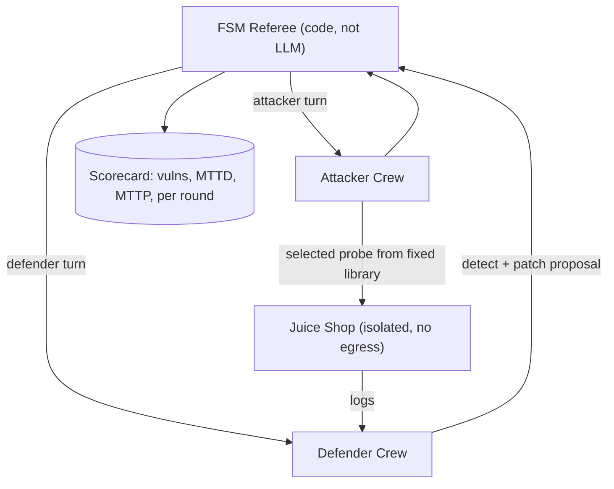

# PLAN.md — Red-Team vs Blue-Team Agent Arena

**Scope discipline (read first).** This is strictly a defensive-research / CTF-lab exercise against an intentionally vulnerable, isolated target (OWASP Juice Shop). All attacker-crew actions are scoped to that sandboxed target only, from a **fixed, pre-approved probe library** — the LLM never free-generates exploit payloads, it only selects and sequences from the library. Nothing here is a general-purpose intrusion tool, and none of it should ever be pointed at a system you don't own and haven't deliberately set up as a vulnerable lab.

## 1. Objective & Success Criteria

Two agent crews in a sandboxed, isolated lab: an attacker crew that probes Juice Shop from a fixed challenge set while a defender crew watches logs and proposes fixes, refereed by a finite-state-machine (FSM) that enforces turn order and scores rounds. Deliverable: a defensive-research writeup — which vulnerability classes were found, how fast the defender detected and proposed a patch — framed around evaluation and defense.

| Metric | Target | How measured |
|---|---|---|
| Fixed ~15-challenge subset the attacker crew triggers | ≥50% | Juice Shop's own score-board challenge status |
| Defender mean time-to-detect (MTTD) | reported, not gamed | log-entry timestamp → defender flag timestamp |
| Defender mean time-to-patch-proposal (MTTP) | reported | detect timestamp → proposal timestamp |
| FSM enforces turn order, zero out-of-turn actions | 100% | code-checked, deliberate out-of-turn test |
| Lab isolation (no route out) | verified before **every** run | `docker network inspect` + egress test |

## 2. Architecture



### Agent roster

| Member | Role | Tools | Reads | Writes |
|---|---|---|---|---|
| FSM Referee | Enforces whose turn, tracks rounds, scores | AutoGen FSM transition graph (code) | round state | `current_turn`, `scorecard` |
| Attacker: Recon | Enumerates the target's visible surface | HTTP client scoped to the isolated target | target responses | `recon_findings` |
| Attacker: Exploit | **Selects** a probe from the fixed library for a challenge; never generates payloads | HTTP client (scoped), fixed probe library | `recon_findings` | `exploit_attempt`, `exploit_result` |
| Defender: Log-Analysis | Watches request/error logs for suspicious patterns | log tailer (target's own logs) | target logs | `detected_incidents` |
| Defender: Patch-Proposal | Proposes a fix (config/validation) — proposal only | diff/description generation | `detected_incidents` | `patch_proposal` |

### The harness decision (Sonnet left this under-specified — it's the crux for safety + reproducibility)

The exploit agent works from a **fixed probe library**: a checked-in mapping `{challenge_id: [pre-written HTTP request templates]}` covering the ~15 chosen challenges (e.g., a specific SQL-injection string on the login form). The LLM's only job is to **choose which challenge to attempt and in what order**, and to interpret the response. It never composes a novel payload. This bounds scope, keeps runs reproducible, and is the safety-critical design point.

### State schema (pseudocode)

```python
class Round(TypedDict):
    round_number: int
    turn: Literal["attacker","defender"]
    attacker_action: dict | None      # {challenge_id, probe_id}
    target_response: dict | None
    defender_detection: dict | None
    defender_patch_proposal: dict | None
    time_to_detect_s: float | None
    time_to_patch_s: float | None

class ArenaState(TypedDict):
    rounds: list[Round]
    challenge_list: list[str]         # the fixed ~15, by Juice Shop challenge name
    scorecard: dict
```

### Detection starter rules + metric definitions (Sonnet left both vague)

- **Detection rules (starter set over Juice Shop request logs):** SQL-injection signatures (`' OR 1=1`, `UNION SELECT`), XSS markers (`<script>`), repeated 401/403 bursts (brute force), access to admin paths, anomalous parameter lengths. The log-analysis agent flags on these.
- **MTTD:** wall-clock from the timestamp the malicious request appears in the target log to the timestamp the defender writes a `detected_incidents` entry for it. **MTTP:** from that detection to the `patch_proposal` timestamp. Use one monotonic clock source for all events.

**Communication pattern.** AutoGen's **FSM-constrained group chat** — the referee is a literal state machine (an `allowed_transitions` dict), not an LLM choosing who speaks. Out-of-turn action is structurally impossible. That is the entire reason for the FSM pattern here over a free-form group chat.

## 3. Tech Stack

| Choice | Why | Rejected |
|---|---|---|
| AutoGen FSM-constrained group chat | Purpose-built strict turn-order enforcement | Free-form group chat w/ LLM speaker selection — reintroduces out-of-turn risk |
| OWASP Juice Shop (Docker) | Deliberately vulnerable, cataloged challenges | A real/toy app — no fixed known-vuln catalog; higher risk |
| Fully isolated Docker network (`--internal`) | Non-negotiable: attacker crew cannot reach anything outside the lab | Host network "for the demo" — turns a safe lab into a real incident |
| Fixed probe library, LLM selects only | Bounds scope, reproducible, safe | LLM-generated payloads — scope creep toward an offensive tool |
| Patch proposals only, never auto-applied | HITL, consistent with the portfolio | Auto-apply — teaches an unsafe habit |

**AutoGen version note.** The FSM group-chat mechanism differs between AutoGen **0.2** (`GroupChat` + `allowed_or_disallowed_speaker_transitions`) and **0.4+** (the rewritten `autogen-agentchat`, `GraphFlow`). Decision: build on whichever you pin, but **pin explicitly** and mirror that version's transition API — do not mix tutorials across the 0.2/0.4 break (the cited notebook is 0.2/legacy).

## 4. Phase-by-Phase Build Plan

| Phase | Goal | Definition of Done | Est. |
|---|---|---|---|
| 0 — Lab Setup | Juice Shop in an isolated network; fixed probe library + 15 challenges chosen | `docker network inspect` confirms isolation; an egress `curl` from the target's namespace **fails**; probe library checked in | 2–3 d |
| 1 — FSM Referee | AutoGen FSM skeleton, attacker/defender turns | A deliberate out-of-turn action is rejected by the state machine | 3–4 d |
| 2 — Attacker Crew | Recon + Exploit (library selection) vs. the 15 | ≥50% of the subset triggered across runs | 5–6 d |
| 3 — Defender Crew | Log-analysis (starter rules) + patch-proposal | Detects a majority of attacker actions in-session, proposes a plausible patch each | 5–6 d |
| 4 — Scoring | Round-by-round scorecard: vulns, MTTD, MTTP | Scorecard across ≥5 runs, aggregated | 3–4 d |
| 5 — Writeup | README leads with scope/safety; results = defender metrics; full Compose lab | `docker compose up` reproduces the isolated arena | 3–4 d |

**Total: ~4–5 weeks part-time.**

## 5. Data & API Requirements

- OWASP Juice Shop (official Docker image `bkimminich/juice-shop`).
- Zero outbound network for the target side; only the agent host needs LLM egress, scoped away from the target's namespace.
- LLM budget: modest — short reasoning calls per round × ~5 runs.

## 6. Eval Strategy

- **Coverage:** the fixed ~15 challenges (from Juice Shop's published catalog, easy/medium); report fraction triggered and which classes are consistently missed.
- **Timing:** MTTD and MTTP per detected action; report the **distribution**, not just the mean (outliers matter for a security narrative).
- **FSM integrity:** a code test that tries to make an agent act out of turn and confirms rejection.
- **Isolation:** re-run the egress test before **every** recorded session (config drift is real over weeks).

## 7. Risks & Where These Projects Usually Fail

- **Scope creep toward an offensive tool** — the moment it stops being "fixed probes vs. one isolated app," it's a different, dangerous project. Keep the library and target fixed.
- **Untested isolation** — assume it's broken until you've verified egress fails; re-verify periodically.
- **Auto-applying patches** — even in a sandbox, teaches the wrong habit.
- **Offensive framing drift** — lead with detection/response metrics, not "look what my agent hacked."
- **FSM as prompt, not code** — if turn order is a system-prompt suggestion, an agent will eventually act out of turn; verify structurally.

## 8. Implementation Notes for the Executing Model

- Set up isolation **before** any agent code — it blocks Phase 1 until the egress test fails.
- Use AutoGen's actual transition-table API (a dict/graph of allowed next-speakers) for the pinned version — the point of the FSM is removing the LLM from the turn decision.
- The probe library is checked-in data; the exploit agent selects a `probe_id`, never composes a request string.
- Patch-Proposal outputs a diff/description; never execute a change against the running target.
- README leads with "Scope and Safety" before any result — responsible, and exactly the signal a security interviewer wants.

## 9. Definition of Done

- [ ] Isolated lab verified (egress fails), re-checked before eval runs.
- [ ] FSM turn-order enforcement verified with a deliberate out-of-turn test.
- [ ] ≥5 arena runs vs. the fixed ~15, scorecard aggregated (coverage, MTTD, MTTP distributions).
- [ ] Patch proposals human-reviewable only, never auto-applied.
- [ ] README leads with scope/safety and frames results around defensive evaluation.
