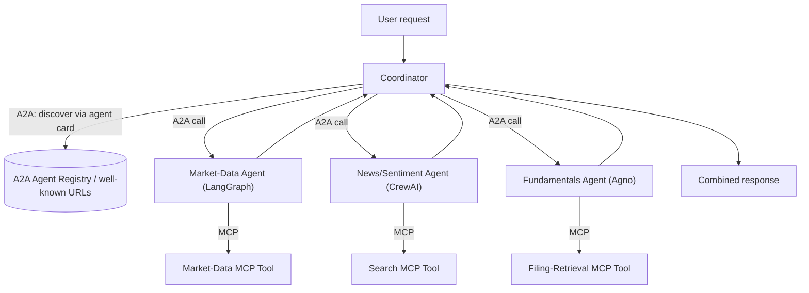

# PLAN.md — A2A Multi-Framework Agent Network

## 1. Objective & Success Criteria

Rebuild 3 of Project 01's specialists (market-data, news/sentiment, fundamentals) as **independent services in 3 different frameworks** — one LangGraph, one CrewAI, one Agno — each exposing itself over Google's Agent-to-Agent (A2A) protocol so a coordinator can discover and call any of them without knowing their internal implementation, and each with its own internal MCP tools. This proves interoperability, not just single-framework proficiency — a distinct and rarer signal than "I know LangGraph."

| Metric | Target |
|---|---|
| Frameworks represented as independent A2A-compliant agents | 3 (LangGraph, CrewAI, Agno) |
| Coordinator successfully discovers all 3 agents via A2A agent cards (no hardcoded endpoint knowledge beyond a registry URL) | 100% |
| A cross-framework request (coordinator → LangGraph agent → its own MCP tool) completes correctly | verified end-to-end |
| Swapping one agent's implementation (e.g., replace the CrewAI news agent with a different framework) requires zero coordinator code changes | verified by actually doing the swap once |
| P95 latency overhead of A2A call vs. an in-process call to the same logic | reported (expect meaningfully higher — document by how much) |

## 2. Architecture



### Components

| Component | Role | Framework | Protocol exposed | Internal tools |
|---|---|---|---|---|
| Coordinator | Discovers and calls the 3 specialist agents, combines results | any (LangGraph recommended for consistency with Project 01) | A2A client | none — pure orchestration |
| Market-Data Agent | Same responsibility as Project 01's market-data worker, now a standalone service | LangGraph | A2A server (agent card + task endpoint) | MCP tool wrapping yfinance |
| News/Sentiment Agent | Same responsibility as Project 01's news worker, now standalone | CrewAI | A2A server | MCP tool wrapping web search |
| Fundamentals Agent | Simplified fundamentals lookup (can be a lighter version than Project 01's full CRAG, to keep this project's scope on protocol interop rather than re-doing Project 01's RAG work) | Agno | A2A server | MCP tool wrapping a small filing-snippet store |

### Message schema (pseudocode — A2A task request/response)

```python
class A2ATaskRequest(TypedDict):
    task_id: str
    input: dict            # e.g. {"ticker": "AAPL"}
    requester_agent_id: str

class A2ATaskResponse(TypedDict):
    task_id: str
    status: Literal["completed","failed","needs_input"]
    output: dict | None
    error: str | None

class AgentCard(TypedDict):
    agent_id: str
    name: str
    description: str
    capabilities: list[str]     # what tasks this agent can accept
    endpoint_url: str
```

**Communication pattern:** each specialist is a fully independent process/service exposing an A2A **agent card** (self-description: capabilities, endpoint) and a task endpoint; the Coordinator discovers agents by fetching their cards (from a simple registry or well-known URLs) and dispatches A2A task requests, waiting for task responses. Internally, each specialist calls its own MCP-wrapped tool — MCP handles *tool* access within an agent, A2A handles *agent-to-agent* communication across agents; the project deliberately exercises both protocols together, since that combination is explicitly what's rare in 2026 hiring pools per the brief.

## 3. Tech Stack

| Choice | Why | Rejected alternative |
|---|---|---|
| Google's A2A protocol/SDK | The named, standard protocol for cross-agent, cross-framework communication as of 2026 | A custom REST API between your 3 services — would work functionally, but doesn't demonstrate protocol literacy, which is the actual point of this project |
| LangGraph / CrewAI / Agno, one each | Deliberately diverse — proves you're not just good at one framework | All 3 in the same framework — defeats the entire purpose of this project |
| MCP for each agent's internal tool access | Consistent with the rest of this portfolio's tool-access pattern; also demonstrates MCP+A2A used together, the explicit 2026-hiring signal called out in the source material | Each agent's tools hand-rolled differently — works, but misses the "I've shipped A2A + MCP together" claim this project exists to earn |
| Docker Compose running all 4 services (coordinator + 3 specialists) | Each is an independent, separately deployable process — Compose is the natural way to demo that | A monorepo that imports all 3 frameworks into one process — reintroduces tight coupling and defeats the "independent service" premise |

## 4. Phase-by-Phase Build Plan

| Phase | Goal | Definition of Done | Est. time |
|---|---|---|---|
| 0 — Setup | Install A2A SDK, build one trivial "hello world" A2A agent + a coordinator that calls it | Coordinator discovers the hello-world agent's card and gets a valid task response | 3–4 days |
| 1 — LangGraph Agent | Market-Data specialist as a standalone LangGraph service, A2A-wrapped, MCP tool for yfinance | Standalone `curl`/A2A-client call returns correct market data for a test ticker | 4–5 days |
| 2 — CrewAI Agent | News/Sentiment specialist as a standalone CrewAI service, A2A-wrapped, MCP tool for search | Same validation as Phase 1, different framework | 4–5 days |
| 3 — Agno Agent | Fundamentals specialist as a standalone Agno service, A2A-wrapped, MCP tool for filing snippets | Same validation, third framework | 3–4 days |
| 4 — Coordinator | Discovers all 3 via agent cards, dispatches in parallel, combines results | A single user request produces a combined response drawing from all 3 frameworks, with no coordinator code referencing framework-specific internals | 3–4 days |
| 5 — Interop proof + Eval | Swap one specialist's implementation (e.g. reimplement the news agent in a 4th framework or a plain script) with zero coordinator changes; measure A2A latency overhead | Swap performed and documented; latency overhead reported vs. an in-process baseline | 3–4 days |
| 6 — Polish | Docker Compose for all 4 services, README explaining the protocol interop story | `docker compose up` starts all 4 independently and the coordinator successfully calls all 3 | 2–3 days |

**Total: ~3–4 weeks part-time.**

## 5. Data & API Requirements

- Reuses the same external dependencies as Project 01's relevant workers (yfinance, a search API) — no new data sources, just re-hosted in 3 different frameworks.
- A2A SDK/library (check current official release for your language — Python is assumed throughout this portfolio).
- LLM budget: similar to a single Project-01 run per test, since this project doesn't add the critic/reflection loop — a lighter build.

## 6. Eval Strategy

- **Discovery correctness:** the coordinator must locate all 3 agents purely from their agent cards/registry, never a hardcoded endpoint baked into coordinator logic — verify by changing an agent's port/URL and confirming the coordinator still works after only updating the registry, not its own code.
- **Interop proof:** the single most important "test" in this project is the Phase 5 swap — actually replace one specialist's framework and confirm the coordinator needs zero changes. Document this with a before/after diff showing the coordinator file is untouched.
- **Latency overhead:** benchmark the same logical call (e.g., "get AAPL price") via A2A vs. a direct in-process function call; report the overhead honestly — A2A/network hops are not free, and acknowledging the tradeoff (protocol flexibility vs. latency) is more credible than pretending there's no cost.

## 7. Risks & Where These Projects Usually Fail

- **Building 3 services that don't actually need to talk cross-framework.** If you could have just called 3 Python functions in one process, you haven't tested anything interesting — the interop proof (§6, Phase 5) is what makes this project real rather than superficial.
- **Hardcoding agent endpoints in the coordinator "to save time."** This defeats the entire discovery-based design; if you do this even temporarily, it must be fixed before Phase 4 is considered done.
- **Treating A2A and MCP as interchangeable.** They solve different problems (agent-to-agent task delegation vs. agent-to-tool access) — mixing them up in your own explanation is a common and easily-caught mistake in an interview.
- **Skipping the latency-overhead measurement because the number looks bad.** Reporting "yes, this is slower than an in-process call, and here's by how much" is more credible and more interesting than omitting the number.
- **Scope creep into re-solving Project 01's RAG problem for the Fundamentals agent.** This project's fundamentals agent can be a simplified snippet lookup — the interesting engineering here is protocol interop, not re-doing CRAG.

## 8. Implementation Notes for the Executing Model

- Get the trivial "hello world" A2A round-trip (Phase 0) working before porting any real logic — this isolates protocol-plumbing bugs from business-logic bugs.
- Keep each specialist's A2A server code physically separate (separate directories/repos-in-a-monorepo, separate `requirements.txt`) — this is what makes the "independent service" and "swap one out" claims true rather than aspirational.
- The Coordinator should treat every specialist identically at the code level (same A2A client call shape) regardless of which framework backs it — if the coordinator has framework-specific branches, the abstraction has leaked.
- When measuring latency overhead, control for the obvious confound (are you comparing a warm vs. cold process, local vs. networked call) — state your methodology in the README so the number is defensible.
- Don't attempt to also add the critic/reflection loop from Project 01 here — this project's scope is protocol interop; a smaller, cleaner build is more convincing than a bloated one.

## 9. Definition of Done

- [ ] 3 specialists running as independent services in 3 different frameworks, each A2A- and MCP-compliant.
- [ ] Coordinator discovers all 3 purely via agent cards/registry.
- [ ] Framework-swap interop proof performed and documented with zero coordinator code changes.
- [ ] Latency overhead measured and reported honestly.
- [ ] Docker Compose brings up all 4 services; README tells the interop story clearly.
