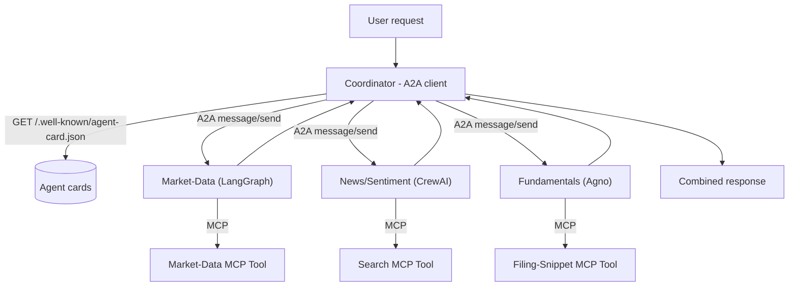

# PLAN.md — A2A Multi-Framework Agent Network

## 1. Objective & Success Criteria

Rebuild 3 of Project 01's specialists (market-data, news/sentiment, fundamentals) as **independent services in 3 different frameworks** — one LangGraph, one CrewAI, one Agno — each exposing itself over the **A2A protocol** so a coordinator can discover and call any of them without knowing their internals, and each with its own internal MCP tools. This proves interoperability, a rarer signal than "I know LangGraph."

| Metric | Target | How measured |
|---|---|---|
| Frameworks as independent A2A agents | 3 (LangGraph, CrewAI, Agno) | 3 running services |
| Coordinator discovers all 3 via agent cards (only a base URL/registry known) | 100% | fetch `/.well-known/agent-card.json` for each |
| Cross-framework request completes correctly | verified end-to-end | integration test |
| Swap one agent's framework → zero coordinator code changes | verified by doing it once | before/after coordinator diff |
| A2A call latency overhead vs. in-process | reported honestly | benchmark |

## 2. Architecture



### A2A data model (rewritten against the real spec — Sonnet's schema was invented)

The real A2A protocol (verified from the `a2aproject/A2A` spec clone) uses JSON-RPC methods and these objects — **use these, not the fabricated `A2ATaskRequest`/`agent_id` shapes**:

```python
# AgentCard (served at https://{host}/.well-known/agent-card.json)
class AgentCard(TypedDict):
    name: str
    description: str
    url: str                          # base A2A endpoint
    version: str
    capabilities: dict                # {streaming: bool, pushNotifications: bool, ...}
    defaultInputModes: list[str]      # e.g. ["text/plain"]
    defaultOutputModes: list[str]
    skills: list["AgentSkill"]

class AgentSkill(TypedDict):
    id: str
    name: str
    description: str
    tags: list[str]
    examples: list[str]

# Interaction is JSON-RPC. Primary methods:
#   message/send   -> send a Message, get a Task or Message back
#   tasks/get      -> poll a Task by id
# A Task moves through states: submitted -> working -> (input-required) -> completed | failed | canceled
# Messages carry Parts (TextPart / FilePart / DataPart).
```

Discovery is the **well-known URI** `GET /.well-known/agent-card.json` per RFC 8615 (optionally augmented by a registry). SDK types live in `a2a.types` (`AgentCard`, `AgentSkill`, `AgentCapabilities`, `Message`, `Task`, `Part`). Install `pip install a2a-sdk`.

### Components

| Component | Framework | Exposes | Internal tools |
|---|---|---|---|
| Coordinator | any (LangGraph recommended) | A2A **client** | none — pure orchestration |
| Market-Data | LangGraph | A2A server (card + JSON-RPC) via `a2a-sdk` | MCP tool wrapping yfinance |
| News/Sentiment | CrewAI | A2A server via `a2a-sdk` | MCP tool wrapping web search |
| Fundamentals | Agno | A2A server via `a2a-sdk` | MCP tool wrapping a filing-snippet store |

**How CrewAI/Agno get A2A'd (Sonnet left this ambiguous):** neither has to be "natively A2A." Each specialist wraps its framework agent behind an `a2a-sdk` server (an `AgentExecutor` that receives a `Message`, runs the underlying CrewAI/Agno/LangGraph agent, and returns a `Task`/`Message`). This is exactly the pattern in `a2aproject/a2a-samples` (`samples/python/agents/*`). The framework is an implementation detail behind the A2A boundary — which is the whole point.

**Communication pattern.** Each specialist is an independent process exposing an agent card + JSON-RPC endpoint; the Coordinator fetches cards, then sends `message/send` requests and reads `Task` results — independent of what's inside each agent. Internally each specialist calls its own MCP-wrapped tool. **MCP = agent→tool; A2A = agent→agent** — this project exercises both together, the explicit 2026 signal.

## 3. Tech Stack

| Choice | Why | Rejected |
|---|---|---|
| A2A protocol + `a2a-sdk` | The standard cross-agent/cross-framework protocol | Custom REST between services — works, but shows no protocol literacy |
| LangGraph / CrewAI / Agno, one each | Proves you're not single-framework | All same framework — defeats the purpose |
| MCP for each agent's internal tools | Consistent + demonstrates MCP+A2A together | Hand-rolled tools — misses the combined claim |
| Docker Compose (coordinator + 3 specialists) | Independent, separately deployable processes | Monorepo one-process — reintroduces coupling |

## 4. Phase-by-Phase Build Plan

| Phase | Goal | Definition of Done | Est. |
|---|---|---|---|
| 0 — Setup | `a2a-sdk`; a hello-world A2A agent + coordinator | Coordinator discovers the card and gets a valid `Task` | 3–4 d |
| 1 — LangGraph agent | Market-Data as a standalone A2A service + yfinance MCP tool | A2A-client call returns correct data for a ticker | 4–5 d |
| 2 — CrewAI agent | News/Sentiment standalone, A2A-wrapped + search MCP tool | Same validation, different framework | 4–5 d |
| 3 — Agno agent | Fundamentals standalone, A2A-wrapped + filing MCP tool | Same validation, third framework | 3–4 d |
| 4 — Coordinator | Discovers all 3 via cards, dispatches in **parallel** (async), combines | One request → combined response from all 3, no framework-specific branches in coordinator | 3–4 d |
| 5 — Interop proof + Eval | Swap one specialist's framework, zero coordinator changes; measure latency overhead | Swap done + before/after coordinator diff; overhead reported | 3–4 d |
| 6 — Polish | Compose for all 4; README tells the protocol story | `docker compose up` runs all 4; coordinator calls all 3 | 2–3 d |

**Total: ~3–4 weeks part-time.**

## 5. Data & API Requirements

- Same externals as Project 01's workers (yfinance, a search API) — re-hosted across 3 frameworks, no new data.
- `a2a-sdk` (`pip install a2a-sdk`); MCP Python SDK for internal tools.
- LLM budget: ~a single Project-01 run per test (no critic loop here) — a lighter build.

## 6. Eval Strategy

- **Discovery correctness:** the coordinator locates all 3 purely from `/.well-known/agent-card.json` — verify by changing a specialist's port/URL and confirming the coordinator still works after updating only the card/registry, not its own code.
- **Interop proof:** the Phase-5 swap — reimplement one specialist in a 4th framework (or a plain script wrapped by `a2a-sdk`), confirm the coordinator file is byte-identical (aside from git noise). This before/after diff is the headline artifact.
- **Latency overhead:** benchmark the same logical call (e.g., "AAPL price") via A2A vs. a direct in-process function call; report the overhead honestly (expect meaningfully higher). Control for warm-vs-cold process and local-vs-networked, and state the methodology.

## 7. Risks & Where These Projects Usually Fail

- **3 services that never needed to be separate** — if they could've been 3 functions in one process, nothing interesting is tested; the swap proof (§6) is what makes it real.
- **Hardcoding endpoints in the coordinator** — defeats discovery; fix before Phase 4 is "done".
- **Confusing A2A and MCP** — agent-to-agent vs. agent-to-tool; mixing them up is an easily-caught interview mistake.
- **Hiding the latency cost** — report it; acknowledging the tradeoff is more credible than pretending it's free.
- **Re-solving Project 01's CRAG** — the fundamentals agent here is a simplified snippet lookup; scope stays on protocol interop.

## 8. Implementation Notes for the Executing Model

- Get the hello-world A2A round-trip working before porting real logic — isolates protocol plumbing from business logic. Start from `a2aproject/a2a-samples` `samples/python/agents/helloworld`.
- Use the **real** `a2a.types` objects (`AgentCard`, `Message`, `Task`, `Part`) and the `/.well-known/agent-card.json` discovery path — do not invent a message schema.
- Keep each specialist physically separate (own dir, own `requirements.txt`) — makes "independent service" and "swap one out" true, not aspirational.
- The Coordinator calls every specialist with the **same** A2A client shape regardless of framework — any framework-specific branch means the abstraction leaked.
- Dispatch the 3 specialists concurrently (asyncio) and combine — Phase 4's DoD implies parallelism, so design it async from the start.
- Emit each specialist's trajectory in its `Task` result metadata so the network is observable by Project 03/13.

## 9. Definition of Done

- [ ] 3 specialists running as independent services in 3 frameworks, each A2A- and MCP-compliant.
- [ ] Coordinator discovers all 3 via `/.well-known/agent-card.json`.
- [ ] Framework-swap interop proof done, with a byte-identical coordinator diff.
- [ ] Latency overhead measured and reported.
- [ ] Docker Compose brings up all 4; README tells the MCP+A2A interop story.

## 10. Localization (India-first)

**Location-neutral pattern — deliberately left global.** A2A protocol interop, framework-agnostic orchestration, and MCP+A2A-together are universal skills with no market assumptions. The protocol, agent-card discovery, and swap-a-framework proof are identical everywhere.

**India shows through by inheritance (no architecture change):** this project rebuilds three of **Project 01's specialists**, which are now Indian (market-data over `.NS`/`.BO`, news over Moneycontrol/ET, fundamentals over Indian filings). So the network's *data* is Indian, but the A2A/MCP wiring — the actual subject — is market-neutral. The `AgentSkill` descriptions in the agent cards will name Indian capabilities ("fetch NSE quote"), which is cosmetic.

**What stayed global:** the entire A2A/MCP interop curriculum.
