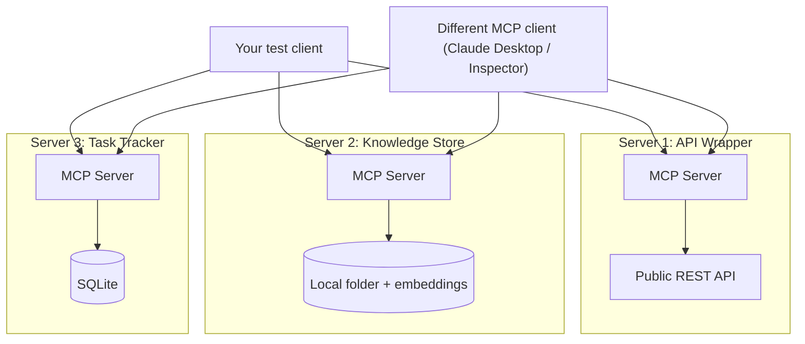

# PLAN.md — MCP Server Trilogy

**Why this project exists (not in the original 8).** Project 04 teaches you to *consume* MCP servers (and author a couple as a means to an end). Almost nobody builds and *publishes* standards-compliant MCP servers for others to use — that authoring skill is rarer and more directly hireable in 2026. This project isolates it, decoupled from any single agent's business logic, and takes it all the way to a published package on the official registry.

## 1. Objective & Success Criteria

Author, test, document, and publish 3 standalone MCP servers: an API-wrapper (weather/geocoding), a knowledge-store (semantic search over a folder), and a task-tracker (SQLite CRUD). Each passes MCP Inspector, ships real tests, and at least one is published to PyPI and submitted to the official MCP Registry.

| Metric | Target | How measured |
|---|---|---|
| MCP servers built, independently installable | 3 (own `pyproject.toml`) | 3 packages |
| MCP Inspector compliance | 3/3, 0 errors | Inspector |
| Automated tool test coverage | ≥80% of defined tools covered | `coverage.py` on tool fns **and** a protocol-level subprocess test per tool |
| Connectable from a *different* MCP client (Claude Desktop / Inspector) | verified for all 3 | manual cross-client check |
| Published publicly | ≥1 on PyPI + submitted to the official MCP Registry | `pip install` from clean env + registry submission |

## 2. Architecture



### Server specs (all three at equal depth — Sonnet only detailed the task-tracker)

**Server 1 — API-Wrapper**
```python
@mcp.tool()
def get_current_weather(location: str) -> WeatherResult:
    """location = city name or 'lat,lon'. On upstream 4xx/5xx or timeout,
       return WeatherError (typed MCP error), never raise/crash the process."""

@mcp.tool()
def geocode(place_name: str) -> list[GeoResult]:
    """Empty list if not found (not an error)."""

@mcp.resource("recent_queries")   # read-only, last N lookups cached in memory
def recent_queries() -> list[str]: ...
```
Error handling: wrap the upstream call; map timeout→`{code: "upstream_timeout"}`, 4xx→`{code: "bad_request"}`, 5xx→`{code: "upstream_unavailable"}`. Cache the last N responses in memory, exposed as a **resource** (a concrete tools-vs-resources example).

**Server 2 — Knowledge-Store**
```python
@mcp.tool()
def search_documents(query: str, top_k: int = 5) -> list[DocHit]:
    """DocHit = {doc_id, path, snippet, score}. top_k clamped to [1,20]."""

@mcp.tool()
def get_document(doc_id: str) -> Document:
    """Raises a typed not_found error for an unknown doc_id."""

@mcp.resource("document_index")    # list of indexed docs, read-only
def document_index() -> list[str]: ...
```
Backing: a folder + a small embedded index (Chroma or flat-file cosine). No web UI, no reranking — a solid typed tool pair is the deliverable.

**Server 3 — Task-Tracker**
```python
@mcp.tool()
def create_task(title: str, due_date: str | None = None) -> TaskRecord:
    """due_date ISO-8601 or None."""

@mcp.tool()
def list_tasks(status: Literal["open","done","all"] = "open") -> list[TaskRecord]: ...

@mcp.tool()
def complete_task(task_id: str) -> TaskRecord:
    """Idempotent: completing an already-done task returns it unchanged.
       Unknown task_id -> typed not_found error (distinct from already-done)."""

@mcp.resource("task_board")
def task_board() -> list[TaskRecord]: ...
```
Backing: SQLite (durable across restarts).

**Communication pattern.** Each server is a fully independent process — **stdio** for local dev, **Streamable HTTP** for remote (not the deprecated SSE) — with no shared state or code between the 3. This independence is the point, not a detail to relax.

## 3. Tech Stack

| Choice | Why | Rejected |
|---|---|---|
| Official MCP Python SDK | Standards-compliant; Inspector-validatable; matches Project 04 | FastMCP-only for all 3 — fine for the simplest; use the lower-level SDK at least once to understand what FastMCP abstracts |
| SQLite (task-tracker) | Zero-ops, durable, ships alongside | In-memory — doesn't survive restart |
| Small embedded vector index | Dependency-light, easy to install | Hosted vector DB — a consumer would have to provision it |
| `pytest` + protocol-level subprocess tests | Unit correctness + real transport | Inspector-UI-only — doesn't scale/CI |
| PyPI + official MCP Registry (`server.json`) | Makes "install this" literal | GitHub-only — a weaker "published" claim |

## 4. Phase-by-Phase Build Plan

| Phase | Goal | Definition of Done | Est. |
|---|---|---|---|
| 0 — Setup | SDK + Inspector; pick the free public API for Server 1 | Inspector connects to a trivial one-tool server | 1–2 d |
| 1 — Server 1 | Weather/geocoding, cached, typed error handling | Inspector clean; real call round-trips; a simulated API failure returns a typed MCP error, no crash | 3–4 d |
| 2 — Server 2 | Doc search over a real folder (this portfolio's markdown) | Search returns relevant hits w/ correct resource metadata; Inspector clean | 4–5 d |
| 3 — Server 3 | SQLite CRUD, idempotent completion | Inspector clean; `complete_task` on a done task no-ops; unknown id returns not_found | 3–4 d |
| 4 — Cross-client | Connect all 3 to a *different* MCP client | Successful call per server from an independent client, screenshot/log | 2–3 d |
| 5 — Tests + Packaging | pytest (≥80% tools) + PyPI for ≥1 | Tests pass in CI; `pip install <pkg>` works from a clean env | 3–4 d |
| 6 — Publish + Polish | Submit to the official MCP Registry; per-server READMEs | Registry submission made (or documented attempt); each server has a standalone README | 2–3 d |

**Total: ~3 weeks part-time.**

## 5. Data & API Requirements

- A free-tier public API for Server 1 (prioritize easy setup for whoever installs it — a keyless or low-friction geocoding/weather API).
- Server 2: this portfolio's own markdown (`projects/*/*.md`) as a ready corpus.
- Server 3: local SQLite only.
- LLM cost: near zero — these are tool-serving processes; the only LLM use is optional, for `prompt`-template example generation during testing.

## 6. Eval Strategy

- **Protocol compliance:** Inspector on each server, 0 errors — the primary non-negotiable eval.
- **Tool correctness:** per tool, ≥1 valid-input test and ≥1 invalid/edge case (`complete_task` on a nonexistent id → clear typed error, not a crash). Coverage measured two ways: `coverage.py` line coverage of tool functions **and** a protocol-level test that spins up the server as a subprocess and calls each tool over its real transport.
- **Cross-client interop:** the most convincing eval — a client you didn't write calls each server unmodified.
- **Installability:** install + run ≥1 server from a genuinely clean environment/container using only the published README.

## 7. Risks & Where These Projects Usually Fail

- **A "server" secretly coupled to your own client's assumptions** — cross-client verification exists to catch this.
- **Skipping upstream-error handling** — a flaky weather API 500 should be a typed MCP error, not an unhandled exception.
- **Non-idempotent/unsafe CRUD** — predictable `complete_task`/`create_task` semantics; sloppy CRUD undermines "production-grade".
- **"Published" = "on GitHub"** — a PyPI package + registry submission is materially stronger.
- **Over-scoping one server into a mini-app** — the knowledge store needs a solid `search_documents`/`get_document`, not a RAG pipeline (that's Project 10).

## 8. Implementation Notes for the Executing Model

- Build + Inspector-validate each server in **complete isolation** — no shared imports, ideally separate venvs — to keep "independent, publishable" honest.
- Use the SDK's **typed** tool decorator (Pydantic-backed params/returns) so Inspector's schema validation is meaningful — loosely-typed dicts defeat it.
- API-wrapper: cache last N responses in memory and expose them as an MCP **resource**, not a tool — the concrete tools-vs-resources example.
- pytest must spin each server as a **subprocess over its real transport**, not call internal functions — internal-only tests miss protocol bugs.
- **Publishing target (concrete):** the official **MCP Registry** exists at `registry.modelcontextprotocol.io` (repo `modelcontextprotocol/registry`) and uses a `server.json` manifest — submit there, plus PyPI. Don't defer this to "search at implementation time"; it's named now.
- If the registry submission has a review queue, document the submission (date, what) as evidence — a genuine attempt completes the goal.

## 9. Definition of Done

- [ ] 3 MCP servers, independently packaged, each Inspector-clean, Streamable-HTTP-capable.
- [ ] pytest ≥80% tool coverage, run against the real transport.
- [ ] Each server verified from a different MCP client.
- [ ] ≥1 server on PyPI + submitted to the official MCP Registry with a `server.json`.
- [ ] Each server has its own standalone README.
