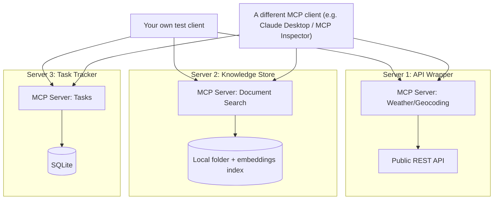

# PLAN.md — MCP Server Trilogy (New Project)

**Why this project exists (not in the original 8):** Project 04 teaches you to *consume* MCP servers as a client. Almost nobody builds and *publishes* standards-compliant MCP servers for others to use — that authoring skill is rarer and more directly hireable in 2026 than another agent-that-calls-tools project. This project isolates that skill on its own, decoupled from any single agent's business logic.

## 1. Objective & Success Criteria

Author, test, document, and publish 3 standalone MCP servers: one wrapping a public API (e.g., a weather or geocoding API), one wrapping a local document/knowledge store (semantic search over a folder of files), and one wrapping a task tracker (create/list/complete tasks, backed by SQLite). Each must pass MCP Inspector's compliance checks, ship with real tests, and at least one must be submitted/packaged for the public MCP registry or listed in a community server directory.

| Metric | Target |
|---|---|
| MCP servers built | 3, each independently installable (own `pyproject.toml`/`requirements.txt`) |
| MCP Inspector compliance (schema validation, no errors) | 3/3 pass |
| Automated test coverage of each server's tools (does calling each tool with valid/invalid input behave correctly) | ≥80% of defined tools covered by an automated test |
| Servers connectable from a *different* MCP client than the one you wrote (e.g., Claude Desktop or another sample client) without modification | verified for all 3 |
| At least 1 server published/listed publicly (PyPI package + a submission attempt to a community MCP server directory) | 1 |

## 2. Architecture



### Server specs

| Server | Tools | Resources | Prompts | Backing store |
|---|---|---|---|---|
| API-Wrapper Server | `get_current_weather(location)`, `geocode(place_name)` | `recent_queries` (last N lookups, read-only) | `weather_summary_prompt` template | none — pure API pass-through, cache last N responses in memory |
| Knowledge-Store Server | `search_documents(query, top_k)`, `get_document(doc_id)` | `document_index` (list of indexed docs, read-only) | `answer_from_docs_prompt` template | local folder + a small embedded vector index (Chroma or a flat file + cosine similarity) |
| Task-Tracker Server | `create_task(title, due_date)`, `list_tasks(status)`, `complete_task(task_id)` | `task_board` (all open tasks, read-only) | none required | SQLite |

### Interface schema (pseudocode — one server's tool definitions, pattern repeats for the other two)

```python
# Task-Tracker Server, illustrative
@mcp.tool()
def create_task(title: str, due_date: str | None = None) -> TaskRecord:
    """Create a new task. due_date is ISO-8601 or None."""
    ...

@mcp.tool()
def list_tasks(status: Literal["open","done","all"] = "open") -> list[TaskRecord]:
    ...

@mcp.tool()
def complete_task(task_id: str) -> TaskRecord:
    """Idempotent: completing an already-completed task returns it unchanged, not an error."""
    ...

@mcp.resource("task_board")
def task_board() -> list[TaskRecord]:
    ...
```

**Communication pattern:** each server is a fully independent process (stdio transport for local dev, optionally HTTP+SSE if you containerize for remote access) with no shared state or code dependency between the 3 — this independence is the point being demonstrated, not an implementation detail to relax "for convenience."

## 3. Tech Stack

| Choice | Why | Rejected alternative |
|---|---|---|
| Official MCP Python SDK | Standards-compliant by construction, matches Project 04's approach for consistency | FastMCP alone for all 3 — fine for the simplest server, but worth also using the lower-level official SDK at least once to understand what FastMCP abstracts away |
| SQLite for the Task-Tracker | Zero-ops, durable, trivial to ship alongside the server | An in-memory store — wouldn't survive a restart, undermines "a real, usable tool" |
| A small embedded vector index (Chroma or flat-file cosine similarity) for the Knowledge-Store | Keeps the server dependency-light and easy to install | A hosted vector DB — adds an external dependency a server consumer would need to provision just to try your tool |
| `pytest` + MCP Inspector's CLI mode (if available) for automated compliance/tool testing | Combines unit-level tool correctness with protocol-level compliance | Manual testing only via the Inspector UI — doesn't scale and can't run in CI |
| PyPI packaging (`pyproject.toml`, versioned release) for at least one server | Makes "install and use this" a literal `pip install` for a stranger | Only a GitHub repo with no packaging — still useful but a materially weaker "published" claim |

## 4. Phase-by-Phase Build Plan

| Phase | Goal | Definition of Done | Est. time |
|---|---|---|---|
| 0 — Setup | MCP SDK + Inspector installed, pick the specific public API for Server 1 (free tier, no-cost) | Inspector connects to a trivial one-tool server | 1–2 days |
| 1 — Server 1 (API Wrapper) | Weather/geocoding server, cached responses, error handling for API failures | Inspector validation passes; a real API call round-trips correctly; a simulated API failure returns a clean MCP error, not a crash | 3–4 days |
| 2 — Server 2 (Knowledge Store) | Document search server over a real folder of files (e.g., this very portfolio's markdown files) | Search returns relevant chunks with correct resource metadata; Inspector passes | 4–5 days |
| 3 — Server 3 (Task Tracker) | SQLite-backed CRUD-style tool set, idempotent completion | Inspector passes; a `complete_task` call on an already-done task doesn't error | 3–4 days |
| 4 — Cross-client verification | Connect all 3 servers to a *different* MCP client than your own test harness | Successful tool call from an independent client for each server, documented with a screenshot/log | 2–3 days |
| 5 — Tests + Packaging | pytest suite per server (≥80% tool coverage), PyPI packaging for at least one | Tests pass in CI; `pip install <your-package>` works from a clean environment | 3–4 days |
| 6 — Publish + Polish | Submit/list at least one server in a community MCP directory, write per-server READMEs | Submission made (even if review is pending) or a documented attempt if a directory has a waitlist; each server has its own standalone README | 2–3 days |

**Total: ~3 weeks part-time.**

## 5. Data & API Requirements

- A free-tier public API for Server 1 (e.g., a no-key or low-friction-signup weather/geocoding API) — pick one with a generous free tier so the server is actually usable by someone who clones it.
- No special data for Server 2 beyond a folder of real documents (this portfolio's own markdown files are a perfectly good, readily available corpus).
- No external API for Server 3 — purely local SQLite.
- LLM cost: near zero — these are tool-serving processes, not agents; the only LLM usage in this project is optional, for the `prompt` templates' example generations during testing.

## 6. Eval Strategy

- **Protocol compliance:** MCP Inspector run against each server with zero schema/validation errors — this is the primary, non-negotiable eval for this project.
- **Tool-level correctness tests:** for each defined tool, at least one valid-input test and one invalid-input/edge-case test (e.g., `complete_task` on a nonexistent ID should return a clear error, not crash the server process).
- **Cross-client interoperability:** the single most convincing eval — connect each server to an MCP client you didn't write and confirm it works unmodified. This directly validates the "standards-compliant, not just working with my own code" claim.
- **Installability:** have someone else (or yourself, from a genuinely clean environment/container) install and run at least one server from only its published README instructions, with no undocumented steps.

## 7. Risks & Where These Projects Usually Fail

- **Building a "server" that's secretly coupled to your own client's assumptions.** If it only works when called by code you also wrote, you've built a tool wrapper with extra steps — the cross-client verification phase exists specifically to catch this.
- **Skipping error handling for the wrapped external API.** A flaky weather API returning a 500 should produce a clean, typed MCP error response, not an unhandled exception that kills the server process.
- **Non-idempotent or unsafe tool operations.** `complete_task` on an already-completed task, or `create_task` called twice with identical retry semantics, should behave predictably — sloppy CRUD semantics undermine the "production-grade" claim this project is going for.
- **Treating "published" as "the code is on GitHub."** A real publish attempt (PyPI package, or a submission to a community directory) is a materially different and stronger claim than a repo existing — don't let this collapse to the easy version.
- **Over-scoping one server into a mini-application.** The Knowledge-Store server doesn't need a web UI or a full RAG pipeline with reranking — it needs a solid, well-typed `search_documents`/`get_document` tool pair; resist scope creep here.

## 8. Implementation Notes for the Executing Model

- Build and Inspector-validate each server in complete isolation from the other two and from any agent code — no shared imports, no shared virtual environment even, to keep the "independent, publishable" claim honest.
- Use the MCP SDK's typed tool-decorator pattern (Pydantic-backed parameter/return typing) rather than accepting/returning loosely-typed dicts — this is what makes Inspector's schema validation actually meaningful.
- For the API-Wrapper server, cache the last N responses in memory and expose them via an MCP `resource` (not a `tool`) — this is a good concrete example of the tools-vs-resources distinction taught in Project 04's PROFESSOR-NOTES.md.
- Write the pytest suite to spin up each server as a subprocess and talk to it over its real transport (not just calling the underlying Python functions directly) — testing only the internal functions would miss real protocol-level bugs.
- If a community MCP server directory's submission process has a review queue or waitlist, document the submission itself (date, what you submitted) as your evidence — you don't need approval to have completed this project's goal, just a genuine, verifiable attempt.

## 9. Definition of Done

- [ ] 3 MCP servers built, independently packaged, each Inspector-compliant.
- [ ] Automated pytest suite covering ≥80% of each server's tools, run against the real transport.
- [ ] Each server verified working from a different MCP client than your own.
- [ ] At least one server published as an installable package and submitted to a public directory.
- [ ] Each server has its own standalone README.
