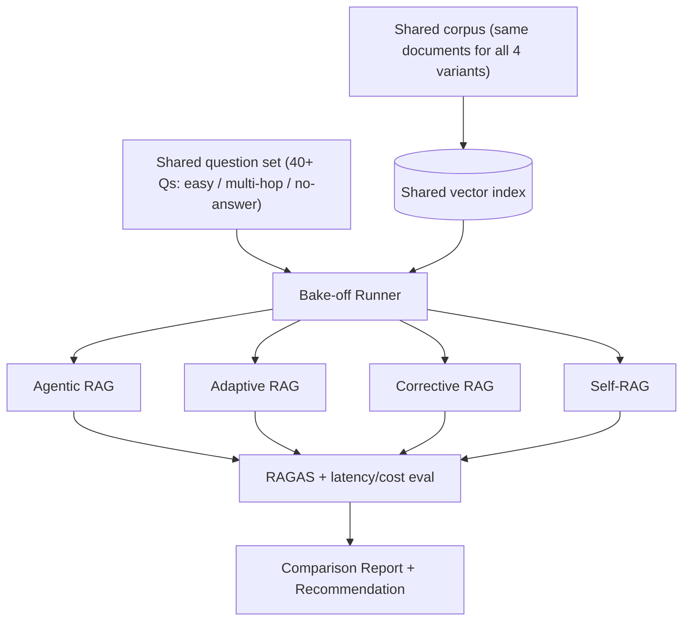

# PLAN.md — RAG Architecture Bake-Off (New Project)

**Why this project exists (not in the original 8):** the curated list highlights 4 distinct LangGraph RAG patterns (Agentic, Adaptive, Corrective, Self-RAG) as "the state of the art... knowing all four is a differentiator" — but nothing in the original 8 projects actually implements and compares all four head-to-head. Project 01 uses Corrective RAG as one sub-component; this project makes RAG architecture itself the subject, producing a citable, numbers-backed comparison the other projects only gesture at individually.

## 1. Objective & Success Criteria

Implement all four RAG variants — Agentic RAG, Adaptive RAG, Corrective RAG (CRAG), and Self-RAG — over the *same* document set and the *same* question set, then benchmark them head-to-head on faithfulness, answer relevancy, context precision/recall (via RAGAS), plus latency and cost per query. Publish the comparison as the project's headline artifact.

| Metric | Target |
|---|---|
| RAG variants implemented and evaluated on identical data/questions | 4/4 |
| RAGAS metrics computed per variant (faithfulness, answer relevancy, context precision, context recall) | all 4 metrics × all 4 variants |
| Eval question set size | ≥40 questions spanning easy factual, multi-hop, and no-answer-in-corpus categories |
| Cost/latency reported per variant, per question category | reported for all 4 × 3 categories |
| A clear, data-backed recommendation ("use X when...") | written, grounded in the actual numbers, not generic advice |

## 2. Architecture



### Variant roster (what distinguishes each, per PLAN.md's own conceptual grounding)

| Variant | Core mechanism | Extra components vs. naive RAG |
|---|---|---|
| Agentic RAG | Agent decides *whether and how* to retrieve before answering (may skip retrieval, retrieve once, or retrieve iteratively) | a routing/decision step before retrieval |
| Adaptive RAG | Routes the query by estimated complexity: no-retrieval / single-step / multi-step retrieval | a query-complexity classifier |
| Corrective RAG (CRAG) | Grades retrieved chunks; falls back to web search when grade is poor | a grader + a fallback retrieval source |
| Self-RAG | Reflects on its own generated answer; re-retrieves if the answer isn't well-supported by the retrieved context | a post-generation critique + conditional re-retrieval loop |

### State schema (pseudocode — shared across variants for fair comparison)

```python
class BakeOffQuestion(TypedDict):
    question_id: str
    question: str
    category: Literal["easy_factual","multi_hop","no_answer_in_corpus"]
    gold_answer: str | None       # None for genuinely unanswerable questions

class VariantRunResult(TypedDict):
    variant: Literal["agentic","adaptive","corrective","self_rag"]
    question_id: str
    retrieved_context: list[str]
    answer: str
    latency_ms: int
    cost_usd: float
    ragas_scores: dict            # faithfulness, answer_relevancy, context_precision, context_recall
```

**Communication pattern:** each variant is its own small LangGraph, structurally different by design (that's the whole comparison) but sharing the same underlying vector index, the same question set, and the same evaluation harness — the Bake-off Runner is a thin orchestration layer that runs all 4 variants over all questions and hands results to a common RAGAS-based scorer, not a multi-agent system in its own right.

## 3. Tech Stack

| Choice | Why | Rejected alternative |
|---|---|---|
| LangGraph for all 4 variants | Matches the curated source material's own reference implementations; keeps the comparison about RAG architecture, not framework differences | Implementing each variant in a different framework — would confound the comparison with framework effects, defeating the point |
| Same embedding model + same chunking strategy across all 4 | Isolates the comparison to retrieval/generation *control flow* differences, not embedding-quality differences | Different embeddings per variant — makes results incomparable |
| RAGAS for scoring | Purpose-built metrics for exactly this comparison (faithfulness, relevancy, context precision/recall) | Hand-rolled scoring — reinvents RAGAS's metrics worse and less comparably to published work |
| A fixed, shared question set with 3 explicit categories | Different RAG variants are expected to shine on different question types (e.g., Adaptive RAG should win on "no-retrieval-needed" easy questions by skipping retrieval entirely) — categorizing lets you show *when* each variant wins, not just an aggregate score | One undifferentiated question set — would hide exactly the nuance this project exists to reveal |

## 4. Phase-by-Phase Build Plan

| Phase | Goal | Definition of Done | Est. time |
|---|---|---|---|
| 0 — Shared foundation | Pick corpus (e.g., a set of technical docs or the SEC filings from Project 01, reused), build one shared vector index, write 40+ categorized questions with gold answers | Index built once; question set reviewed for category balance | 3–4 days |
| 1 — Corrective RAG | Implement CRAG (grader + web-search fallback) | Runs end-to-end on the full question set | 3–4 days |
| 2 — Self-RAG | Implement reflect-and-re-retrieve loop | Runs end-to-end; verify it actually re-retrieves on at least one under-supported answer in testing | 3–4 days |
| 3 — Adaptive RAG | Implement complexity-based routing (no-retrieval/single/multi-step) | Verify the no-retrieval path is actually taken for at least one easy question, not always routed to retrieval | 3–4 days |
| 4 — Agentic RAG | Implement retrieval-strategy-choosing agent | Runs end-to-end; distinguishable from Adaptive RAG in your own writeup (don't let these two collapse into the same implementation — see risk note) | 3–4 days |
| 5 — Bake-off + RAGAS | Run all 4 variants over all 40+ questions, compute RAGAS metrics + latency/cost | Full comparison table generated across variants × categories | 4–5 days |
| 6 — Report + Polish | Write the comparison report with a data-backed recommendation | README leads with the comparison table and a clear "use X when Y" summary | 2–3 days |

**Total: ~3–4 weeks part-time.**

## 5. Data & API Requirements

- A shared document corpus — reusing Project 01's SEC filings is a reasonable choice if built after Project 01 (keeps this project's setup cost low); otherwise any moderate technical-document corpus works.
- Web-search API (only needed for the Corrective RAG variant's fallback path) — reuse Tavily/DuckDuckGo choice from Project 01.
- RAGAS library (`pip install ragas`) — needs an LLM for some of its metrics (e.g., faithfulness uses an LLM judge internally) — budget accordingly.
- LLM cost: 4 variants × 40+ questions, several of which involve multiple LLM calls (grading, reflection, routing) — budget a moderate eval run, likely $5-15 total depending on model choice; this is the most LLM-call-intensive project in the portfolio precisely because it's comparing 4 architectures' overhead against each other.

## 6. Eval Strategy

*(This project's PLAN.md §6 and its actual deliverable are the same thing — the bake-off itself.)*

- **RAGAS metrics per variant per category:** faithfulness, answer relevancy, context precision, context recall — reported as a 4×3 (variant × category) grid, not just 4 aggregate numbers, since the whole value is showing *which variant wins on which question type*.
- **Cost/latency per variant per category:** CRAG and Self-RAG are expected to cost more on harder questions (extra grading/reflection calls); Adaptive RAG is expected to cost less on easy questions (skips retrieval entirely) — confirm or refute these expectations with your actual numbers rather than assuming them.
- **Qualitative failure analysis:** for each variant, find and describe at least one question it handles distinctly better or worse than the others, with the actual retrieved context and answer shown — numbers alone don't make the report compelling, concrete examples do.

## 7. Risks & Where These Projects Usually Fail

- **Agentic RAG and Adaptive RAG collapsing into the same implementation.** These are conceptually distinct (Agentic RAG picks a retrieval *strategy*; Adaptive RAG routes by query *complexity*) but naive implementations often end up doing the same thing under different names — be deliberate about what makes each one structurally different, and say so explicitly in the report.
- **Confounding the comparison with inconsistent setup.** Different chunk sizes, different embedding models, or different corpora per variant invalidates the whole comparison — lock these down once in Phase 0 and never vary them per variant.
- **RAGAS's own LLM-based metrics inheriting the same-model bias risk noted in Project 03.** Consider using a different model for RAGAS's internal judging than the one generating your variants' answers, for the same reason Project 03 flags this.
- **Only reporting aggregate scores, hiding the actually interesting result.** The real finding of a bake-off is usually "variant X wins on category Y, loses on category Z" — an aggregate average across categories can wash this out and make the report boring and less useful.
- **Treating this as "implement 4 tutorials" instead of "run a real experiment."** The value is entirely in the shared, controlled comparison — if each variant runs on different data or you don't compute the same metrics for all 4, you've built 4 disconnected demos, not a bake-off.

## 8. Implementation Notes for the Executing Model

- Build the shared corpus/index and the shared question set in Phase 0 and freeze them — do not let any later variant's implementation "just add one more document that helps it look better."
- For the "no_answer_in_corpus" question category, deliberately write a few questions with no supporting information in the corpus — a good RAG system (of any variant) should say so rather than hallucinating an answer; this category specifically tests that failure mode.
- Use a consistent, versioned model for both answer generation and RAGAS scoring across all 4 variants (pin the model version in your eval config) — a mid-run model version change would invalidate the comparison.
- When implementing Self-RAG's reflection step, verify with a deliberate test that it actually triggers re-retrieval at least once (e.g., manually construct a case with a weak initial retrieval) — a Self-RAG implementation that never actually re-retrieves in practice isn't demonstrating the pattern, just adding unused code.
- Report latency/cost per category, not just per variant — an aggregate latency number hides the fact that Adaptive RAG's whole value proposition is being fast on easy questions specifically.

## 9. Definition of Done

- [ ] All 4 variants implemented on a shared corpus, index, and question set.
- [ ] Full RAGAS + latency/cost comparison table (4 variants × 3 categories) generated.
- [ ] At least one concrete qualitative example per variant showing a distinguishing behavior.
- [ ] README leads with the comparison table and a clear, data-backed "use X when Y" recommendation.
