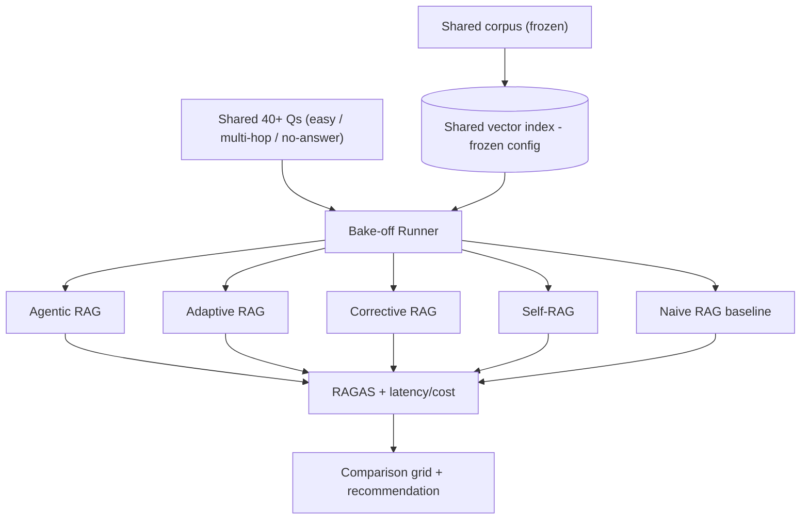

# PLAN.md — RAG Architecture Bake-Off

**Why this project exists (not in the original 8).** The curated list highlights 4 distinct LangGraph RAG patterns (Agentic, Adaptive, Corrective, Self-RAG) as a differentiator — but nothing in the original 8 implements and compares all four head-to-head. Project 01 uses CRAG as one sub-component; this project makes RAG architecture itself the subject, producing a citable, numbers-backed comparison the others only gesture at.

## 1. Objective & Success Criteria

Implement all four RAG variants over the *same* corpus and the *same* question set, then benchmark head-to-head on faithfulness, answer relevancy, context precision/recall (RAGAS), plus latency and cost. Publish the comparison as the headline artifact.

| Metric | Target | How measured |
|---|---|---|
| Variants implemented on identical data/questions | 4/4 | shared harness |
| RAGAS metrics per variant | all 4 metrics × 4 variants × 3 categories | RAGAS |
| Question set size | ≥40, spanning easy-factual / multi-hop / no-answer | committed `questions.json` |
| Cost/latency per variant per category | reported | token + wall-clock accounting |
| Data-backed "use X when Y" recommendation | written, grounded in the numbers | README |

## 2. Architecture



Note: add a **Naive RAG baseline** as a 5th column. Without it, "Corrective RAG scores 0.85 faithfulness" has no reference point; against naive you can show what each mechanism *buys*.

### The frozen experiment config (the control — Sonnet never specified it, which is ironic for a controlled experiment)

Locked once in Phase 0, never varied per variant:
- **Corpus:** a fixed 15–25 document technical set (reuse Project 01's ingested SEC filings if built, else a moderate technical corpus). Must contain genuine multi-hop content (facts split across ≥2 docs) or the multi_hop category is meaningless.
- **Embedding model:** one model, pinned version.
- **Chunking:** fixed size (≈800 tokens, 100 overlap), identical across variants.
- **Index:** one Chroma collection, `k=5` retrieval.
- **Generation + RAGAS-judge model:** pinned versions; use a *different* model for RAGAS's internal judging than for generation (same-model-bias caveat, per Project 03).

### Per-variant control-flow spec (since the tutorials moved — implement from these, not by reverse-engineering)

| Variant | Nodes/edges | Distinguishing trigger |
|---|---|---|
| Naive | retrieve k → generate | none |
| Corrective (CRAG) | retrieve → **grade each chunk 0/1** → if mean<0.5, web-search fallback → generate | retrieval-quality grade |
| Self-RAG | retrieve → generate → **critique answer vs. context** → if unsupported, re-retrieve+regenerate (cap 1) | post-generation groundedness |
| Adaptive | **classify query complexity** {no-retrieval / single / multi-step} → route → generate | upfront complexity classifier |
| Agentic | agent loop: **decide retrieve? which query?** → (optionally iterate retrieval) → generate | agent-chosen retrieval strategy, can iterate mid-process |

The Agentic-vs-Adaptive distinction (the #1 collapse risk): Adaptive routes **once, upfront, on complexity**; Agentic **decides and can re-decide mid-loop** what/whether to retrieve. Implement them so this shows in code, and demonstrate it with an example in the report.

### State schema (pseudocode — shared)

```python
class BakeOffQuestion(TypedDict):
    question_id: str
    question: str
    category: Literal["easy_factual","multi_hop","no_answer_in_corpus"]
    gold_answer: str | None       # None for genuinely unanswerable

class VariantRunResult(TypedDict):
    variant: Literal["naive","agentic","adaptive","corrective","self_rag"]
    question_id: str
    retrieved_context: list[str]
    answer: str
    latency_ms: int; cost_usd: float
    ragas_scores: dict            # faithfulness, answer_relevancy, context_precision, context_recall
```

**Communication pattern.** Each variant is its own small LangGraph, structurally different by design, sharing one index, one question set, one scorer. The Bake-off Runner is thin orchestration, not a multi-agent system.

## 3. Tech Stack

| Choice | Why | Rejected |
|---|---|---|
| LangGraph for all 5 | Matches the source implementations; keeps the comparison about architecture, not framework | Different frameworks per variant — confounds with framework effects |
| Same embedding + chunking across all | Isolates the comparison to control-flow differences | Per-variant embeddings — incomparable |
| RAGAS scoring | Purpose-built faithfulness/relevancy/precision/recall | Hand-rolled — worse, incomparable |
| Fixed categorized question set | Variants shine on different question types | One undifferentiated set — hides the interesting result |

## 4. Phase-by-Phase Build Plan

| Phase | Goal | Definition of Done | Est. |
|---|---|---|---|
| 0 — Shared foundation | Freeze corpus/index/config; write 40+ categorized Qs w/ gold answers | Index built once; category balance reviewed; config pinned | 3–4 d |
| 1 — CRAG + Naive baseline | Grader + web fallback; naive baseline | Both run end-to-end on the full set | 3–4 d |
| 2 — Self-RAG | Reflect-and-re-retrieve loop | Verified to re-retrieve on ≥1 under-supported answer in testing | 3–4 d |
| 3 — Adaptive | Complexity routing | No-retrieval path verified taken for ≥1 easy Q | 3–4 d |
| 4 — Agentic | Retrieval-strategy agent | Runs end-to-end; distinguishable from Adaptive in the writeup | 3–4 d |
| 5 — Bake-off + RAGAS | Run all 5 over all Qs; metrics + latency/cost | Full grid generated | 4–5 d |
| 6 — Report | Comparison + data-backed recommendation | README leads with the grid + "use X when Y" | 2–3 d |

**Total: ~3–4 weeks part-time.**

## 5. Data & API Requirements

- The frozen corpus (§2). Web-search API only for CRAG's fallback (reuse Project 01's Tavily/DuckDuckGo).
- RAGAS (`pip install ragas`) — uses an LLM internally for faithfulness; budget accordingly. Metric import names change across RAGAS versions — pin one and check names against the installed version.
- LLM cost: 5 variants × 40+ Qs, several with multiple calls (grade/reflect/route) — the most call-intensive project; budget $5–15.

## 6. Eval Strategy

- **RAGAS grid:** faithfulness, answer_relevancy, context_precision, context_recall as a **variant × category** grid (not 4 aggregate numbers) — the value is which variant wins on which question type.
- **Cost/latency per variant per category:** confirm/refute expectations with numbers (CRAG/Self-RAG cost more on hard Qs; Adaptive cheaper on easy). An aggregate latency hides Adaptive's whole point (fast on easy).
- **Significance:** with ~13 Qs/category, report the metric mean **and** its spread (e.g., a 95% CI or the per-question distribution); don't claim "X beats Y" on a within-noise gap.
- **Qualitative:** ≥1 concrete example per variant where it distinctly beats/loses to others, with the actual retrieved context and answer.

## 7. Risks & Where These Projects Usually Fail

- **Agentic and Adaptive collapse into the same impl** — be deliberate about the upfront-vs-mid-loop distinction and show it.
- **Confounded setup** — lock corpus/chunking/embeddings/index in Phase 0, never vary per variant.
- **RAGAS same-model bias** — use a different judge model than the generation model.
- **Aggregate-only reporting** — breaks by category or the interesting finding washes out.
- **"4 tutorials, not an experiment"** — the value is the shared, controlled comparison.

## 8. Implementation Notes for the Executing Model

- Build + **freeze** the shared corpus/index/question set in Phase 0 — no later variant may "add a document that helps it look better."
- Write a few genuinely unanswerable questions for `no_answer_in_corpus` — a good RAG of any variant should say "not in the corpus," not hallucinate; this category tests that.
- Pin one model version for generation and one (different) for RAGAS judging across all variants; a mid-run model change invalidates the comparison.
- Verify Self-RAG actually re-retrieves at least once (construct a weak-initial-retrieval case) — otherwise it's unused code.
- Report latency/cost per **category**, not just per variant.
- Include the Naive baseline column so every mechanism's marginal value is visible.

## 9. Definition of Done

- [ ] All 4 variants + naive baseline on a shared, frozen corpus/index/question set.
- [ ] Full RAGAS + latency/cost grid (5 × 3) generated, with spread/CI noted.
- [ ] ≥1 qualitative example per variant showing a distinguishing behavior.
- [ ] README leads with the grid and a data-backed "use X when Y" recommendation.

## 10. Localization (India-first)

**Corpus-localized, method preserved.** The controlled experiment — four RAG variants over one frozen corpus/index/question set, scored with RAGAS — is unchanged. Only the shared corpus and questions are Indian.

**What changed (data only):**
- **Shared corpus:** reuse **Project 01's Indian annual reports / quarterly results** (financial docs are dense with genuine multi-hop content — facts split across the Directors' Report and the Notes, ideal for the `multi_hop` category). Alternatively, an Indian-domain corpus (RBI circulars, SEBI regulations) works.
- **Question set:** 40+ questions about Indian companies/regulations across the three categories (easy-factual / multi-hop / no-answer-in-corpus); INR/lakh-crore in gold answers.
- The frozen config (embedding model, chunk size, k, index) is unchanged — that's the experiment's control.

**What stayed global:** all four variant implementations, the naive baseline, RAGAS scoring, the variant×category grid, and the controlled-experiment methodology. Nothing about the RAG curriculum is Indian.

**Trade-off:** an Indian corpus is a strict positive (more useful to you, same rigor); the *only* caution is to keep the corpus frozen once chosen, exactly as the original demands.
