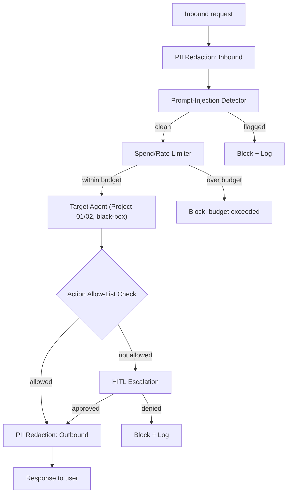

# PLAN.md — Agent Guardrail Gateway (New Project)

**Why this project exists (not in the original 8):** several projects in this portfolio (01, 02) build agents that take consequential actions, and Project 07 explores offensive/defensive security as a CTF-style exercise. None of the original 8 builds a *reusable, standalone safety middleware* that any agent can sit behind — a gap the market rewards, since "I bolted a safety layer onto my own one agent" is a much weaker claim than "I built a gateway that protects any agent."

## 1. Objective & Success Criteria

Build a middleware/proxy that sits between a user (or an upstream system) and any target agent (point it at Project 01 and/or Project 02), enforcing: PII redaction on both inbound and outbound text, prompt-injection detection on inbound text, spend/rate limits per user/session, and an action allow-list with human-in-the-loop escalation when the target agent attempts something outside the allow-list. Red-team it with an adversarial-prompt eval suite and report block rates.

| Metric | Target |
|---|---|
| PII redaction recall on a labeled test set (names, emails, phone numbers, SSNs, credit-card-like numbers) | ≥95% |
| Known prompt-injection pattern block rate (from a curated adversarial test set) | ≥85% |
| False-positive rate (legitimate requests wrongly blocked) | <5% |
| Spend/rate limit enforcement | 100% — no request exceeds the configured budget, verified by code, not sampled |
| Actions outside the allow-list correctly routed to human escalation, never auto-executed | 100% |
| Gateway latency overhead added to a passthrough request | <300ms P95 |

## 2. Architecture



### Component roster

| Component | Role | Tools | Reads | Writes |
|---|---|---|---|---|
| PII Redaction (inbound/outbound) | Detects and masks PII patterns in text passing either direction | regex + a lightweight NER model (not a full LLM call — must be fast and deterministic-ish) | raw text | redacted text, `pii_findings` (logged, not sent to the target) |
| Prompt-Injection Detector | Flags inbound text matching known injection patterns (instruction override attempts, role-play jailbreaks, data-exfiltration framing) | pattern library + a lightweight classifier (heuristic first, LLM-based secondary check only if heuristic is ambiguous) | inbound text | `injection_verdict` |
| Spend/Rate Limiter | Enforces per-user/session token and dollar budgets, and request-rate caps | counter store (Redis is appropriate here — this is exactly the ephemeral-counter use case Redis is good at) | request metadata, budget config | updated counters, `limit_verdict` |
| Action Allow-List Checker | Inspects the target agent's proposed actions (tool calls) against a configured allow-list | rule check (code, not LLM) | target agent's proposed tool calls | `allow_verdict` |
| HITL Escalation | Same principle as Project 02, applied to any disallowed action the gateway intercepts | Slack/terminal approval | `allow_verdict`, disallowed action | `human_decision` |

### State/config schema (pseudocode)

```python
class GatewayConfig(TypedDict):
    pii_patterns: list[str]              # regex + NER label types to redact
    injection_pattern_library: list[str]
    per_session_token_budget: int
    per_session_dollar_budget: float
    request_rate_limit_per_minute: int
    action_allow_list: list[str]         # tool/action names the target may execute without escalation

class GatewayRequestLog(TypedDict):
    request_id: str
    session_id: str
    pii_findings: list[str]              # types found, not the actual PII values
    injection_verdict: Literal["clean","flagged"]
    limit_verdict: Literal["ok","blocked_budget","blocked_rate"]
    proposed_actions: list[str]
    allow_verdict: Literal["allowed","escalated","denied"]
    latency_added_ms: int
```

**Communication pattern:** a synchronous proxy — the gateway wraps every call to the target agent's API (inbound request processing, then a passthrough call, then outbound response processing), structurally similar to how a web-application firewall wraps an HTTP service. It is deliberately agent-agnostic: nothing in the gateway's code should assume anything about the target beyond "it's an HTTP API that accepts text and may propose named actions."

## 3. Tech Stack

| Choice | Why | Rejected alternative |
|---|---|---|
| FastAPI middleware / reverse-proxy design | Natural fit for wrapping an arbitrary downstream HTTP API | Building the gateway as another LangGraph node inside the target agent itself — couples the gateway to one target, defeating the "reusable for any agent" premise |
| Regex + lightweight NER for PII (not a full LLM call per request) | PII redaction must be fast and applied to every request/response; a full LLM call for this on every message is slow and needlessly expensive | LLM-only PII detection — works but adds unacceptable latency/cost for something structured pattern-matching handles well for common PII types |
| Heuristic-first, LLM-secondary for prompt-injection detection | Most known injection patterns are catchable by pattern-matching cheaply; reserve the more expensive LLM-based ambiguity check for genuinely unclear cases | LLM-only injection detection on every request — expensive and adds the same self-serving-bias risk noted in Project 03 if the same model family is used everywhere |
| Redis for spend/rate counters | Ephemeral, fast, exactly the right tool for per-session counters with TTLs | Postgres — durable but unnecessarily heavy for counters that reset every session/day |
| Deterministic allow-list check (code, not LLM) for actions | Same reasoning as Project 02's validation rules engine — a security boundary must be exact and auditable | LLM-judged "does this action seem OK" — non-deterministic and unauditable, the wrong tool for a hard security boundary |

## 4. Phase-by-Phase Build Plan

| Phase | Goal | Definition of Done | Est. time |
|---|---|---|---|
| 0 — Setup | Pick target agent (Project 01 or 02), stand up the gateway as a passthrough proxy with no checks yet | A request through the gateway reaches the target and returns unmodified | 2–3 days |
| 1 — PII Redaction | Inbound + outbound redaction | ≥95% recall on a labeled PII test set (names, emails, phones, SSNs, card-like numbers) | 4–5 days |
| 2 — Injection Detection | Heuristic + LLM-secondary detector | ≥85% block rate on a curated adversarial prompt set, <5% false positives on a legitimate-request set | 4–5 days |
| 3 — Spend/Rate Limiting | Per-session budgets and rate caps enforced via Redis counters | A deliberate over-budget test is blocked 100% of the time, verified by code | 3–4 days |
| 4 — Allow-List + Escalation | Action allow-list check + HITL escalation for disallowed actions | A deliberately out-of-allow-list action from the target agent is escalated, never auto-executed | 4–5 days |
| 5 — Red-team Eval | Adversarial test suite across all 4 protections, block-rate + false-positive-rate reporting | Full metrics table from §6 generated and committed | 4–5 days |
| 6 — Polish | Docker, README documenting protections and their measured effectiveness | README leads with the red-team results table | 2–3 days |

**Total: ~3–4 weeks part-time.**

## 5. Data & API Requirements

- A target agent to protect (Project 01's FastAPI endpoint is the natural choice, since it's already black-box-accessible).
- A labeled PII test set — synthesize this yourself (LLM-generated text samples with known-injected PII, similar to Project 02's synthetic-document approach) rather than sourcing real PII data.
- A curated adversarial prompt-injection test set — build from publicly documented injection patterns (OWASP LLM Top 10's prompt-injection examples, adapted and clearly scoped for defensive testing) plus your own variations.
- Redis instance (local Docker container) for counters.
- LLM budget: mostly cheap heuristic checks; the secondary LLM-based injection check and PII/NER model calls are the main cost, modest at this scale.

## 6. Eval Strategy

- **PII recall/precision:** run the labeled PII test set through the redaction layer; report recall (did it catch the PII) and precision (did it over-redact legitimate text) separately.
- **Injection block rate + false positives:** run the adversarial prompt set (block rate target) *and* a set of legitimate, benign requests that merely resemble injection patterns in surface form (e.g., a user legitimately asking "ignore the previous recommendation and show me a different one") to measure false positives — this second set is what makes the false-positive-rate metric meaningful rather than trivially zero.
- **Budget enforcement:** deliberately construct a request sequence designed to exceed the configured budget; verify the limiter blocks it exactly at the configured threshold, not before or after (an off-by-one here is a real, embarrassing bug class).
- **Allow-list integrity:** code-level test (not just observation) that no action outside the allow-list can reach execution without passing through the HITL escalation path — structurally verify this the same way Project 04 verifies its approval gate.

## 7. Risks & Where These Projects Usually Fail

- **PII redaction that only catches the patterns you tested.** Real PII takes many forms (international phone formats, non-US ID numbers); be explicit in the README about what's covered and what isn't rather than implying blanket coverage.
- **Injection detection that's either too strict (blocks legitimate creative or edge-case requests) or too loose (a simple rephrasing bypasses it).** This tradeoff is inherent — report both the block rate and the false-positive rate honestly rather than optimizing one at the other's expense without disclosing it.
- **Treating the gateway as a silver bullet.** No prompt-injection or PII defense is 100% — the README should frame this as risk reduction with measured effectiveness, not a claim of perfect safety.
- **Coupling the gateway to one specific target agent's internals.** If the gateway can only work with Project 01 specifically (not any HTTP-based agent), you've built a feature of Project 01, not a standalone gateway — keep the target genuinely black-box, same principle as Project 03.
- **Skipping the off-by-one/edge-case testing on budget enforcement.** Rate/spend limiters are notorious for subtle boundary bugs; explicitly test the boundary condition, not just "well under" and "well over" budget cases.

## 8. Implementation Notes for the Executing Model

- Keep the target agent genuinely black-box, exactly as in Project 03 — the gateway should only ever call the target's public HTTP API.
- Log PII *findings* (what type of PII was found and where) for audit purposes, but never log the actual PII values themselves — the audit log should not become a second place PII leaks from.
- For prompt-injection detection, build the heuristic pattern library from a documented source (OWASP LLM Top 10 examples) rather than inventing patterns ad hoc, so your test methodology is defensible and reproducible.
- Implement the budget/rate limiter with atomic increment-and-check operations (Redis `INCR` + compare, not a separate read-then-write) to avoid a race condition where concurrent requests both pass the check before either increments the counter.
- Design the allow-list config as data (a config file), not hardcoded logic, so the same gateway code could plausibly protect a different target agent with a different allow-list — this is what makes the "reusable gateway" claim credible rather than just asserted.

## 9. Definition of Done

- [ ] Gateway wraps a target agent's API with all 4 protections active.
- [ ] Red-team eval suite run; PII recall, injection block rate, false-positive rate, and budget-enforcement integrity all reported per §6.
- [ ] Allow-list/escalation integrity verified by a code-level test, not just observation.
- [ ] Dockerized; README leads with the red-team results table and an honest statement of coverage limits.
