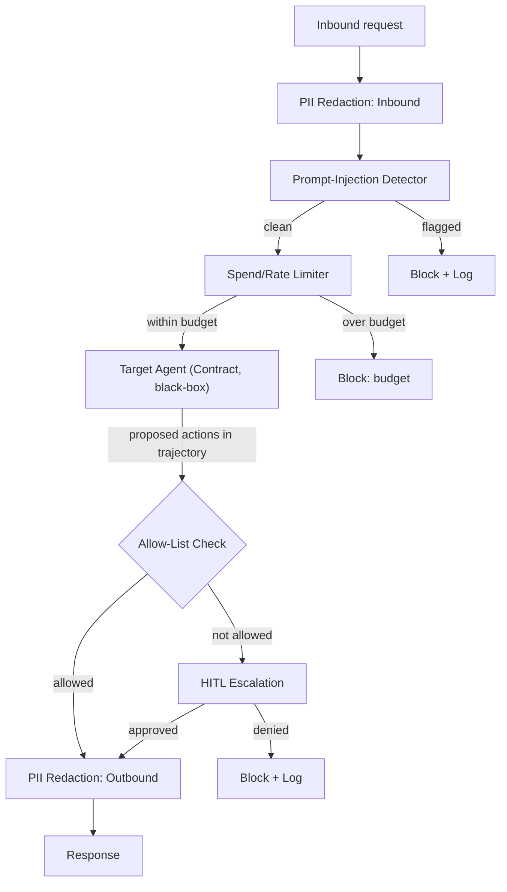

# PLAN.md — Agent Guardrail Gateway

**Why this project exists (not in the original 8).** Projects 01/02 build agents that take consequential actions, and Project 07 explores security as a CTF exercise. None builds a *reusable, standalone safety middleware* any agent can sit behind — a gap the market rewards, since "I bolted a safety layer onto my one agent" is far weaker than "I built a gateway that protects any agent."

## 1. Objective & Success Criteria

A middleware/proxy between a caller and any target agent (point it at Project 01/02 via the Target Agent Contract), enforcing: PII redaction (inbound + outbound), prompt-injection detection (inbound), spend/rate limits per session, and an action allow-list with HITL escalation for anything outside it. Red-team it with an adversarial suite and report block rates.

| Metric | Target | How measured |
|---|---|---|
| PII redaction recall (names, emails, phones, SSNs, card-like) | ≥95% | labeled synthetic test set |
| Known prompt-injection block rate on a **named** corpus | ≥85% | curated adversarial set (§5) |
| False-positive rate (legit requests wrongly blocked) | <5% | benign-but-injection-resembling set |
| Spend/rate enforcement | 100%, code-verified | boundary test |
| Actions outside allow-list → escalation, never auto-executed | 100% | structural check |
| Gateway latency overhead (passthrough, excl. secondary-LLM path) | <300ms P95 | benchmark |

## 2. Architecture



### How the allow-list sees proposed actions (Sonnet's black-box tension, resolved)

The allow-list must inspect the target's *proposed tool calls* — but a black-box agent returning only a final answer hides them. Resolution via the **Target Agent Contract** (defined in Projects 01/02/13): the target returns its `trajectory` (including proposed/executed tool calls) in its response. The gateway reads `trajectory[].tool_calls[].name` and checks each against the allow-list. For agents that *execute* actions before responding, the stronger deployment is to place the gateway between the agent and its tools (the agent calls tools *through* the gateway) — document both modes; the Contract mode is the default for this project.

### Component roster + specs

| Component | Role | Mechanism | Writes |
|---|---|---|---|
| PII Redaction | Mask PII both directions | regex (structured) + spaCy NER (names/orgs) | redacted text, `pii_findings` (types only) |
| Injection Detector | Flag inbound injection | heuristic pattern library first; LLM secondary only if ambiguous | `injection_verdict` |
| Spend/Rate Limiter | Per-session token/$ budgets + rate cap | Redis atomic `INCR` + compare | `limit_verdict` |
| Allow-List Checker | Check proposed tool calls vs. config allow-list | deterministic (code) | `allow_verdict` |
| HITL Escalation | Approve/deny disallowed actions | Slack/terminal | `human_decision` |

### PII detection specifics (Sonnet named the layer, not the patterns)

- **Regex, structured:** email (`\b[\w.+-]+@[\w-]+\.[\w.-]+\b`), US phone, SSN (`\d{3}-\d{2}-\d{4}`), credit-card-like (13–16 digits) **plus a Luhn checksum** to cut false positives on arbitrary digit runs.
- **NER, unstructured:** spaCy `en_core_web_sm` labels `PERSON`, `ORG`, `GPE`, `LOC` for names/places regex can't catch.
- **Log findings, never values:** `pii_findings` stores `["EMAIL","PERSON"]`, not the actual PII — the audit log must not become a new leak vector.

### Config schema (pseudocode)

```python
class GatewayConfig(TypedDict):
    pii_regex_types: list[str]; ner_labels: list[str]
    injection_pattern_library: list[str]
    per_session_token_budget: int; per_session_dollar_budget: float
    request_rate_limit_per_minute: int
    action_allow_list: list[str]        # tool names allowed without escalation
```

**Communication pattern.** A synchronous proxy wrapping every call to the target's Contract API (inbound processing → passthrough → outbound processing), like a web-application firewall wraps an HTTP service. Agent-agnostic: the gateway assumes only "an HTTP Contract API that accepts text and returns a trajectory with proposed actions."

## 3. Tech Stack

| Choice | Why | Rejected |
|---|---|---|
| FastAPI reverse-proxy | Natural fit to wrap an arbitrary downstream HTTP API | A LangGraph node inside the target — couples to one agent |
| Regex + spaCy NER for PII | Fast, applied to every message; deterministic-ish | LLM-per-request PII — unacceptable latency/cost |
| Heuristic-first, LLM-secondary injection | Most known patterns catch cheaply; reserve LLM for ambiguity | LLM-on-every-request — expensive + same-model-bias risk |
| Redis atomic counters | Ephemeral per-session counters w/ TTL | Postgres — too heavy for counters |
| Deterministic allow-list | A security boundary must be exact and auditable | LLM-judged "seems OK" — non-deterministic, unauditable |

## 4. Phase-by-Phase Build Plan

| Phase | Goal | Definition of Done | Est. |
|---|---|---|---|
| 0 — Setup | Target chosen; passthrough proxy, no checks | A request reaches the target and returns unmodified | 2–3 d |
| 1 — PII Redaction | Inbound + outbound, regex + NER + Luhn | ≥95% recall on the labeled set | 4–5 d |
| 2 — Injection Detection | Heuristic + LLM-secondary | ≥85% block on the named corpus, <5% FP on the benign set | 4–5 d |
| 3 — Spend/Rate Limiting | Redis atomic counters | Over-budget blocked 100%, code-verified at the boundary | 3–4 d |
| 4 — Allow-List + Escalation | Check trajectory actions + HITL | Out-of-allow-list action escalated, never auto-executed | 4–5 d |
| 5 — Red-team Eval | Adversarial suite across all 4 | §6 metrics table committed | 4–5 d |
| 6 — Polish | Docker, README leading with results | Red-team table is first in README | 2–3 d |

**Total: ~3–4 weeks part-time.**

## 5. Data & API Requirements

- A Contract-compliant target (Project 01 default).
- **Labeled PII set:** synthesize text with known-injected PII (like Project 02's synthetic approach) — no real PII.
- **Named injection corpus:** build from OWASP LLM Top 10's documented injection patterns + your variations; cite it so the ≥85% claim is scoped to a defined set, not "injection in general." Plus a benign set that *resembles* injection ("ignore the previous recommendation and show another") to measure false positives.
- Redis (local Docker).
- LLM budget: mostly cheap heuristics; the secondary injection check + NER are the main cost, modest.

## 6. Eval Strategy

- **PII recall/precision:** report recall (caught) and precision (didn't over-redact) separately.
- **Injection block + FP:** block rate on the named adversarial corpus, and FP rate on the benign-but-resembling set — both required, or the number is gameable by blocking everything.
- **Budget enforcement:** construct a sequence designed to exceed budget; verify it blocks **exactly** at the threshold (off-by-one here is a real bug class). Add a **concurrency** test: fire parallel requests and confirm the atomic counter doesn't let both through.
- **Allow-list integrity:** code-level test that no action outside the allow-list reaches execution without HITL — structural, like Project 04's gate.

## 7. Risks & Where These Projects Usually Fail

- **PII redaction only catching tested patterns** — be explicit in the README about coverage (international formats, non-US IDs may be out).
- **Injection detector too strict/loose** — report both block and FP rates; don't optimize one silently.
- **Silver-bullet framing** — no injection/PII defense is 100%; frame as measured risk reduction.
- **Coupling to one target's internals** — keep the target black-box via the Contract.
- **Budget off-by-one / race** — test the exact boundary and concurrency (atomic `INCR`, not read-then-write).

## 8. Implementation Notes for the Executing Model

- Keep the target black-box — only the Contract HTTP API.
- Log PII **findings/types**, never values.
- Build the injection pattern library from OWASP LLM Top 10 so methodology is defensible/reproducible.
- Implement the limiter with atomic `INCR`-and-compare (not read-then-write) to avoid the concurrent-both-pass race.
- Make the allow-list **config data**, not hardcoded logic — that's what makes "reusable gateway" credible.
- **Latency budget clarification:** the <300ms P95 excludes the secondary-LLM injection path; when the heuristic is ambiguous and the LLM check fires, that request is allowed to exceed 300ms (or run the LLM check async/sampled). State this in the README so the number is honest.
- Luhn-check card-like matches to keep PII precision up.

## 9. Definition of Done

- [ ] Gateway wraps a target's Contract API with all 4 protections active.
- [ ] Red-team eval run; PII recall, injection block rate, FP rate, budget integrity reported per §6.
- [ ] Allow-list/escalation integrity verified by a code-level test.
- [ ] Dockerized; README leads with the red-team table and an honest coverage-limits statement.

## 10. Localization (India-first)

**Deep-localized on PII patterns + regulatory framing; every safety mechanism preserved.** This project *gains* from Indian localization because Indian PII (Aadhaar, PAN, UPI IDs) has well-defined, checkable formats — perfect material for the deterministic-detection curriculum — and the DPDP Act gives the guardrail a real compliance purpose.

**What changed (PII patterns, regulatory context — not architecture):**
- **PII detectors (regex layer):** add Indian formats — **Aadhaar** (12 digits, **Verhoeff checksum** — a superb deterministic-validation example, stronger than the US SSN case), **PAN** (`[A-Z]{5}[0-9]{4}[A-Z]`), **UPI VPA** (`name@bank`), **Indian mobile** (`+91` / 10-digit starting 6–9), **IFSC** (`[A-Z]{4}0[A-Z0-9]{6}`), **GSTIN**. The Luhn/checksum lesson generalizes to Verhoeff (Aadhaar) — a genuine upgrade to the "validate, don't just pattern-match" teaching.
- **NER layer:** add Indian name/place handling (spaCy multilingual or IndicNER) so unstructured Indian names are caught.
- **Regulatory framing:** OWASP framing stays; add the **DPDP Act 2023** as the "why" — the gateway is a **data-processor control** enforcing data minimization and purpose limitation. Masking Aadhaar to last-4 is the canonical DPDP-compliant behavior.
- **Formatting/limits:** spend limits in ₹.

**What stayed global (unchanged):** the reverse-proxy gateway, heuristic-first injection detection, atomic Redis rate/spend limiting, the deterministic allow-list, HITL escalation, the black-box Target Agent Contract, log-findings-not-values, and the red-team eval methodology. Every mechanism intact; the DPDP framing is additive.

**Trade-off:** none of substance — Indian PII formats are a superset that makes the detection curriculum *richer* (Verhoeff > Luhn as a teaching case). Keep the US patterns too (worldwide mode) so the gateway is market-agnostic in code, India-tuned by config — mirroring Project 01's adapter lesson.
