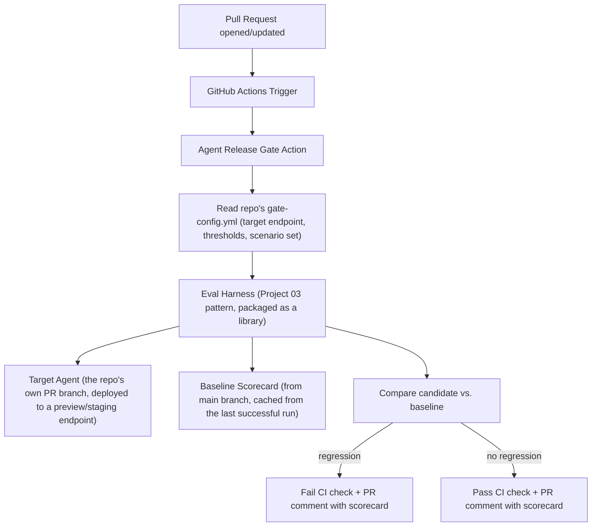

# PLAN.md — Agent Release Gate: CI/CD for Agents (New Project)

**Why this project exists (not in the original 8):** Project 03 builds the eval harness itself; its own stretch goals mention "CI integration: every commit... triggers an eval run" but treat it as an afterthought. This project promotes that afterthought to the main deliverable: packaging the eval-harness pattern as a **reusable, installable GitHub Action** that any agent repository (not just yours) can adopt. The difference between "I built an eval harness" and "I built a devops product other teams install" is exactly the kind of CI/CD-for-agents signal the market rewards and the original 8 only gesture at.

## 1. Objective & Success Criteria

Package the Project 03 eval-harness pattern (simulated users + LLM-as-judge + regression detection) as a standalone, configurable GitHub Action that runs on every pull request to an agent repository, fails the build if it detects a regression (accuracy drop, cost/latency regression beyond a threshold, new tool-error classes), and posts a scorecard as a PR comment. Demo it protecting at least 2 different target repos (e.g., Project 01 and Project 02) to prove it's genuinely reusable, not hardcoded to one.

| Metric | Target |
|---|---|
| Target repos successfully protected by the Action (config-only integration, no Action code changes) | ≥2 |
| CI run time for a PR-triggered eval | <10 min |
| Deliberately-regressed PRs correctly blocked | 3/3 (reuse or extend Project 03's 3 broken-version test cases) |
| Deliberately-clean PRs correctly passed | ≥5/5 (no false-positive blocks) |
| Action is installable by copying a workflow YAML + a config file, no source-code forking required | verified |
| Scorecard PR comment format is stable and readable across runs | verified across ≥5 runs |

## 2. Architecture



### Components

| Component | Role | Tools | Reads | Writes |
|---|---|---|---|---|
| GitHub Action entrypoint | Wires the harness into the CI trigger, reads config, posts results | GitHub Actions runner, GitHub API (for PR comments/check status) | `gate-config.yml`, PR metadata | CI check status, PR comment |
| Eval Harness (packaged) | The Project 03 simulator + judge + aggregator, refactored into an importable library rather than a standalone app | same as Project 03 | scenarios, target endpoint | `VersionScorecard` |
| Baseline Store | Caches the last successful main-branch scorecard so every PR has something to compare against | a small artifact store (GitHub Actions cache, or a committed JSON file) | prior run's scorecard | current run's scorecard (once merged) |
| Config schema | Per-repo configuration: target endpoint URL, scenario set location, regression thresholds | YAML file living in the *target* repo, not the Action's own repo | — | — |

### Config schema (pseudocode — what a target repo's `gate-config.yml` looks like)

```yaml
target_endpoint: "http://localhost:8000/analyze"   # how to reach the PR branch's deployed agent
scenario_set_path: "eval/scenarios.json"            # target repo's own scenario definitions
thresholds:
  min_success_rate: 0.80
  max_cost_regression_pct: 20
  max_p95_latency_regression_pct: 30
  block_on_new_tool_error_classes: true
```

**Communication pattern:** the Action is a self-contained CI job — it has no persistent "state" beyond the cached baseline scorecard between runs. Within a run, it's a straight pipeline: read config → deploy/reach the PR's candidate agent → run the harness → compare to baseline → report. This is deliberately the least "agentic" project in the portfolio architecturally — the point is packaging and reliability engineering around an eval harness, not a new agent pattern.

## 3. Tech Stack

| Choice | Why | Rejected alternative |
|---|---|---|
| GitHub Actions (composite or Docker action) | The most directly demoable CI platform; "here's a PR that got blocked" is a concrete, checkable artifact | A custom CI server — reinvents free infrastructure for no benefit |
| Project 03's harness, refactored into an installable package | Avoids rebuilding eval logic from scratch; also validates that Project 03's design was reusable in the first place | A brand-new eval implementation — wasted effort, and undermines the "I designed this to be reusable" claim if you can't actually reuse it |
| GitHub Actions cache (or a committed JSON artifact) for the baseline scorecard | Simple, free, sufficient for a portfolio-scale project | A dedicated scorecard database/service — over-engineered for what's fundamentally a small cached JSON blob per repo |
| YAML config file living in the *target* repo | This is what makes the Action genuinely reusable — the Action's own code has zero repo-specific assumptions, only reads what the target repo declares | Hardcoding target-repo specifics inside the Action's source — the single mistake that would make the "≥2 target repos, no Action code changes" success criterion impossible to hit honestly |

## 4. Phase-by-Phase Build Plan

| Phase | Goal | Definition of Done | Est. time |
|---|---|---|---|
| 0 — Setup | Refactor Project 03's harness into an importable package (or start here if Project 03 isn't built yet, in a smaller standalone form) | Harness runs identically whether invoked as a CLI or imported as a library | 3–4 days |
| 1 — Action skeleton | A GitHub Action that triggers on `pull_request`, reads a `gate-config.yml`, and can reach a target endpoint | A trivial config pointing at a stub "always healthy" endpoint passes CI | 3–4 days |
| 2 — Harness integration | Wire the real harness into the Action; run scenarios against the PR's deployed candidate | A real target agent (Project 01, deployed to a preview environment or run locally in the CI job) gets evaluated by the Action | 4–5 days |
| 3 — Baseline + Comparison | Cache/retrieve the main-branch baseline scorecard; compute regression per the config's thresholds | A deliberately regressed PR against Project 01 is correctly blocked; a clean PR passes | 4–5 days |
| 4 — Scorecard comment | Post a stable, readable markdown scorecard as a PR comment | Comment format identical in structure across ≥5 runs, easy to diff by eye | 2–3 days |
| 5 — Second target repo | Point the same, unmodified Action at Project 02 via only a new `gate-config.yml` | Project 02 protected with zero changes to the Action's own source — the core reusability proof | 3–4 days |
| 6 — Polish | README documenting installation (copy workflow YAML + config), the 3+5 regression/clean-pass test results | A stranger could add this Action to their own agent repo from the README alone | 2–3 days |

**Total: ~3–4 weeks part-time.**

## 5. Data & API Requirements

- Requires Project 01 (and ideally Project 02) already built, to serve as target repos.
- Requires a way to run/reach the PR's candidate agent from within the CI job — simplest approach: run the target agent locally inside the same CI job (e.g., `docker compose up` the target, point the harness at `localhost`), avoiding the complexity of a real staging deployment for a portfolio project.
- LLM budget: same as Project 03 per run (~$2-5), now incurred on every PR — budget-conscious repos should scope the scenario set down for PR-triggered runs vs. a fuller nightly run, and the README should mention this as a real operational consideration.

## 6. Eval Strategy

*(This project's eval strategy is evaluating the release gate itself — a step removed from Project 03, which evaluates a single target agent.)*

- **Regression-catching:** reuse or extend Project 03's 3 deliberately-broken agent versions as 3 PRs against the target repo; the gate must block all 3.
- **False-positive avoidance:** run ≥5 genuinely clean PRs (trivial changes — README edits, comment additions, a harmless refactor) and confirm none are blocked.
- **Cross-repo reusability:** the core proof — install the identical Action against a second target repo (Project 02) via config only, and confirm it works without touching the Action's source.
- **CI runtime:** measure and report wall-clock time for a full gate run; if it exceeds the 10-minute target, document the scenario-set-scoping tradeoff (fewer scenarios per PR run, fuller set on a nightly schedule) rather than silently letting CI time balloon.

## 7. Risks & Where These Projects Usually Fail

- **Hardcoding target-repo assumptions into the Action.** The single failure mode that would invalidate this project's entire premise — if Phase 5 requires editing the Action's own code to support a second target, you haven't built a reusable gate.
- **No baseline to compare against on a repo's very first run.** The gate needs a sensible bootstrap behavior (e.g., "first run always passes and becomes the baseline, with a clear log message") rather than crashing or incorrectly flagging every metric as a regression against nothing.
- **CI runs that are too slow or too expensive to actually be adopted.** An eval gate that takes 45 minutes and costs $10 per PR will get disabled by any real team within a week — the 10-minute/moderate-cost target in §1 exists because an unused gate provides zero value regardless of how well-designed it is.
- **Flaky, non-deterministic CI failures.** LLM-based evals have inherent variance; a gate that fails intermittently on unchanged code erodes trust fast — build in a small tolerance band (not exact-threshold blocking) and/or a "re-run before failing" step, and document this design choice.
- **Scorecard comments that change format every run.** Undermines the "easy to eyeball a regression over time" value proposition — treat the comment template as a stable interface, versioned deliberately if it ever needs to change.

## 8. Implementation Notes for the Executing Model

- Build Phase 0's refactor (harness as an importable package) even if you haven't built Project 03 first — a scoped-down standalone version of the same simulator+judge+aggregator pattern is a fine substitute; note this dependency explicitly in your own build log so the portfolio's internal consistency is documented.
- Use GitHub's `actions/cache` (or a committed baseline JSON artifact, simpler for a small portfolio-scale project) to persist the baseline scorecard between runs — don't recompute a fresh baseline from scratch on every PR, which would be slow and defeats the point of comparing against a known-good state.
- Add a tolerance band to the regression comparison (e.g., "success rate dropped by more than 5 percentage points," not "any drop at all") to avoid flaky failures from normal LLM output variance — document the chosen tolerance in the README as a real design decision, not an arbitrary number.
- Keep the PR-comment template as a versioned constant in the Action's code (a format string or small template file), and add a test that renders it against a fixed sample scorecard so format regressions are themselves caught by your own tests.
- When demoing cross-repo reusability (Phase 5), literally diff the Action's source directory before and after adding the second target repo — a byte-identical diff (aside from git history/timestamps) is the cleanest possible proof for your README.

## 9. Definition of Done

- [ ] GitHub Action triggers on PRs, reads a target-repo-owned config, runs the harness, and posts a scorecard comment.
- [ ] 3 deliberately-regressed PRs blocked; ≥5 clean PRs passed.
- [ ] Same Action protects 2 different target repos (Project 01 and Project 02) via config only — diffed and confirmed no source changes.
- [ ] CI runtime and cost per run measured and reported.
- [ ] README documents installation for a repo that isn't yours, sufficient for a stranger to adopt it.
