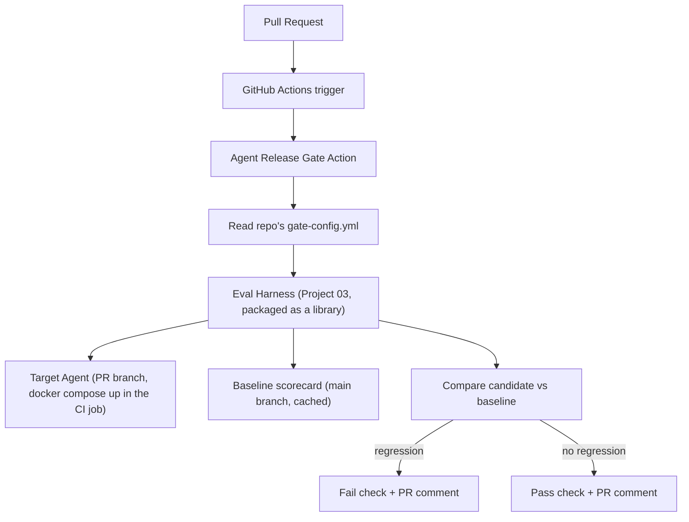

# PLAN.md — Agent Release Gate: CI/CD for Agents

**Why this project exists (not in the original 8).** Project 03 builds the eval harness; its own stretch goals mention "run an eval on every commit" as an afterthought. This project promotes that to the main deliverable: packaging the harness as a **reusable, installable GitHub Action** any agent repo can adopt. "I built an eval harness" vs. "I built a devops product other teams install" is exactly the CI/CD-for-agents signal the market rewards.

## 1. Objective & Success Criteria

Package Project 03's harness (simulated users + judge + regression detection) as a standalone, configurable GitHub Action that runs on every PR, fails the build on a regression, and posts a scorecard PR comment. Demo it protecting ≥2 target repos (Project 01 and 02) by config only.

| Metric | Target | How measured |
|---|---|---|
| Target repos protected, config-only (no Action code changes) | ≥2 | byte-identical Action-source diff |
| CI run time per PR-triggered eval | <10 min | measured |
| Deliberately-regressed PRs blocked | 3/3 (reuse Project 03's broken versions) | injection test |
| Clean PRs passed | ≥5/5 (no false-positive blocks) | clean-PR set |
| Installable by copying workflow YAML + config, no forking | verified | fresh-repo adoption test |
| Scorecard comment format stable across runs | verified across ≥5 runs | format test |

## 2. Architecture



### Config schema (`gate-config.yml`, lives in the *target* repo)

```yaml
target:
  launch: "docker compose up -d"        # how CI brings up the candidate agent
  endpoint: "http://localhost:8000/invoke"   # the Target Agent Contract endpoint
  healthcheck: "http://localhost:8000/healthz"
scenario_set_path: "eval/scenarios.json"
thresholds:
  min_success_rate: 0.80
  max_cost_regression_pct: 20
  max_p95_latency_regression_pct: 30
  success_rate_tolerance_pp: 5           # derived from Project 03's measured variance
  block_on_new_tool_error_classes: true
```

### Regression math + tolerance (imported from Project 03, not invented here)

The 5-percentage-point `success_rate_tolerance_pp` is **derived** from Project 03's measured run-to-run variance (§6 there), not arbitrary. The gate flags a regression when the candidate is worse than baseline **and** Project 03's two-proportion test is significant (or the drop exceeds the tolerance band). This is why Project 03 must pin its variance number — Project 12 imports it as config default.

### Target-repo contract (the dockerized-target requirement Sonnet left implicit)

A protected repo must: (a) be launchable in CI via its `launch` command; (b) expose the **Target Agent Contract** endpoint (`/invoke` returning output + trajectory + version + cost + latency); (c) ship a `gate-config.yml`. Projects 01/02 already satisfy (b); this project pins (a) and (c).

### Components

| Component | Role |
|---|---|
| Action entrypoint | Wires the harness into the CI trigger, reads config, launches the target, posts results, sets the check status |
| Eval Harness (packaged) | Project 03's simulator + judge + aggregator, refactored into an importable `agent_eval_gate` library |
| Baseline Store | Caches the last successful main-branch scorecard, keyed by `(repo, scenario_set_hash)` so a scenario change invalidates it |

**Communication pattern.** A self-contained CI job with no persistent state beyond the cached baseline. Within a run: read config → `docker compose up` the candidate → run the harness against its Contract endpoint → compare to baseline → report. Deliberately the least "agentic" project — it's packaging + reliability engineering around an eval harness.

## 3. Tech Stack

| Choice | Why | Rejected |
|---|---|---|
| GitHub Actions, **Docker action** (Python) | Directly demoable; Docker packages the harness's Python deps once | Composite/JS action — fine, but Docker avoids re-installing deps per run given the Python stack |
| Project 03's harness as an installable package | Avoids rebuilding; validates 03 was reusable | New eval impl — wasted, undermines the reuse claim |
| `actions/cache` (or a committed baseline JSON) | Simple, free baseline persistence | A scorecard DB/service — over-engineered |
| YAML config in the *target* repo | The Action has zero repo-specific assumptions | Hardcoding target specifics — makes the ≥2-repo criterion impossible honestly |

## 4. Phase-by-Phase Build Plan

| Phase | Goal | Definition of Done | Est. |
|---|---|---|---|
| 0 — Setup | Refactor Project 03's harness into an importable package | Harness runs identically as CLI or import | 3–4 d |
| 1 — Action skeleton | Triggers on `pull_request`, reads `gate-config.yml`, reaches an endpoint | A trivial config pointing at a stub healthy endpoint passes CI | 3–4 d |
| 2 — Harness integration | Launch the candidate + run scenarios | Project 01 (via `docker compose up` in the job) gets evaluated | 4–5 d |
| 3 — Baseline + Comparison | Cache/retrieve baseline; compute regression per thresholds + tolerance | A regressed PR blocked; a clean PR passes | 4–5 d |
| 4 — Scorecard comment | Stable markdown scorecard PR comment | Format identical across ≥5 runs, diff-able | 2–3 d |
| 5 — Second target repo | Point the unmodified Action at Project 02 via a new config | Project 02 protected, zero Action source changes (byte-identical diff) | 3–4 d |
| 6 — Polish | README: install (copy YAML + config), 3+5 results | A stranger could adopt it from the README alone | 2–3 d |

**Total: ~3–4 weeks part-time.**

## 5. Data & API Requirements

- Project 01 (and ideally 02) built, as target repos.
- Reach the candidate agent from CI: run it locally in the job (`docker compose up`, point the harness at `localhost`) — no real staging deployment needed.
- LLM budget: same as Project 03 per run (~$2–5), now per PR — scope the PR-triggered scenario set smaller than a fuller nightly run; note this in the README.

## 6. Eval Strategy

- **Regression-catching:** reuse Project 03's 3 broken versions as 3 PRs; the gate blocks all 3.
- **False-positive avoidance:** ≥5 genuinely clean PRs (README edits, comment additions, harmless refactor); none blocked.
- **Cross-repo reusability:** the core proof — install the identical Action against Project 02 by config only; confirm the byte-identical Action-source diff.
- **CI runtime:** measure and report; if >10 min, document the scenario-scoping tradeoff (fewer per-PR scenarios, fuller nightly), don't let it balloon silently.

## 7. Risks & Where These Projects Usually Fail

- **Hardcoding target assumptions into the Action** — the single failure that invalidates the premise; if Phase 5 needs Action code changes, it's not reusable.
- **No baseline on a repo's first run** — bootstrap: first run always passes and becomes the baseline, with a clear log message; don't crash or flag everything.
- **CI too slow/expensive** — a 45-min $10 gate gets disabled within a week; the <10-min/moderate-cost target exists for adoption.
- **Flaky non-deterministic failures** — LLM variance; use the tolerance band (not exact-threshold blocking) and/or a re-run-before-failing step; document it.
- **Unstable comment format** — treat the template as a versioned interface with its own render test.

## 8. Implementation Notes for the Executing Model

- Build Phase 0's refactor even if Project 03 isn't built — a scoped-down standalone simulator+judge+aggregator is fine; note the dependency in your build log.
- Use `actions/cache` (or a committed baseline JSON) keyed by `(repo, scenario_set_hash)` so a scenario-set change invalidates the baseline.
- Add the **tolerance band** to the comparison (from Project 03's variance), and document the number as a real design decision.
- Keep the PR-comment template a versioned constant with a test that renders it against a fixed sample scorecard.
- Phase 5 proof: literally `diff` the Action's source dir before/after adding the second repo — byte-identical (aside from git noise) is the cleanest README artifact.
- **GitHub Actions security gotcha (Sonnet missed this):** a CI eval needs an LLM API key (a secret). On `pull_request` from a **fork**, secrets are **not** exposed (good, but the gate can't run the real eval); `pull_request_target` *does* expose secrets but runs in the base-repo context and is a well-known injection risk if it checks out untrusted PR code. Decision: run the gate on `pull_request` for same-repo branches (secrets available) and, for fork PRs, either skip with a clear "requires maintainer run" message or use a manually-triggered `workflow_dispatch` on the maintainer side. Document this — it's the real-world footgun.

## 9. Definition of Done

- [ ] GitHub Action triggers on PRs, reads target-repo config, launches the candidate, runs the harness, posts a scorecard comment, sets the check status.
- [ ] 3 regressed PRs blocked; ≥5 clean PRs passed.
- [ ] Same Action protects Project 01 and 02 by config only — byte-identical source diff.
- [ ] CI runtime + cost measured and reported.
- [ ] Fork-secret handling documented; README lets a stranger adopt it.
