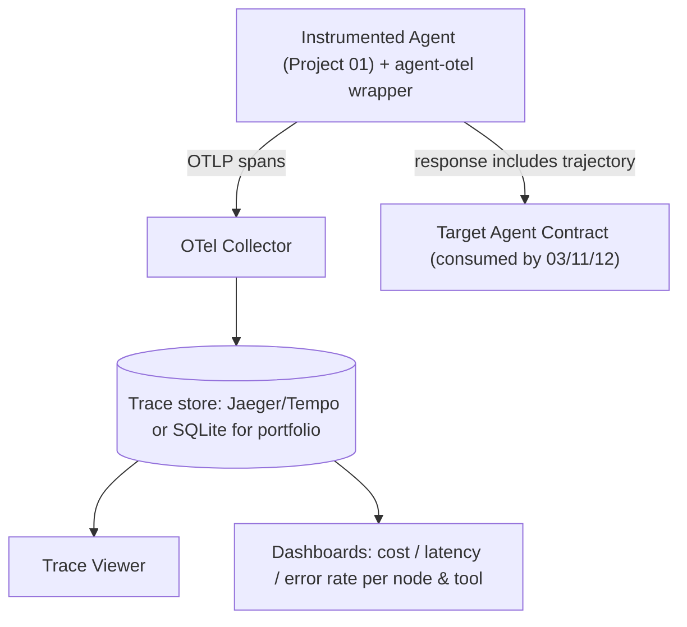

# PLAN.md — Agent Observability Stack

**Why this project exists (new — added by the Fable-5 revision).** Project 03 judges an agent's *output quality* as a black box. Nothing in the portfolio instruments an agent's *runtime internals* — the spans, tool calls, token flows, and errors that production teams actually stare at when something breaks. In 2026, "agent observability" (OpenTelemetry GenAI semantic conventions, trace viewers, cost/latency dashboards) is a distinct, fast-growing hiring signal. This project also **implements the Target Agent Contract** that Projects 03/11/12 depend on — so it retro-justifies and unblocks them: it's the reference way an agent emits its own trajectory.

**What it adds beyond the current set.** 03 = "is the output good?" (evaluation). 13 = "what did the agent actually *do*, and where did time/tokens/errors go?" (observability). They are complementary halves of production agent operations; this project fills the observability half and standardizes the emit-your-trajectory contract the other projects assume.

## 1. Objective & Success Criteria

Instrument an existing agent (Project 01) with OpenTelemetry using the **GenAI semantic conventions**, export spans to a collector, and build a trace viewer + cost/latency/error dashboards. Ship a small reusable `agent-otel` wrapper other agents can adopt, and define the Target Agent Contract concretely.

| Metric | Target | How measured |
|---|---|---|
| Agent runs producing a complete, well-formed trace (root + per-node + per-tool-call spans) | 100% | span-completeness check |
| GenAI semantic-convention attribute coverage (model, tokens in/out, tool name, latency) | all required attrs present on the relevant spans | schema check against the convention |
| Cost attribution accuracy (sum of per-span token cost vs. the run's actual billed tokens) | within 5% | reconciliation test |
| Trace overhead added to the agent | <5% latency | before/after benchmark |
| Second agent (Project 02) instrumented via the wrapper | works with zero wrapper code changes | reuse test |

## 2. Architecture



### Span model (GenAI semantic conventions)

```
run (root span)                     attrs: gen_ai.system, session.id, agent.version, cost.usd(total)
  ├─ node: supervisor               attrs: gen_ai.operation.name=chat, gen_ai.request.model,
  │                                        gen_ai.usage.input_tokens, gen_ai.usage.output_tokens, latency_ms
  ├─ node: market_data
  │    └─ tool: get_market_data     attrs: gen_ai.tool.name, tool.args (redacted), tool.status, latency_ms
  ├─ node: fundamentals
  │    ├─ tool: retrieve
  │    └─ tool: web_search (fallback)
  └─ node: report_generator
```

Follow the OpenTelemetry **GenAI semantic conventions** (`gen_ai.*` attributes) so traces are portable to any OTel-compatible backend, not a bespoke schema.

### The Target Agent Contract (defined here, consumed elsewhere)

```
POST /invoke {input, session_id} -> {
  output: str,
  trajectory: [{node, span_id, tool_calls:[{name, args, result, latency_ms, status}],
                input_tokens, output_tokens}],
  version: str, cost_usd: float, latency_ms: int
}
GET /traces/{session_id} -> full OTel span tree (JSON)
```
The `trajectory` in the response is derived from the same spans exported to the collector — one source of truth. Projects 03 (eval), 11 (guardrail allow-list), and 12 (release gate) all read this.

### `agent-otel` wrapper (the reusable artifact)

A small library exposing decorators/context managers: `@traced_node`, `traced_tool(...)`, and an `instrument(app)` that adds the `/invoke` + `/traces` endpoints. Adopting it in a new agent means decorating nodes/tools — no bespoke tracing code.

## 3. Tech Stack

| Choice | Why | Rejected |
|---|---|---|
| OpenTelemetry + GenAI semantic conventions | The emerging standard; portable across backends | A bespoke logging schema — not portable, not a hireable skill |
| OTLP → OTel Collector | Standard export path | Direct-to-DB writes — couples the agent to storage |
| Jaeger/Tempo (or SQLite for a light portfolio build) | Real trace viewer; SQLite keeps the demo self-contained | A hosted vendor (Langfuse/Phoenix) — great products, but building it yourself teaches the mechanics and avoids a vendor dependency in the demo (mention them as the "buy" alternative) |
| Streamlit dashboards | Enough for cost/latency/error charts | Grafana — heavier; fine as a stretch |
| Reuse Project 01 as the instrumented agent | Already Contract-shaped | A new toy agent — wasted |

## 4. Phase-by-Phase Build Plan

| Phase | Goal | Definition of Done | Est. |
|---|---|---|---|
| 0 — Setup | OTel SDK + collector running; read the GenAI conventions | A hello-world span reaches the collector | 2–3 d |
| 1 — Instrument nodes | `@traced_node` around Project 01's graph nodes | Every node emits a span with model + token attrs | 3–4 d |
| 2 — Instrument tools | `traced_tool` around each tool call | Tool spans carry name/args(redacted)/status/latency | 3–4 d |
| 3 — Contract endpoint | `/invoke` returns trajectory; `/traces/{id}` returns the span tree | Contract matches the schema; 03's harness can consume it | 3–4 d |
| 4 — Viewer + dashboards | Trace tree view + cost/latency/error dashboards | Can see per-node/per-tool cost + latency for a run | 4–5 d |
| 5 — Reusability | Instrument Project 02 via the wrapper, zero wrapper changes | Project 02 traces appear with the same schema | 3–4 d |
| 6 — Polish | Package `agent-otel`; README w/ a real debugged-via-trace story | A stranger instruments their agent from the README | 2–3 d |

**Total: ~3–4 weeks part-time.**

## 5. Data & API Requirements

- Project 01 (and 02) as the instrumented agents.
- OTel Collector (local Docker) + a trace backend (Jaeger/Tempo or a SQLite exporter for a self-contained build).
- LLM cost model reused from Project 01 for per-span cost attribution.

## 6. Eval Strategy

- **Span completeness:** every run produces a root span with one child per executed node and one grandchild per tool call; assert the tree shape in code.
- **Convention conformance:** check that required `gen_ai.*` attributes are present on the right spans.
- **Cost reconciliation:** sum per-span token cost and compare to the run's actual billed tokens — within 5%.
- **Overhead:** benchmark the agent with and without instrumentation; <5% latency.
- **Reusability:** Project 02 instrumented via the wrapper with no wrapper edits.

## 7. Risks & Where These Projects Usually Fail

- **Reinventing a bespoke schema** instead of using GenAI semantic conventions — kills portability and the hireable-skill claim.
- **Logging raw args/PII in spans** — redact tool args and never put secrets/PII in attributes (reuse Project 11's findings-not-values discipline).
- **Trace overhead** — sampling and async export keep it under budget; measure it.
- **Two sources of truth** — derive the `/invoke` trajectory from the same spans, not a parallel hand-built log, or they drift.
- **Confusing this with Project 03** — 13 instruments runtime; 03 judges quality. Say so in the README.

## 8. Implementation Notes for the Executing Model

- Follow the **OpenTelemetry GenAI semantic conventions** exactly (`gen_ai.system`, `gen_ai.request.model`, `gen_ai.usage.input_tokens`/`output_tokens`, `gen_ai.tool.name`) — don't invent attribute names.
- Export via **OTLP** to a collector; keep the agent decoupled from the storage backend.
- Redact tool args before putting them on a span; never attach secrets/PII.
- Derive the Contract `trajectory` from the emitted spans (one source of truth).
- Provide `@traced_node` / `traced_tool` / `instrument(app)` so adoption is decorate-and-go — the reuse proof (Project 02) depends on this.
- Mention Langfuse/Arize-Phoenix in the README as the "buy" alternative to your "build," and say when each makes sense — shows product awareness.

## 9. Definition of Done

- [ ] Project 01 fully instrumented; every run emits a complete, convention-conformant trace.
- [ ] `/invoke` + `/traces/{id}` implement the Target Agent Contract (consumed by 03/11/12).
- [ ] Trace viewer + cost/latency/error dashboards work.
- [ ] Overhead <5%; cost reconciliation within 5%.
- [ ] Project 02 instrumented via the wrapper with zero wrapper changes.
- [ ] `agent-otel` packaged; README has a real "I debugged X by reading the trace" story.

## 10. Localization (India-first)

**Location-neutral — deliberately left global.** OpenTelemetry GenAI semantic conventions, span/trace instrumentation, cost/latency attribution, and the Target Agent Contract are vendor- and market-neutral infrastructure. Nothing here is Indian.

**India shows through only by inheritance:** it instruments Projects 01/02 (now Indian), so the traces are of Indian agents — but the tracing schema, collector, and dashboards are identical everywhere. One small, useful India note: display **cost in ₹** alongside USD on the cost dashboard (LLM tokens are billed in USD; an INR column is a one-line view-layer convenience for an India-based operator).

**What stayed global:** the entire observability stack.
