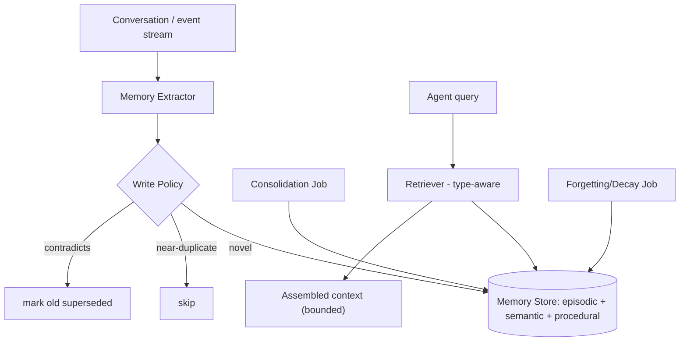

# PLAN.md — Agent Long-Term Memory System

**Why this project exists (new — added by the Fable-5 revision).** Project 04 has *memory-lite* (a pgvector store of preferences) as one feature of a larger agent. Nothing in the portfolio treats **memory itself** as the subject: the write/consolidate/forget/retrieve policies, the episodic vs. semantic vs. procedural distinction, and the eval of recall over many sessions. "Stateful agents / agent memory" is one of the clearest 2026 hiring signals (mem0, Letta/MemGPT, Zep). This project builds a standalone memory service any agent can plug into and, crucially, *evaluates* it — which almost no memory demo does.

**What it adds beyond the current set.** 04 uses a vector store as a means to an end. 14 makes memory the end: it studies *what* to store, *when* to consolidate, *when* to forget, and *how to measure* whether memory actually helps — the parts a "just embed everything" approach skips.

## 1. Objective & Success Criteria

Build a standalone long-term memory service (an API + library) implementing episodic, semantic, and procedural memory with explicit write/consolidation/forgetting/retrieval policies, and benchmark it on a multi-session recall task against a naive "embed-everything" baseline.

| Metric | Target | How measured |
|---|---|---|
| Recall accuracy on a 50-question multi-session benchmark | ≥85% | §6 benchmark |
| Improvement over the naive embed-everything baseline | ≥15 pp on the "requires consolidation/supersession" question subset | head-to-head |
| Contradiction handling (a superseded fact is never returned as current) | 100% | supersession test |
| Retrieval latency (P95) | <150ms | benchmark |
| Context-token savings vs. dumping full history | ≥70% fewer tokens at equal recall | token accounting |

## 2. Architecture



### The three memory types (the distinction Sonnet's Project 04 never drew)

| Type | What it holds | Example | Retrieval trigger |
|---|---|---|---|
| Episodic | Specific past events/interactions, time-stamped | "On 2026-05-01 the user asked for a refund on order #123" | "what happened when…" |
| Semantic | Distilled facts/preferences (consolidated from episodes) | "The user prefers email over phone" | most queries, as background |
| Procedural | How-to / learned workflows the agent should follow | "When the user says 'summarize', use bullet format" | task-shaped queries |

### Memory entry schema (pseudocode)

```python
class Memory(TypedDict):
    memory_id: str
    type: Literal["episodic","semantic","procedural"]
    content: str
    embedding: list[float]
    created_at: str; last_accessed: str; access_count: int
    salience: float                 # decays with time, reinforced on access
    superseded_by: str | None       # for contradiction handling
    source_episode_ids: list[str]   # semantic memories cite the episodes they were distilled from
```

### The four policies (the actual engineering — Project 04 hand-waved these)

- **Write:** an extractor proposes candidate memories from the conversation. Write only if not a near-duplicate (cosine > 0.9 vs. retrieved neighbors). Classify the type. Episodic writes are cheap; semantic writes are gated on being genuinely new.
- **Consolidation (batch job):** periodically cluster related episodic memories and distill them into a semantic memory (e.g., three episodes of the user choosing email → one semantic "prefers email"), citing `source_episode_ids`. This is what "learning over time" actually means mechanically.
- **Forgetting/decay:** `salience` decays with age; reinforced on access (`last_accessed`, `access_count`). Low-salience, old, non-procedural episodic memories are pruned. Semantic/procedural memories persist longer.
- **Retrieval (type-aware):** for a query, retrieve top-k semantic (background), relevant episodic (if the query is event-shaped), and applicable procedural memories; assemble into a **bounded** context (token budget), preferring high-salience, non-superseded entries.

## 3. Tech Stack

| Choice | Why | Rejected |
|---|---|---|
| Standalone FastAPI service + client library | Any agent plugs in; memory isn't welded to one agent | Memory inside one agent — the Project 04 pattern, which is exactly what this project transcends |
| pgvector (Postgres) | Durable, transactional, semantic + metadata queries in one store | Pure vector DB — weaker on the metadata/supersession queries you need |
| A distilled-semantic consolidation job | "Learning over time" made mechanical | Store-everything — the naive baseline you're beating |
| Salience decay | Bounded memory, relevant retrieval | Never-forget — unbounded growth, degraded retrieval |
| mem0 / Letta as design references | Prior art for exactly these policies | Adopting one wholesale — you'd learn less; read them, build the mechanics |

## 4. Phase-by-Phase Build Plan

| Phase | Goal | Definition of Done | Est. |
|---|---|---|---|
| 0 — Setup | pgvector schema for the 3 types; service skeleton | Can write + retrieve a memory via the API | 2–3 d |
| 1 — Write policy + extractor | Extract candidates, dedup, classify type | Near-duplicates dropped; types assigned correctly on a test set | 3–4 d |
| 2 — Retrieval (type-aware) | Bounded, type-aware assembly | Query returns a bounded context mixing the right types | 3–4 d |
| 3 — Consolidation | Batch distill episodic → semantic w/ provenance | 3 episodes of a preference → 1 cited semantic memory | 4–5 d |
| 4 — Forgetting + supersession | Decay job + contradiction handling | A changed preference supersedes the old; old never returned as current | 3–4 d |
| 5 — Benchmark | 50-question multi-session eval vs. naive baseline | §6 metrics table, ≥15pp gain on the consolidation subset | 4–5 d |
| 6 — Package + Polish | Client library + README; plug into Project 04 | Project 04's memory swapped for this service, works | 3–4 d |

**Total: ~4 weeks part-time.**

## 5. Data & API Requirements

- A **multi-session conversation dataset** with ground-truth "what should the agent remember/recall": synthesize it — script ~10 multi-turn sessions per persona where later sessions test recall of earlier facts, including a few *contradiction* arcs (the user changes a preference) and *consolidation* arcs (a preference stated implicitly across 3 sessions). Emit ground-truth recall Q&A alongside.
- pgvector (local Docker).
- LLM budget: extraction + consolidation calls; modest.

## 6. Eval Strategy

- **Recall accuracy:** 50 questions across sessions; each has a ground-truth answer derivable from earlier sessions. Score correct recall.
- **Consolidation subset:** questions that require distilling across episodes (implicit preference) or respecting a supersession — this is where the naive embed-everything baseline should lose ≥15pp.
- **Supersession integrity:** a superseded fact must never be returned as current — 100%, code-checked.
- **Token efficiency:** compare tokens used to answer with your bounded retrieval vs. dumping full history at equal recall — ≥70% savings.
- **Latency:** retrieval P95 <150ms.

## 7. Risks & Where These Projects Usually Fail

- **"Memory" = a growing vector dump** — that's the baseline you must beat, not the deliverable; the policies are the point.
- **No consolidation** — without distilling episodes into semantic memories, the agent never actually "learns," it just accumulates.
- **No supersession** — returning stale contradicted preferences is the most visible failure; test it explicitly.
- **Unbounded retrieval** — dumping everything relevant blows the context budget; retrieval must be bounded and salience-ranked.
- **No eval** — most memory demos never measure whether memory helps; the benchmark vs. baseline is what makes this credible.

## 8. Implementation Notes for the Executing Model

- Model the 3 memory types explicitly (PLAN §2) — a single flat "memory" table is the Project-04 pattern this project exists to surpass.
- Consolidation is a **batch job**, not inline — cluster episodic memories and distill, citing `source_episode_ids` for auditability.
- Supersession, not deletion — mark `superseded_by` and exclude from retrieval; keeps history auditable.
- Salience decay: a simple exponential decay on age, reinforced on access, is enough — don't over-engineer a forgetting curve.
- Retrieval is **type-aware and bounded**: always include high-salience semantic memories as background; include episodic only for event-shaped queries; enforce a token budget.
- Build the naive embed-everything baseline *first* so the benchmark has its comparison from the start.
- Expose the service so Project 04 can swap its inline memory for this — the reuse proof.

## 9. Definition of Done

- [ ] Standalone memory service with episodic/semantic/procedural types + all four policies.
- [ ] Consolidation distills episodes into cited semantic memories.
- [ ] Supersession: contradicted facts never returned as current (100%).
- [ ] 50-question multi-session benchmark run; ≥15pp gain over naive on the consolidation subset; ≥70% token savings.
- [ ] Packaged as a service + client library; plugged into Project 04.
- [ ] README with the benchmark table and the memory-type design explained.

## 10. Localization (India-first)

**Location-neutral core; Indian examples only.** The memory architecture — episodic/semantic/procedural types, write/consolidate/forget/supersede policies, and the benchmark-vs-naive-baseline methodology — has no market assumptions and is unchanged.

**What changed (examples only):** the multi-session benchmark conversations use Indian personas and context (IST times, ₹ amounts, Indian preferences like "don't schedule during Diwali week"), and when this service plugs into Project 04 it inherits that agent's Indian context. The memory *mechanisms* are identical.

**What stayed global:** everything about the memory curriculum.
