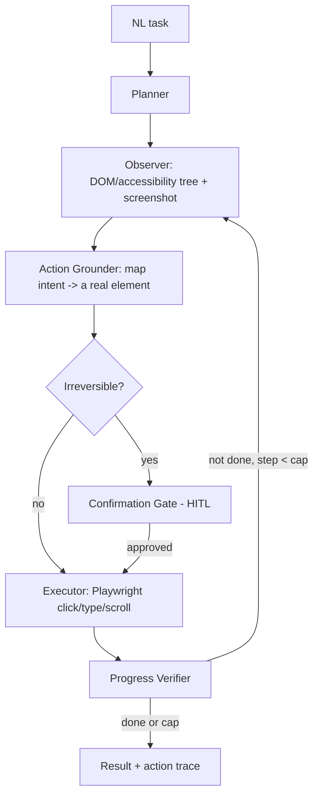

# PLAN.md — Computer-Use / Browser Automation Agent

**Why this project exists (new — added by the Fable-5 revision).** The portfolio has no agent that *acts on a live GUI*. Computer-use / browser automation (an agent that reads a page via DOM + vision, plans, and clicks/types to complete a web task) is one of the hottest 2026 capabilities and the strongest possible *live* demo — you can show it booking, filling, or extracting on a real site. It exercises a distinct skill set (perception grounding, action spaces, failure recovery, safety on irreversible clicks) absent from the RAG/orchestration-heavy rest of the set.

**What it adds beyond the current set.** Every other project acts through APIs/tools with clean typed interfaces. This one acts through a *messy, changing, visual* interface — the hardest grounding problem in the portfolio — and forces the perception + action-space + recovery skills that computer-use roles specifically test.

## 1. Objective & Success Criteria

Build an agent that, given a natural-language web task, drives a real browser (Playwright) using a combination of DOM/accessibility-tree parsing and vision, plans and executes actions (click/type/scroll/navigate), verifies progress, recovers from failures, and gates any irreversible action (purchase, submit, delete) behind confirmation. Benchmark task-success on a fixed set of web tasks.

| Metric | Target | How measured |
|---|---|---|
| Task success on a fixed 20-task benchmark (deterministic local/sandbox sites) | ≥60% | §6 benchmark |
| Steps-to-completion vs. a human baseline | reported (efficiency signal) | logged action count |
| Irreversible actions taken without confirmation | 0 | structural gate, code-checked |
| Recovery rate (tasks that hit an error but still complete) | ≥40% of erroring tasks | logged |
| Hallucinated actions (clicking an element that isn't there) | <5% of actions | action-grounding check |

## 2. Architecture



### Component roster

| Component | Role | Mechanism |
|---|---|---|
| Planner | Decompose the task into sub-goals; re-plan on failure | LLM |
| Observer | Capture page state: accessibility tree (structured) + screenshot (vision) | Playwright + a11y snapshot |
| Action Grounder | Map "click the login button" to a specific element handle | match intent against a11y-tree elements; vision fallback for canvas/visual-only UI |
| Executor | Perform the action | Playwright |
| Progress Verifier | Did the action move toward the goal? | LLM over before/after observation |
| Confirmation Gate | Block irreversible actions until approved | structural HITL |

### Why DOM/accessibility-tree first, vision as fallback (the key design decision)

Pure-vision (screenshot → coordinates) is brittle and expensive; pure-DOM misses canvas/visual-only UIs. Decision: **primary grounding on the accessibility tree** (structured, gives reliable element roles/names/handles), **vision as fallback** when the a11y tree is insufficient (custom canvas widgets, image-only buttons). This mirrors how the strongest computer-use systems actually work and is cheaper and more reliable than screenshot-only.

### Action space + state (pseudocode)

```python
Action = Literal["click","type","scroll","navigate","wait","done","ask_confirmation"]

class Step(TypedDict):
    action: Action
    target_element: str | None    # a11y element id / selector, NOT raw coordinates when avoidable
    value: str | None             # text to type / url to navigate
    reversible: bool

class BrowserAgentState(TypedDict):
    task: str
    plan: list[str]
    observations: list[dict]      # a11y snapshot + screenshot ref per step
    actions_taken: list[Step]
    step_count: int               # hard cap
    done: bool
```

### Safety: the irreversible-action gate (non-negotiable)

Actions are classified `reversible` vs. not. Irreversible (submit payment, place order, delete, send message, confirm booking) **must** route through the Confirmation Gate — structurally, like Project 04's approval gate: the executor refuses an irreversible `Step` lacking an approval token. On the benchmark, run against sites where these actions are either sandboxed or the gate is set to auto-deny (measuring that it *would* have gated), never against real transactions.

## 3. Tech Stack

| Choice | Why | Rejected |
|---|---|---|
| Playwright | Robust cross-browser automation, accessibility snapshots, already installed in this environment | Selenium — clunkier a11y access; raw CDP — too low-level |
| A11y-tree-first + vision fallback grounding | Reliable + cheap where possible, vision only where needed | Screenshot-only — brittle, expensive, coordinate-fragile |
| Fixed local/sandbox benchmark sites | Deterministic, reproducible, safe | Live public sites for scoring — non-deterministic, ToS/rate-limit risk |
| Vision-capable LLM for the fallback + verifier | Needed for visual grounding + progress checks | Text-only model — can't do the vision fallback |
| Structural confirmation gate | Irreversible-action safety | Prompt "please confirm" — not a boundary |

## 4. Phase-by-Phase Build Plan

| Phase | Goal | Definition of Done | Est. |
|---|---|---|---|
| 0 — Setup | Playwright driving a browser; a11y snapshot + screenshot capture | Can observe a page's a11y tree + screenshot | 2–3 d |
| 1 — Grounding + Executor | Map an intent to an element and click/type it | "Click login" reliably hits the right element on 5 test pages | 4–5 d |
| 2 — Planner + loop | Plan → observe → ground → act → verify, bounded | A 3-step task completes end-to-end on a test site | 4–5 d |
| 3 — Vision fallback | Use the screenshot when the a11y tree is insufficient | A canvas/image-only button is clicked via vision | 4–5 d |
| 4 — Safety gate + recovery | Irreversible-action gate + re-plan on failure | An irreversible action is blocked; a failed step triggers re-plan | 3–4 d |
| 5 — Benchmark | 20-task fixed benchmark; success + recovery + hallucination rates | §6 metrics table | 4–5 d |
| 6 — Deploy + Polish | Screencast demo; README w/ the benchmark + a live-run clip | Recruiter sees the agent complete a task on video | 3–4 d |

**Total: ~4–5 weeks part-time.**

## 5. Data & API Requirements

- **Benchmark sites:** use deterministic, self-hostable targets — a local e-commerce/test app (e.g., a sandbox shop), form-filling pages, a to-do web app — so scoring is reproducible and safe. Optionally reference public web-agent benchmarks (WebArena/WebVoyager-style task formats) for task design, but score against your controlled sites.
- Playwright + Chromium (pre-installed in this environment at `/opt/pw-browsers`; do **not** run `playwright install`).
- Vision-capable LLM for grounding fallback + verification.
- LLM budget: vision calls per step make this the more expensive project per task; bound steps and prefer a11y-tree (cheap) over vision (expensive) grounding.

## 6. Eval Strategy

- **Task success:** 20 fixed tasks on the controlled sites; a task is success if the goal state is reached (verified by a site-specific assertion, e.g., item in cart, form submitted).
- **Efficiency:** steps-to-completion vs. a human doing the same task.
- **Safety:** 0 irreversible actions without confirmation — structural, code-checked (include tasks that *tempt* an irreversible action to prove the gate fires).
- **Recovery:** of tasks that hit an error (element not found, unexpected page), fraction that still complete via re-plan ≥40%.
- **Grounding:** hallucinated-action rate (agent tried to act on a non-existent element) <5%.

## 7. Risks & Where These Projects Usually Fail

- **Screenshot-only grounding** — brittle and expensive; a11y-tree-first is the reliable design.
- **No step cap** — a stuck agent loops forever on a page; hard cap + re-plan budget.
- **No irreversible-action gate** — a computer-use agent that can submit/pay/delete without confirmation is dangerous; gate structurally.
- **Scoring on live sites** — non-deterministic and risky (ToS, rate limits, real transactions); score on controlled sites.
- **Ignoring recovery** — real web tasks fail mid-way constantly; an agent that can't re-plan looks impressive in a scripted demo and fails live.

## 8. Implementation Notes for the Executing Model

- **Playwright is pre-installed** here (`PLAYWRIGHT_BROWSERS_PATH=/opt/pw-browsers`); do not run `playwright install`. If a pinned version needs a specific binary, launch with `executablePath: '/opt/pw-browsers/chromium'`.
- Ground on the **accessibility tree first** (`page.accessibility.snapshot()` / role-based locators), fall back to vision (screenshot → the model picks a region/element) only when the a11y tree is insufficient — this is the cost/reliability decision.
- Prefer role/name-based Playwright locators over raw XY coordinates — coordinates break on layout shifts.
- Classify each `Step.reversible`; the executor refuses an irreversible step without an approval token (structural gate, like Project 04).
- Hard-cap `step_count`; on the cap, return partial progress + the action trace (which doubles as the Target Agent Contract trajectory, so Project 03/13 can observe it).
- Score only on controlled/sandbox sites; use public-benchmark task *formats* for design, not live scoring.
- Bound vision calls (expensive) — use them only on grounding fallback and progress verification, not every step.

## 9. Definition of Done

- [ ] Agent completes web tasks via a11y-tree-first grounding with vision fallback.
- [ ] 20-task benchmark run on controlled sites; success, efficiency, recovery, hallucination rates reported.
- [ ] Irreversible actions structurally gated — 0 taken without confirmation, code-verified.
- [ ] Re-plan/recovery demonstrated on failing tasks.
- [ ] Screencast demo + README with the benchmark table and a live-run clip.

## 10. Localization (India-first)

**Location-neutral pattern; optionally India-flavored targets.** GUI perception (a11y-tree-first + vision fallback), the typed action space, failure recovery, and the structural irreversible-action gate are universal computer-use skills, unchanged.

**Optional India flavor (target sites only, no architecture change):** the benchmark's controlled/sandbox sites can mimic **Indian portals** an Indian user actually automates — an IRCTC-style booking flow, a GST-portal-style form, a government-services form. Keep scoring on your own self-hosted deterministic clones (never live IRCTC/government sites — non-deterministic, and automating real government/ticketing portals raises ToS/legal issues). The irreversible-action gate maps naturally to "don't actually submit the booking/payment."

**What stayed global:** the entire computer-use curriculum; only the demo sites are optionally Indian.
