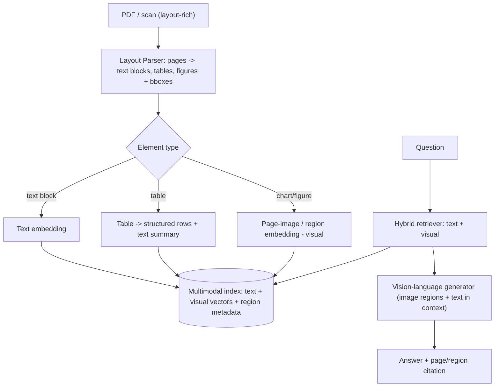

# PLAN.md — Multimodal Document Intelligence Agent

**Why this project exists (new — Task-1 gap sweep of 500-AI-Agents-Projects).** The repo's AutoGen section has a whole **Multimodal Agents** group (DALL·E + GPT-4V, Llava, GPT-4V) that nothing in the portfolio touches. Project 02 processes documents but is explicitly *text-native* (OCR deferred); Project 15 uses vision only narrowly (screenshot → element). No project reasons over **images, charts, tables, diagrams, and scanned/layout-rich documents as a first-class modality**. Visual document understanding + multimodal RAG is one of the highest-value 2026 skills (every "chat with your PDF/report/invoice" product that actually works is multimodal). **Gap filled:** multimodal / vision-language reasoning and layout-aware document AI.

**What it adds beyond the current set.** Every other project's inputs are text or structured API responses. This one's input is *pixels + layout* — charts whose meaning is in the bars, tables whose structure matters, scanned forms, diagrams. It forces the distinct engineering of multimodal embeddings, layout parsing, and vision-grounded citation.

## 1. Objective & Success Criteria

Build an agent that ingests layout-rich documents (PDFs with charts/tables/figures, scanned forms) and answers questions that require *reading the visuals*, not just the text — citing the exact page/region. Benchmark on a mix of text-answerable and vision-only questions, and compare a **text-only RAG baseline** against a **multimodal (vision) pipeline** to quantify what vision buys.

| Metric | Target | How measured |
|---|---|---|
| Answer accuracy on a 60-question set (20 text / 20 table / 20 chart-or-figure) | ≥80% overall | LLM-judge + manual |
| Vision uplift: multimodal vs. text-only baseline on the chart/table subset | ≥25 pp | head-to-head |
| Region-grounded citations (answer cites the page + bounding region it used) | 100% resolve to a real region | code-checked |
| Table-extraction fidelity (cell-level F1 on a labeled table subset) | ≥90% | vs. ground truth |
| Cost per document indexed | reported | token/page accounting |

## 2. Architecture



### Two design decisions Sonnet-level plans would skip

1. **Two multimodal-RAG strategies, benchmarked, not assumed.** (a) *Parse-and-embed-text* (OCR/layout → text, plus table-to-structured, plus an LLM-generated caption for each figure, all embedded as text) vs. (b) *embed-the-page-image directly* (visual document retrieval, e.g., ColPali-style late-interaction image embeddings, no OCR). Decision: build (a) as the workhorse and (b) for the chart/figure subset, and **report which wins where** — (b) shines on dense visual layouts, (a) is cheaper on text-heavy docs. This mirrors the real industry tradeoff.
2. **Region-grounded citation.** A citation must resolve to a `(page, bounding_box)` that actually contains the evidence — the vision analogue of Project 06's file:line verification. The generator receives cropped region images and must cite the region id it used; a deterministic check confirms the region exists.

### State schema (pseudocode)

```python
class DocElement(TypedDict):
    element_id: str
    page: int
    bbox: tuple[float,float,float,float]   # x0,y0,x1,y1 on the page
    kind: Literal["text","table","figure","chart"]
    text: str | None            # OCR/extracted text or table-as-markdown
    caption: str | None         # LLM caption for a figure/chart
    image_ref: str | None       # cropped region image for visual retrieval
    embedding: list[float]

class MMState(TypedDict):
    doc_id: str
    elements: list[DocElement]
    question: str
    retrieved: list[DocElement]      # mixed text + visual
    answer: str | None
    citations: list[dict]            # {page, bbox, element_id}
```

## 3. Tech Stack

| Choice | Why | Rejected |
|---|---|---|
| A layout parser (Docling / PDF layout model) | Turns a PDF into typed elements (text/table/figure) with bounding boxes — the structure vision RAG needs | Plain `pdfminer` text dump — loses tables/figures/layout, the whole point |
| Table → structured rows + markdown | Tables answered by structure, not prose | Treating a table as flat text — destroys cell relationships |
| Vision-capable LLM (generator + figure captioning) | Needed to read charts/diagrams | Text-only model — can't answer chart questions |
| ColPali-style visual retrieval (chart/figure subset) | Retrieves page images without lossy OCR; strong on dense visuals | OCR-only for everything — the baseline it must beat on visuals |
| Chroma/pgvector, multimodal (text + image vectors) | One index, two vector types + region metadata | Separate stores — harder to fuse ranking |

## 4. Phase-by-Phase Build Plan

| Phase | Goal | Definition of Done | Est. |
|---|---|---|---|
| 0 — Setup | Layout parser on 5 sample docs; element extraction + bboxes | Elements typed with correct pages/bboxes | 3–4 d |
| 1 — Text-only baseline | Parse→text (incl. table-to-markdown, figure captions) → text RAG | Answers text/table questions; baseline metrics | 4–5 d |
| 2 — Visual pipeline | Region-image embedding + visual retrieval for charts/figures | Chart questions answered from the image, not the caption | 4–5 d |
| 3 — Fusion + citation | Hybrid text+visual retrieval; region-grounded citation | Every answer cites a real (page, bbox); fused ranking works | 4–5 d |
| 4 — Benchmark | 60-question set; baseline vs. multimodal; table-F1 | §6 metrics, ≥25pp vision uplift on the visual subset | 4–5 d |
| 5 — Deploy + Polish | Upload-a-PDF UI showing cited regions highlighted; Docker | Recruiter uploads a report and sees a chart-grounded answer w/ the region boxed | 3–4 d |

**Total: ~4 weeks part-time.**

## 5. Data & API Requirements

- **Documents:** layout-rich PDFs with real charts/tables — e.g., the SEC filings from Project 01 (financial tables + charts), a few annual-report/earnings decks, and a couple of scanned forms. Commit the exact set.
- **Question set:** 60 questions split 20 text / 20 table / 20 chart-or-figure, each with a ground-truth answer and the page/region that supports it.
- Vision-capable LLM; a layout parser; an embedding model (text) + a visual document embedder for the ColPali-style path.
- Cost: per-page vision calls make ingestion the cost driver; report per-document cost.

## 6. Eval Strategy

- **Accuracy by question type:** text / table / chart-figure reported separately — the aggregate hides that vision only matters on the visual subset.
- **Vision uplift:** text-only baseline vs. multimodal on the chart/table subset — the headline number (≥25pp), proving vision earns its cost.
- **Table fidelity:** cell-level F1 on a labeled table subset (≥90%).
- **Citation grounding:** 100% of citations resolve to a real `(page, bbox)` (code-checked).

## 7. Risks & Where These Projects Usually Fail

- **OCR-only "multimodal"** — dumping text and ignoring the visuals; then charts are unanswerable and there's no uplift to show. Build the real visual path.
- **Tables as flat text** — destroys structure; parse to rows.
- **Ungrounded visual citations** — "see the chart on page 4" without a verified region is the vision version of a hallucinated citation.
- **No baseline** — without the text-only comparison you can't prove vision was worth the cost.
- **Cost blindness** — per-page vision calls are expensive; report it and cache page embeddings.

## 8. Implementation Notes for the Executing Model

- Parse to **typed elements with bounding boxes** (Docling or an equivalent layout model) — text/table/figure/chart, each with `(page, bbox)`. This is the backbone; everything else hangs off it.
- Build the **text-only baseline first** so the benchmark has its comparison from day one.
- For figures/charts, do **both**: an LLM caption (for the text index) *and* a region-image embedding (for visual retrieval) — the benchmark decides which wins per question type.
- Region-grounded citation is a **deterministic check**, like Project 06's file:line: the generator cites an `element_id`; assert it exists and its bbox is on the cited page.
- Fuse text + visual retrieval by reciprocal-rank fusion (reuse Project 06's hybrid-fusion idea).
- Reuse Project 01's SEC filings as the primary corpus (financial docs are chart/table-dense) — cross-project synergy.
- Emit the Target Agent Contract trajectory (which elements retrieved, which modality) so Projects 03/13 can observe it.

## 9. Definition of Done

- [ ] Layout parser produces typed elements with bboxes on all sample docs.
- [ ] Text-only baseline and multimodal pipeline both run on the 60-question set.
- [ ] ≥25pp vision uplift on the chart/table subset; table cell-F1 ≥90%.
- [ ] 100% region-grounded citations (code-checked).
- [ ] Upload-a-PDF demo highlighting the cited region; Docker; README leads with the vision-uplift table.

## 10. Localization (India-first)

**Deep-localized on document types; every vision-language mechanism preserved.** Layout parsing, the text-vs-visual retrieval benchmark, region-grounded citation, and table-fidelity scoring are unchanged — only the documents are Indian, which makes this project *directly* useful and demo-worthy in India.

**What changed (document types — not architecture):**
- **Documents:** US filings/reports → **GST invoices** (visual layout: GSTIN block, HSN/SAC table, tax-split table), **Indian annual-report charts/tables** (reuse Project 01's corpus — segment revenue tables, promoter-holding pie charts), **scanned Indian forms** (bank/KYC forms, utility bills), and **Aadhaar/PAN card images** *with masking* (last-4 only; ties to the DPDP discipline from Projects 02/11 — never store full Aadhaar). 
- **Table extraction:** the GST tax-split table and annual-report segment tables are the cell-fidelity benchmark targets — genuinely structure-dependent, exactly what the ≥90% cell-F1 metric needs.
- **Vision-uplift benchmark:** the chart/table subset uses Indian annual-report visuals, where the multimodal path must beat text-only by ≥25pp.
- **Formatting:** ₹, lakh/crore in extracted values.

**What stayed global (unchanged):** the layout parser, the two-strategy (parse-and-embed-text vs. embed-page-image/ColPali) benchmark, region-grounded citation as a deterministic check, hybrid fusion, and the Target Agent Contract emission. Every learning objective intact.

**Trade-off / privacy note:** Aadhaar/PAN card understanding is a real Indian use case (fintech onboarding) but a DPDP-sensitive one — use **masked synthetic samples only** for the eval, and make masking part of the pipeline output. This is additive learning (document-AI + data-protection), not a change to the vision curriculum.
