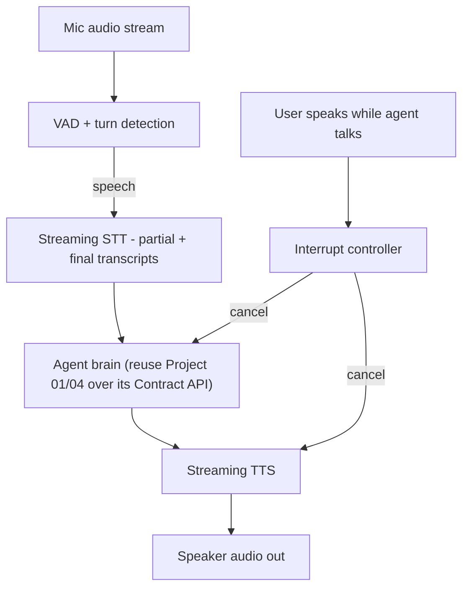

# PLAN.md — Voice / Real-Time Conversational Agent

**Why this project exists (new — Task-1 gap sweep).** The 500-repo has a voice/audio entry (AutoGen "Agent Chat with Whisper" — transcription/translation) and voice AI is one of the largest 2026 agent categories (AI receptionists, phone support, drive-through, scheduling). Nothing in the portfolio touches **audio, streaming, or real-time turn-taking latency**. Every other project is text/HTTP request-response with second-scale latency budgets. Voice is a fundamentally different engineering problem: sub-second end-to-end latency, streaming STT/TTS, interruption (barge-in), and turn detection. **Gap filled:** real-time voice + streaming audio agents.

**What it adds beyond the current set.** This is the only project with a *human-perceptible latency budget* (people notice >~800ms of dead air) and the only one dealing with streaming audio, partial transcripts, and interruption. It exercises real-time systems engineering the rest of the portfolio never touches.

## 1. Objective & Success Criteria

Build a real-time voice agent: the user speaks, the agent transcribes (streaming), reasons (reusing an existing text agent as its brain), and speaks back — with natural turn-taking, interruption handling, and a bounded latency budget. Reuse a portfolio agent (e.g., Project 04 personal-ops or Project 01) as the "brain" so the focus is the voice loop, not new reasoning.

| Metric | Target | How measured |
|---|---|---|
| End-to-end response latency (user stops speaking → agent starts speaking), P50 | <1.0s | measured over a scripted call set |
| P95 response latency | <1.8s | same |
| Barge-in works (user interrupts → agent stops speaking within) | <300ms | measured |
| Turn-detection false-cutoff rate (agent starts talking over a thinking pause) | <10% | labeled call set |
| Task success on a 15-scenario spoken-task set (schedule, look up, answer) | ≥80% | reuse the brain's success + transcript check |
| Transcription WER on the test set | reported | vs. reference transcripts |

## 2. Architecture



### The latency budget (the core engineering artifact — most voice demos ignore it)

End-to-end response = turn-detection delay + STT finalization + brain think time + TTS first-audio. Budget it explicitly:

| Stage | Budget (P50) | Technique to hit it |
|---|---|---|
| Turn detection (end-of-speech) | ~200ms | VAD + a short silence threshold; semantic turn-detection to avoid cutting off mid-thought |
| STT finalization | ~150ms | streaming STT so most of the transcript is done before the user stops |
| Brain think time | ~400ms | **stream the LLM**; start TTS on the first sentence, don't wait for the full response; keep the brain's tool calls fast |
| TTS first audio | ~250ms | streaming TTS (first chunk out while the rest synthesizes) |

The trick that makes voice feel instant: **pipeline, don't sequence** — start speaking the first sentence while the LLM is still generating the rest, and start STT on partials before end-of-turn.

### Interruption (barge-in) handling

While the agent is speaking, keep the mic open. If the VAD detects user speech above a threshold, the Interrupt controller **cancels the current TTS playback and the in-flight brain call**, flushes, and routes the new input as a fresh turn. Without this, the agent talks over the user — the #1 thing that makes a voice agent feel robotic.

### State schema (pseudocode)

```python
class Turn(TypedDict):
    turn_id: str
    speaker: Literal["user","agent"]
    transcript: str
    audio_start_ms: int; audio_end_ms: int
    interrupted: bool

class VoiceSessionState(TypedDict):
    session_id: str
    turns: list[Turn]
    agent_speaking: bool         # for barge-in logic
    pending_brain_call: str | None   # cancellable handle
```

## 3. Tech Stack

| Choice | Why | Rejected |
|---|---|---|
| A voice-agent orchestrator (Pipecat or LiveKit Agents) | Handles the real-time pipeline (VAD → STT → LLM → TTS), streaming, and interruption plumbing | Hand-rolling the audio pipeline — weeks of WebRTC/streaming glue for no learning benefit; use the framework, focus on the loop design |
| Streaming STT (Whisper-family / a streaming ASR) | Partial transcripts before end-of-turn | Batch STT — adds full-utterance latency |
| Streaming TTS (first-chunk-fast) | First audio out fast | Batch TTS — waits for the whole utterance |
| Reuse Project 01/04 as the brain over its Contract API | Focus on the voice loop, not new reasoning | A new agent — scope creep; the voice loop is the lesson |
| Semantic VAD / turn detection | Avoid cutting the user off mid-thought | Fixed silence timeout only — cuts off thinking pauses |

## 4. Phase-by-Phase Build Plan

| Phase | Goal | Definition of Done | Est. |
|---|---|---|---|
| 0 — Setup | Audio in/out + VAD + a round-trip STT→echo→TTS | You can speak and hear a transcript spoken back | 3–4 d |
| 1 — Brain integration | Wire a portfolio agent as the brain over its Contract API | A spoken question gets a spoken, correct answer | 3–4 d |
| 2 — Streaming + pipelining | Stream STT partials + stream LLM + stream TTS first-sentence | P50 end-to-end <1.0s on the scripted set | 4–5 d |
| 3 — Barge-in | Interrupt controller cancels TTS + brain on user speech | Interrupting stops the agent <300ms and re-routes | 3–4 d |
| 4 — Turn detection | Semantic turn detection to cut false cutoffs | False-cutoff rate <10% | 3–4 d |
| 5 — Eval + Deploy | 15-scenario spoken-task set; a demo call | §6 metrics; a recorded demo call | 3–4 d |

**Total: ~3–4 weeks part-time.**

## 5. Data & API Requirements

- STT + TTS services (streaming-capable) and a real-time transport (WebRTC via the orchestrator).
- The brain: reuse Project 01 (research) or Project 04 (personal ops — a more natural voice-assistant fit) over its Contract API.
- A **scripted call set**: 15 spoken tasks with reference transcripts + expected outcomes (schedule a meeting, look up a PR, answer a factual question), for reproducible latency/accuracy measurement.
- No new dataset beyond the recorded scripts.

## 6. Eval Strategy

- **Latency:** P50/P95 end-to-end (end-of-user-speech → first agent audio), measured over the scripted set. This is the headline — voice lives or dies on latency.
- **Barge-in:** time from user-interrupt to agent-stop (<300ms).
- **Turn detection:** false-cutoff rate on labeled thinking-pauses (<10%).
- **Task success:** the brain's success on the 15 spoken tasks + a transcript check that STT didn't corrupt intent.
- **WER:** transcription word-error-rate on the test set, reported.

## 7. Risks & Where These Projects Usually Fail

- **Sequential pipeline** — waiting for full STT, then full LLM, then full TTS blows the latency budget; pipeline/stream every stage.
- **No barge-in** — talking over the user is the #1 tell of a bad voice agent.
- **Fixed silence-timeout turn detection** — cuts users off mid-thought or waits too long; use semantic turn detection.
- **Ignoring the latency budget** — a voice demo with 3s of dead air is unusable regardless of answer quality; budget and measure each stage.
- **Rebuilding the brain** — scope creep; reuse a portfolio agent, the voice loop is the deliverable.

## 8. Implementation Notes for the Executing Model

- Use a voice-agent orchestrator (Pipecat or LiveKit Agents) — do **not** hand-roll WebRTC/streaming; the learning is in the *loop design* (budget, pipelining, barge-in), not the transport glue.
- **Pipeline, don't sequence:** stream STT partials into the brain's context assembly, stream the LLM, and start TTS on the first complete sentence while the rest generates.
- Keep the mic open during agent speech; the Interrupt controller must cancel **both** the TTS playback and the in-flight (streaming) brain call — a cancellable handle in state.
- Use **semantic turn detection** (is the utterance a complete thought?) layered on VAD, not a bare silence timer — this is what makes it feel human.
- Reuse Project 04 as the brain for the most natural voice-assistant demo (calendar/PRs/notes by voice), or Project 01 for a "research by voice" demo.
- Instrument each pipeline stage's latency (this is a natural fit for Project 13's OTel spans — one span per stage) so the budget is measured, not guessed.

## 9. Definition of Done

- [ ] Full voice loop: speak → transcribe → reason (reused brain) → speak back.
- [ ] P50 end-to-end <1.0s, P95 <1.8s on the scripted set.
- [ ] Barge-in stops the agent <300ms and re-routes.
- [ ] Turn-detection false-cutoff <10%; WER reported.
- [ ] 15-scenario spoken-task eval; a recorded demo call; README leads with the latency-budget table.

## 10. Localization (India-first)

**Deep-localized on language/accent; every real-time mechanism preserved.** Streaming STT→LLM→TTS, latency budgeting, barge-in, and turn detection are unchanged — but India is where voice AI is exploding (vernacular customer support, IVR replacement), and Indian languages make the project both more useful and more impressive.

**What changed (languages, models, use case — not architecture):**
- **Languages:** English-only → **Indian-accented English + Hindi, with Hinglish code-mixing** (users switch languages mid-sentence — a genuine, hard, India-specific challenge that showcases robustness).
- **STT:** Whisper (handles Indian-accented English + Hindi acceptably) as the default; **AI4Bharat IndicASR / IndicConformer** as the higher-accuracy Indian-language option.
- **TTS:** an Indian-voice TTS — **AI4Bharat Indic-TTS** (or a hosted Indian-voice API) so the agent sounds natural to Indian users, not a foreign accent.
- **Use case:** the demo is an **Indian phone-support / appointment-booking bot** (the archetypal Indian voice-AI product — think a clinic or a bank's vernacular IVR), with the "brain" being Project 04 (personal ops) or Project 01 (research) unchanged behind the voice layer.
- **Latency framing:** note India's network variability (mobile-first, variable latency) as an extra reason the streaming/latency-budget curriculum matters.

**What stayed global (unchanged):** the streaming pipeline architecture, latency budgeting, barge-in/turn-detection, and the reuse of an existing agent as the brain via the Target Agent Contract. The real-time-systems curriculum is intact; only the language models and demo scenario are Indian.

**Trade-off recorded:** Indian-language ASR/TTS is harder and sometimes lower-accuracy than English — that's a *feature* for learning (you confront real code-mixing and accent robustness), but budget extra eval time. Keep an English-only mode too (worldwide compatibility), so the pipeline is language-pluggable, mirroring Project 01's adapter lesson.
