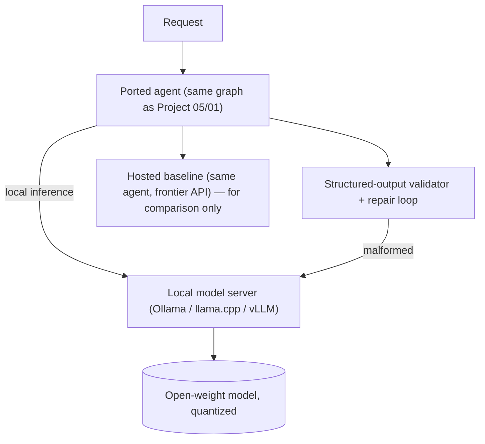

# PLAN.md — Local / Offline Open-Weight Agent

**Why this project exists (new — Task-1 gap sweep).** The 500-repo's LangGraph section explicitly ships **"Adaptive RAG (Local)"** and **"Self-RAG (Local)"** — "local models for offline use." Every one of the portfolio's other 17 projects assumes a frontier *hosted* API (Claude/OpenAI). None confronts the distinct engineering of running an agent on **local, open-weight models** (Ollama/llama.cpp/vLLM): quantization, small-context and slower inference, unreliable tool-calling on smaller models, and the privacy/cost/latency reasons you'd choose this. On-prem and privacy-sensitive deployments (healthcare, finance, defense, air-gapped) are a real and growing hiring signal. **Gap filled:** self-hosted / offline / open-weight agent engineering.

**What it adds beyond the current set.** Everything else outsources the model to an API. This project owns the model: it teaches quantization tradeoffs, why small models fail at tool-calling and how to compensate, hardware/throughput reality, and how to *measure* the quality-vs-cost-vs-privacy tradeoff against a hosted baseline — the exact analysis an on-prem deployment decision needs.

## 1. Objective & Success Criteria

Re-implement one existing portfolio agent (recommended: Project 05 self-healing SQL, or Project 01's fundamentals RAG) to run **fully offline on local open-weight models**, then benchmark it head-to-head against the hosted-API version on task success, latency, and cost, and characterize the quality-vs-privacy-vs-cost frontier.

| Metric | Target | How measured |
|---|---|---|
| Agent runs fully offline (no external API calls) | verified — network egress blocked during a run | egress test |
| Task success vs. the hosted baseline (same eval set) | within 15pp of hosted, or the gap honestly reported | reuse the ported project's benchmark |
| Tool-call/structured-output reliability on the local model | ≥90% well-formed (after your mitigation) | schema-validity rate |
| Local inference latency (P50) | reported (expect higher than hosted) | measured |
| Cost model: local (amortized hardware) vs. hosted per 1k requests | reported crossover point | derived |

## 2. Architecture



### The three problems local models create (and the mitigations — the real content)

1. **Unreliable structured output / tool calls.** Smaller open-weight models emit malformed JSON / wrong tool schemas far more often than frontier models. Mitigations, specced: **constrained decoding / grammar-enforced JSON** (GBNF grammars in llama.cpp, or an outlines/JSON-schema-guided decoder) so the model *cannot* emit invalid JSON; plus a validate-and-repair loop as backstop. This is the single biggest gap between "works in a demo" and "works."
2. **Smaller context + slower inference.** Local models often have less usable context and much lower throughput. Mitigations: tighter retrieval (fewer, better chunks — reuse Project 06's hybrid retrieval), aggressive prompt trimming, and a model-size/quantization choice matched to the task (a 7–8B quantized model is fine for SQL generation; reasoning-heavy tasks may need larger).
3. **Quantization quality loss.** Quantizing (e.g., Q4 vs. Q8 vs. fp16) trades quality for memory/speed. Mitigation: **measure it** — run the eval at 2–3 quantization levels and report the quality/latency/VRAM curve, so the deployment choice is data-driven.

### State/config (pseudocode)

```python
class LocalRunConfig(TypedDict):
    model: str                  # e.g. "qwen2.5:7b-instruct-q4"
    quantization: str           # "Q4_K_M" | "Q8_0" | "fp16"
    server: Literal["ollama","llamacpp","vllm"]
    grammar_constrained: bool   # enforce JSON schema at decode time
    max_context: int
```

## 3. Tech Stack

| Choice | Why | Rejected |
|---|---|---|
| Ollama (dev) + llama.cpp/vLLM (perf) | Ollama = easiest local serving for the build; llama.cpp for GBNF grammar-constrained JSON; vLLM for throughput | Only a hosted API — this project's entire premise is *not* that |
| Grammar-constrained decoding (GBNF / JSON-schema) | Makes small-model structured output reliable *by construction* | Prompt-and-hope JSON — the main reason local agents fail |
| Port an existing agent (05 or 01-fundamentals) | Isolate the "local" variable; same eval, clean comparison | A new agent — confounds the hosted-vs-local comparison |
| Local embedding model (offline RAG) | Fully offline requires local embeddings too | Hosted embeddings — breaks the "offline" claim |
| The hosted version as a baseline | Quantify the tradeoff you're characterizing | No baseline — can't report the frontier |

## 4. Phase-by-Phase Build Plan

| Phase | Goal | Definition of Done | Est. |
|---|---|---|---|
| 0 — Setup | Local model server + a quantized open-weight model; local embeddings | A local model answers a prompt; embeddings run offline | 2–3 d |
| 1 — Port the agent | Swap Project 05/01's model calls to the local server | The ported agent runs end-to-end locally | 3–4 d |
| 2 — Structured-output reliability | Grammar-constrained decoding + repair loop | ≥90% well-formed tool calls/SQL on the eval set | 4–5 d |
| 3 — Offline RAG (if porting 01) / retrieval trim | Local embeddings + tighter retrieval for small context | Runs within the local context budget | 3–4 d |
| 4 — Benchmark + quantization sweep | Hosted vs. local on the same eval; 2–3 quant levels | §6 metrics + the quality/latency/VRAM curve | 4–5 d |
| 5 — Deploy + Polish | Dockerized fully-offline stack; README with the tradeoff analysis | `docker compose up` runs with no external network; README leads with the hosted-vs-local table | 3–4 d |

**Total: ~3–4 weeks part-time.**

## 5. Data & API Requirements

- An open-weight instruct model (7–14B class) served locally; a local embedding model.
- Reuse the **exact eval set** of the ported project (Project 05's Spider subset, or Project 01's ticker set) so the comparison is clean.
- Hardware: a GPU helps but a quantized 7–8B model runs on CPU/consumer GPU — note the hardware you used (it's part of the honest cost analysis).
- No external APIs during a local run (that's the point) — the hosted baseline runs separately for comparison.

## 6. Eval Strategy

- **Offline verification:** block network egress during a local run and confirm the agent still completes — proves "offline" is real, not aspirational (reuse Project 07's egress-test discipline).
- **Hosted vs. local:** same eval set, report task success, latency, and cost side by side; state the gap honestly (local will usually be somewhat worse and slower — the value is the privacy/cost story, and knowing the gap).
- **Structured-output reliability:** schema-validity rate before vs. after grammar-constrained decoding — shows the mitigation working.
- **Quantization curve:** eval at 2–3 quant levels; plot quality vs. latency vs. VRAM so the deployment choice is data-driven.
- **Cost crossover:** derive at what request volume amortized local hardware beats per-token hosted cost.

## 7. Risks & Where These Projects Usually Fail

- **Prompt-and-hope JSON on a small model** — the #1 failure; use grammar-constrained decoding.
- **Pretending local == hosted quality** — it usually isn't; the credible story is measuring the gap and the privacy/cost upside, not hiding it.
- **Context overflow** — small local context + fat prompts; trim retrieval and prompts.
- **Unspecified quantization** — "runs on a local model" without saying which quant level is meaningless; report the curve.
- **Not actually offline** — a stray hosted-embedding call breaks the premise; verify egress is blocked.

## 8. Implementation Notes for the Executing Model

- **Port, don't rebuild:** take Project 05's graph (recommended — SQL generation is structured-output-heavy, exactly where local models struggle, so the mitigations shine) or Project 01's fundamentals RAG, and swap only the model/embedding calls. Same eval set.
- **Grammar-constrain the structured outputs** (GBNF in llama.cpp, or a JSON-schema-guided decoder) so malformed JSON is *impossible*, then keep a validate-and-repair loop as backstop. This is the load-bearing mitigation.
- Use a **local embedding model** for RAG so the pipeline is genuinely offline.
- Run the **quantization sweep** (e.g., Q4_K_M / Q8_0 / fp16) and report the quality/latency/VRAM curve — this table *is* the resume artifact ("I characterized the on-prem quality/cost frontier").
- Verify offline by **blocking egress** during a run (Project 07's discipline).
- Keep the **hosted baseline** wired for the comparison — the deliverable is the tradeoff analysis, not just "it runs locally."
- The local model server is a natural MCP/Contract-compatible backend — keep the agent's interface identical to the hosted version so the swap is clean.

## 9. Definition of Done

- [ ] Ported agent runs fully offline (egress-blocked run succeeds).
- [ ] Grammar-constrained structured output ≥90% valid; hosted-vs-local benchmark on the same eval set reported honestly.
- [ ] Quantization quality/latency/VRAM curve reported; cost crossover derived.
- [ ] Dockerized offline stack; README leads with the hosted-vs-local tradeoff table.

## 10. Localization (India-first)

**Deep-localized on motivation and models; every systems concept preserved.** Self-hosting, quantization, grammar-constrained decoding, and the hosted-vs-local benchmark are unchanged — but the *why* is especially strong in India: cost (₹ per query at scale matters more when serving price-sensitive users), **data residency / DPDP** (keep personal data on-prem, never send it to a foreign API), and **low/unreliable connectivity** (offline-capable agents for rural/edge deployments).

**What changed (motivation, models, examples — not architecture):**
- **Framing:** the hosted-vs-local trade-off analysis foregrounds **Indian drivers** — DPDP data-residency (a bank/hospital may be barred from sending PII to a US API), rupee cost at scale, and offline operation for low-connectivity regions.
- **Models:** general open-weight models (Llama/Qwen/etc. via Ollama/llama.cpp/vLLM) **plus Indian-language open models** — **AI4Bharat** models and India-built LLMs (e.g. Sarvam, Krutrim families) — so a *local* agent can serve Hindi/Indic users without a foreign API. This pairs naturally with Project 17 (offline vernacular voice) and Project 02/11 (on-prem PII handling under DPDP).
- **Port target:** the agent ported to local is Project 05 (SQL) as specified — unchanged — but a compelling India demo is porting Project 02's KYC pipeline to fully on-prem for DPDP compliance.
- **Cost analysis:** reported in ₹ (hosted API ₹/query vs. amortized local GPU/CPU ₹/query).

**What stayed global (unchanged):** the quantization/decoding/self-hosting curriculum, grammar-constrained structured output on small models, and the hosted-vs-local benchmark methodology. The systems-engineering learning is intact; the motivation and model choices are India-tuned.

**Trade-off recorded:** Indian-language open models are younger and often weaker than frontier hosted models — which is exactly the honest trade-off this project teaches (you *measure* the local-vs-hosted quality gap rather than assuming it). That measurement, framed around real DPDP/cost/connectivity drivers, is a genuinely hireable India-market analysis.
